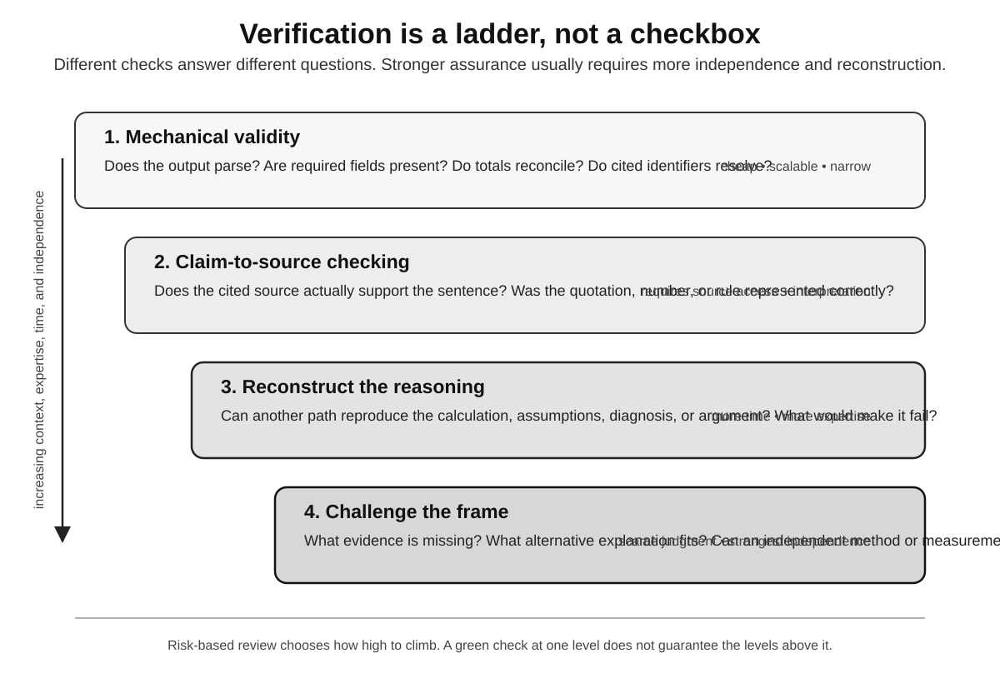

# The Verification Trap

“Just verify it” may be the most reassuring sentence in AI governance.

Let the machine draft, classify, retrieve, calculate, summarize, or recommend. Put a human at the end. The machine supplies speed; the human keeps judgment.

The arrangement looks clean until checking the work requires doing much of the work again.

Suppose a model produces a research memo in five minutes. A serious check may mean opening every important source, confirming that it says what the memo claims, looking for contrary evidence, validating calculations, testing assumptions, and deciding whether the conclusion follows. Research has not disappeared. Its order has changed. Instead of building an argument from evidence, the human begins with a polished argument and works backward to discover whether it deserves to exist.

That can still be faster. A strong draft is a useful scaffold. Errors may be rare. Review can concentrate on load-bearing claims. But the verifier inherits something the original researcher did not: an answer already sitting on the desk.

First moves matter.

A plausible diagnosis makes alternatives less salient. A polished strategic narrative turns ambiguous facts into supporting facts. A clean code patch invites the question “Does this look right?” before “Was this the right problem?” A generated legal argument can send research hunting for precedent that supports it rather than asking whether another cause of action should have been considered.

Verification often inherits the generator's frame.

Then comes the arithmetic. Generation takes seconds. Serious verification takes minutes or hours. Output can expand much faster than the supply of people capable of inspecting it.

So organizations ration scrutiny. Low-consequence outputs pass automatically. High-consequence ones get deeper review. Samples are audited. Deterministic controls catch known errors. Independent methods test selected claims.

At that point, “human verification” is not an act. It is an allocation system for scarce judgment.

The institution is deciding which failures it can afford not to catch.

That is not cynical. Mature safety systems already work this way. Absolute verification is usually impossible. The useful questions are concrete: What can fail? What can be checked cheaply? What deserves escalation? What happens after a near miss?

*Verification is not one act. Cheap checks can catch malformed output, broken references, or violated constraints; stronger assurance may require reading the source, reconstructing the reasoning, seeking contrary evidence, or using an independent method capable of disagreeing. Risk-based review decides how far to climb. Conceptual diagram by the author; verification framing informed by NIST AI RMF/TEVV guidance.*

A policy saying “all AI outputs must be reviewed” often means nobody has calculated the review burden. What percentage can a person meaningfully inspect? Which claims require primary-source validation? Which operations are reversible? What independent signals exist? How is disagreement handled? How often do apparently low-risk outputs receive random audit?

Most importantly: what is the error rate *after* review?

Organizations may become excellent at measuring model accuracy while remaining ignorant about combined-system accuracy. A model with a ten percent error rate plus excellent review may produce a safer process than a model with a one percent error rate plus ceremonial review. The metric that matters is what survives the whole loop under real incentives and real time pressure.

Research on automation bias helps explain why. A systematic review by Kate Goddard, Abdul Roudsari, and Jeremy Wyatt examined clinical decision-support studies involving omission errors—failing to act when automation misses a problem—and commission errors—following incorrect automated advice. Training, accountability, displayed confidence, and access to underlying information can change behavior.

Expertise helps, but it is not an inoculation. Raja Parasuraman and Dietrich Manzey's 2010 review emphasized that complacency and automation bias emerge partly from attention allocation inside human-machine systems, not simply from lazy operators. If a system is usually right, trusting it is rational.

The design problem is keeping rational trust conditional.

That makes independence more valuable than repetition.

One system answers. A second system checks. It sounds like redundancy, and sometimes it is. But if both share training data, retrieval sources, architecture, incentives, or an upstream mistake, agreement can be less informative than it looks.

An institution can build a hall of mirrors and call it consensus.

Independent verification asks a harder question: what evidence or method could disagree for a reason that matters? A deterministic unit test is independent of a code generator along one useful dimension. A physical measurement is independent of a textual explanation. A differently trained model may add some independence. A primary source can test a summary. A domain expert's precommitted estimate can test a generated forecast.

The strongest check often looks unlike the thing being checked.

Engineering has always known this. Repeating the same calculation adds little. Boundary checks, invariants, reconciliations, different methods, and independent measurements create stronger assurance. Generated language makes the lesson easy to forget because every check can sound sophisticated. A model can write a magnificent critique of its own answer and preserve the original blind spot intact.

NIST's AI Risk Management Framework and its generative-AI profile push governance toward lifecycle risk rather than a final accuracy gate. That is the useful direction. Verification for a restaurant recommendation and verification for a radiation-treatment plan should not resemble each other merely because both involve AI.

But this book has another problem with verification: what it does to the verifier.

A person who spends years checking polished outputs sees a different world from a person who spends years constructing solutions. The reviewer encounters errors after a candidate answer has narrowed the field. They may become excellent editors of machine output while losing some practice at originating an independent approach.

That is not automatically decline. Editing is a serious discipline. Senior professionals often review more than they draft. The difference is biographical: most of those senior professionals built their reviewing judgment through earlier production.

AI can reverse the order.

The junior arrives as editor before becoming author.

Can deep verification be learned that way? In some domains, certainly. Chess students analyze strong games. Programmers learn from code review. Medical trainees learn from worked cases. Creation need not precede critique every time.

But critique needs contrast.

If every example arrives polished, the learner needs deliberate exposure to failures whose causes can be understood. If the system quietly repairs its own mistakes before the human sees them, the human loses the error distribution that sharpens judgment.

So make verification a practiced skill. Seed errors. Mix correct and incorrect outputs. Include plausible citations that support the wrong proposition, recommendations missing a base rate, and code that passes ordinary tests while violating an invariant. Measure whether reviewers find the problem without being told one exists.

Now “human review” means something testable.

It may also reveal an uncomfortable result: some humans designated as reviewers cannot detect important failures even with ample time, while some automated checks can. In those cases, preserving a human checkpoint for ceremony adds little. Replace weak checks with stronger ones. Keep accountability legible.

The danger is not machine verification.

The danger is a verification stage whose guarantee nobody can name.

A model checking a model can run continuously, inspect every transaction, compare outputs against policy, execute tests, and surface anomalies. Human attention can move toward disagreements, novel patterns, and governance decisions. That may be safer than the old human-only process.

Abdicating intelligence is not synonymous with removing humans from loops. An institution abdicates when it loses the capacity to understand and challenge the loop itself.

Who can change the verifier? Who understands its failure modes? Who can inspect the evidence path? Who notices if generator and verifier become more correlated after a vendor update? Who can halt the process when every metric is green and reality is not?

Those second-order capabilities become more valuable as first-order production is automated. Lawyers may spend less time drafting routine material and more time specifying adequate authority and testing citation paths. Doctors may spend more time examining uncertainty, conflicting evidence, and whether a support system's objective fits the clinical decision. Engineers may spend more time defining invariants, tests, interfaces, and failure containment.

That can be higher-leverage work. It does not appear by magic when the first draft disappears.

The curriculum has to teach how systems fail: model error, source error, specification error, distribution shift, correlated failure, adversarial manipulation, incentive mismatch, interface effects, and the mundane fact that people route around controls that slow them down.

Verification is organizational behavior as much as technical design. A reviewer punished for blocking releases will approve more releases. A doctor given ninety seconds cannot perform a ten-minute check. A content moderator facing thousands of machine-generated cases will lean on whatever ranking shrinks the queue. A manager rewarded for throughput learns to experience uncertainty as delay.

Governance written without incentives becomes theater.

Dashboards, audit committees, model cards, acknowledgment boxes, and quarterly attestations do not matter if the person who finds a serious problem lacks the authority or time to stop the process. Real verification can delay, reject, escalate, or force a different method.

And it learns.

A discovered failure should update more than the answer. Why did the generator fail? Why did the first check miss it? Which assumption made the error plausible? Can a cheap control catch the class next time? Does training expose humans to the pattern? Does the risk tier need to change?

Without that feedback, verification is cleanup.

With it, the institution develops memory.

The *Mata v. Avianca* sanctions looked like one lawyer failing to verify one set of cases. The larger lesson is not merely “read your citations.” Institutions need inspectable chains from assertion to source and real responsibility where claims become action. AI increases the volume and fluency of assertions. The chain matters more, not less.

There will be plenty of systems that generate answers and plenty that check them.

The scarce capability may be knowing what kind of check counts.

Another green light does not answer that question.
