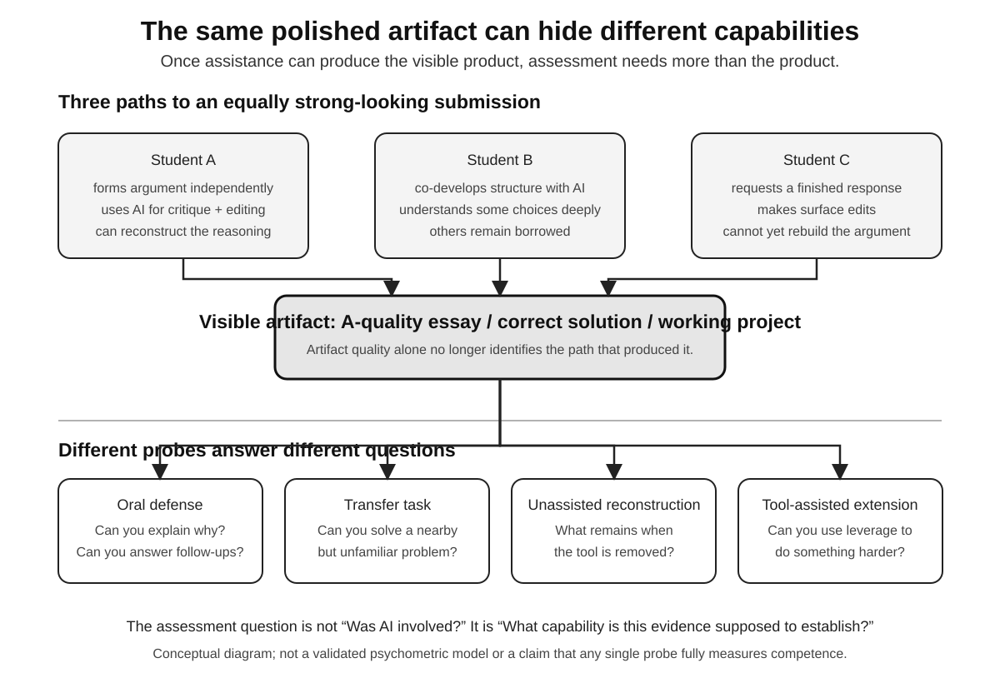

# The Student Who Gets It Right

A student can get better at homework while getting worse at mathematics.

That sounds contradictory only if homework performance and learning are the same variable.

They are not.

Education has always known this. A parent can help too much. A teacher can guide a student through a problem so smoothly that the next problem is impossible alone. Cramming can raise tomorrow's score and leave little behind next month.

Generative AI makes the distinction harder to ignore because the help can be extraordinarily competent.

In a field experiment involving nearly a thousand high-school mathematics students, researchers led by Hamsa Bastani studied GPT-4-based support during practice. One version resembled a relatively open chatbot. Another used teacher-designed safeguards and hints intended to guide students without simply handing over solutions.

During assisted practice, the open GPT condition improved grades by 48 percent relative to control; the safeguarded tutor improved them by 127 percent.

Then the AI went away.

On the later unassisted exam, students from the open GPT condition scored 17 percent below control. The safeguarded tutor largely eliminated that negative effect.

The experiment should not be inflated into a law of AI and learning. It took place in one high school, in mathematics, with particular interfaces and a particular generation of models. The deployment occurred in Fall 2023, and the published paper calls for more work on generalizability and long-term outcomes.

The narrower result is more useful anyway.

**Design can change the relationship between assisted performance and later independent performance.**

The same underlying capability can behave as scaffold or substitute depending on when it enters the task and what it is allowed to do.

That makes the usual policy question—should students be allowed to “use ChatGPT”?—almost useless. A model can explain, quiz, hint, translate, critique, simulate, solve, outline, brainstorm, grade, or complete. Those actions do not ask the same thing of the learner.

Schools have to decide what they are trying to build.

If the goal is a correct artifact, broad assistance may be perfectly sensible. If the goal is changing the student so that future performance improves, the sequence of assistance matters.

Education routinely confuses those products because one is easy to see.

A school produces assignments and grades. Its actual product is harder to inspect: memory, conceptual structure, skill, judgment, curiosity, habits of attention, and the ability to learn something new after the teacher has left the room.

AI can make the visible product almost free.

That creates a measurement crisis.

An essay once served two purposes at once. It was writing, and it was evidence that a student had practiced organizing thought. A homework problem was an answer and evidence that somebody had attempted the procedure. A take-home project was an artifact and, imperfectly, a trace of sustained work.

Once a machine can produce the artifact, the artifact becomes weaker evidence about the student.

*Three equally polished submissions can reflect very different underlying capabilities once powerful assistance is available. The artifact still matters, but it cannot by itself tell an assessor whether the student can explain the reasoning, transfer it, reconstruct it without assistance, or use tools to extend it. Different probes answer different questions. Conceptual diagram by the author; not a validated psychometric model. Evidence boundary informed by Bastani et al. (2025), Kestin et al. (2025), OECD (2026), and UNESCO guidance.*

This is now an explicit policy problem, not merely a classroom annoyance. The OECD's July 2026 spotlight on responsible generative-AI adoption in higher education treats assessment, academic integrity, reliability, equity, and the development of student knowledge and skills as system-level concerns. The useful shift is away from asking whether AI touched an assignment and toward asking what capability the assignment was supposed to measure.

Schools can respond by trying to detect machine use. That may work in narrow settings and fail as models improve. More importantly, it treats the old artifact as sacred instead of asking what evidence of learning should replace it.

Assessment has to move closer to capability.

Can the student explain the argument orally? Solve a neighboring problem? Find the error in a plausible AI answer? Compare two sources and defend the stronger one? Reconstruct the reasoning after the tool disappears? Use the tool to extend an idea rather than merely produce it?

Those assessments are harder to scale.

That may be the point.

Mass education was built partly around artifacts that could be collected and graded efficiently. Generative AI attacks the correlation between artifact quality and individual competence. Preserving the meaning of a credential will require either new evidence or an acceptance that the credential proves less.

The obvious reaction is to move everything into locked rooms without AI.

There is a place for that. Unassisted assessment remains one of the cleanest ways to measure what a person can do without the system. If independence matters, test independence.

But an education designed only around AI-free performance would be as artificial as one designed only around AI-assisted performance. Students will live and work with intelligent tools. They need competence in the combined system too.

The curriculum therefore needs two questions:

1. **What can you do alone?**
2. **What can you do with leverage?**

The second is not trivial. Effective tool use requires framing problems, evaluating output, choosing sources, managing context, iterating, and knowing when to stop. A student who understands a domain can often extract more value from AI because they can ask better questions and catch subtler errors.

Domain knowledge and tool skill can reinforce each other.

The danger is letting tool skill impersonate domain knowledge while the domain knowledge is still being built.

This is why timing matters.

A calculator introduced after a student understands number relationships plays a different role from one introduced before those relationships exist. Translation assistance after a learner attempts a sentence creates a different cognitive event from translation assistance instead of the attempt. Code generation used to compare implementations differs from code generation used before the learner understands variables and control flow.

No universal age or sequence will fit every subject. But the principle is general: preserve enough unassisted work for the learner to build the representations that make assisted work meaningful.

Then use the machine aggressively.

An AI tutor can do things human schooling has struggled to provide at scale. It can answer the fifth follow-up question without impatience. Generate ten examples around one misconception. Shift reading level. Practice a language at midnight. Build quizzes from a student's own errors.

The opportunity is enormous.

The danger is that tutoring and completion share an interface.

The student asks a question. The system decides how much answer to give.

A human teacher uses context to make that choice. Is the student stuck after real effort? Avoiding work? Is the assignment diagnostic? Has frustration crossed from productive to pointless? Is there a misconception worth exposing before the answer appears?

An AI tutor can in principle infer some of this from interaction history. It can also be optimized for satisfaction, engagement, speed, or answer ratings instead of learning.

Those objectives are not the same.

A student may prefer the tutor that gives more help. Parents may prefer the tutor that raises homework scores. Schools may prefer the system that reduces support tickets.

The learning objective needs protection because it can lose every local preference contest.

A polished explanation can feel like understanding. A difficult retrieval can feel like failure. Learning sometimes reverses those feelings later.

Imagine a tutor that records not merely whether the student reached the answer but how assistance changed over time: hints required, confidence before and after, performance on neighboring problems, retention after delay, recurring errors.

Then it withdraws support as competence rises.

A student should periodically meet the task without the tool—not as punishment, but as measurement. If transfer fails, the tutor has learned something about its own teaching.

This is a different philosophy from the answer machine.

The answer machine is judged by whether its answer is good.

The tutor is judged by what the student can do later.

That distinction should become a procurement question. Does the system optimize completion or learning? What evidence supports the claim? Can teachers control assistance? Can the system expose its intervention history? Does it preserve student privacy? Encourage source inspection? Can it be configured to ask before telling?

UNESCO's guidance on generative AI in education emphasizes human-centered, age-appropriate, equitable, and pedagogically validated use. Those principles become less foggy when translated into product behavior.

Pedagogical validation means evaluating the system on learning, not merely satisfaction or answer accuracy.

Equity changes under this frame too.

AI can make individualized support available to students who never had private tutors. That is one of its strongest democratic possibilities. But if affluent schools use AI to supplement expert teaching while under-resourced schools use it to replace teachers, the same technology can widen differences in human support.

The question is not whether AI is present.

It is what disappears when AI arrives.

A student with a great teacher and a great AI tutor may receive more attention than any previous generation. A student handed a tablet because staffing is expensive may receive fluent answers and less human relationship.

Education is cognitive and social infrastructure.

People learn what knowledge is for by watching other people care about it. They learn what confusion looks like, how disagreement feels, how an adult changes their mind, what a serious question does to a room. A machine can participate in some of those interactions. It does not automatically replace the institution in which learning acquires social meaning.

That is not sentimentality. Motivation, identity, norms, and belonging affect whether people persist through difficulty. The best tutoring system still enters a human environment.

The future classroom should not be organized around defending a pre-AI workflow. It should separate production, assistance, and evidence of learning.

Let machines produce when production is the goal.

Let them tutor when learning is the goal.

Test independence when independence matters.

Teach combined capability because combined capability matters too.

And stop grading an artifact as though nobody else could have helped make it.

The student who gets the right answer has accomplished something.

The educational question is what, exactly, they can do next.
