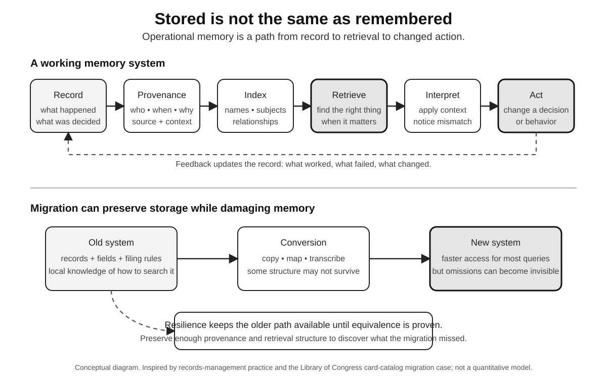

# The Memory Outside Us

Nobody knows how to build a modern city.

Not nobody in the modest sense that the job is difficult. Nobody in the literal sense. No single person contains the knowledge required to design the foundations, route the power, purify the water, schedule the trains, machine the elevator parts, write the building code, finance the bonds, calibrate the hospital equipment, and keep the sewage moving downhill.

People know pieces. Engineers know structures. Electricians know power. Operators know water. Accountants know budgets. Machinists know tolerances. Dispatchers know procedures. Software systems hold inventories and schedules. Standards preserve agreements. Drawings preserve dimensions. Institutions preserve responsibilities.

The city works because intelligence is distributed.

A brilliant person cut off from that distribution would be remarkably helpless.

This matters because there is an easy, wrong version of the argument in this book: real intelligence lives inside individual human heads; external aids weaken it; memory is virtuous when biological and suspect when stored elsewhere.

Civilization is evidence against that story.

Edwin Hutchins made the point vividly in *Cognition in the Wild*, his study of navigation aboard a U.S. Navy ship. Navigation was not best understood as one navigator solving a problem internally. Information moved through instruments, charts, procedures, people, spoken commands, and changes in representation. The cognitive task belonged to a system.

The ship knew where it was in a sense no individual component could claim alone.

Andy Clark and David Chalmers pushed a related argument in philosophy with “The Extended Mind.” Their famous thought experiment asks whether an external notebook can, under the right conditions, play the functional role we normally assign to memory. If information is reliably available, automatically trusted, and integrated into action, why insist that cognition stops at the skin?

The argument remains debated. Its practical value does not depend on settling the philosophy.

The boundary of a useful mind is not obvious.

A person with a notebook, search engine, colleague, calculator, and AI system can be more capable than the same person alone. Treating every external contribution as a loss of human intelligence mistakes cooperation for weakness.

John Hardwig's work on epistemic dependence makes the social version harder to avoid. Modern knowledge requires trusting other knowers. No physicist personally verifies every theorem, measurement, instrument calibration, and manufacturing process behind a new experiment. No physician reproduces the biomedical literature before treating a patient. No citizen can validate every economic statistic, legal doctrine, weather model, and engineering standard needed for ordinary life.

We know by depending.

The serious question is how dependence becomes rational.

Trustworthy knowledge systems provide reasons to trust beyond the pleasantness of the answer. Reputation, professional norms, transparent methods, replication, adversarial review, audit, liability, source access, calibration, and institutional memory all let us rely on knowledge we did not personally produce.

AI can enter that system as another cognitive partner, and an unusually powerful one.

A model can range across more text than any person, translate between specialties, search with tools, synthesize material, and remain available to billions of users. It can become a front door to distributed human knowledge.

That could increase human intelligence in a meaningful sense.

A small-business owner can ask questions once reserved for specialists. A patient can arrive at an appointment with a vocabulary for symptoms. A student can interrogate difficult material without exhausting a tutor. A scientist can cross into an adjacent literature before lunch. A programmer can work in a language learned yesterday. Someone who struggles to write can speak an idea and get help turning it into text.

The expansion is not fake because the capability is shared with a machine.

We do not call a scientist fraudulent for using a microscope.

The mistake would be evaluating only the unaided human when the real actor is the coupled system.

This is the strongest counterargument to the thesis of abdication, and it deserves to be allowed to win where it wins.

Perhaps humanity is not handing over intelligence.

Perhaps it is extending intelligence again.

Writing externalized memory. Printing scaled access. Telecommunications stretched collaboration across distance. Computers externalized calculation and storage. Search externalized retrieval. AI externalizes parts of synthesis and inference. Each step can be read as the collective mind acquiring another organ.

On this view, demanding that individuals preserve every displaced capacity is like complaining that nobody can lift a shipping container without a crane.

The crane is part of the system now.

There is real force in this argument because it changes what counts as decline.

If people remember fewer isolated facts but solve harder problems because retrieval is effortless, civilization may be more intelligent. If junior workers perform near expert levels with assistance, their unaided performance is not the whole economically relevant fact. If doctors supported by models make fewer diagnostic errors, the combined outcome matters more than preserving the old choreography of reasoning.

Human history contains many cases where losing an individual skill accompanied gaining a collective one.

Specialization itself looks like cognitive abdication if the unit of analysis is the isolated person. I do not know how to make the medicine I take. I cannot repair the electrical grid. I rely on people I will never meet.

The arrangement works because responsibility is distributed rather than abolished.

That is the boundary.

Distributed cognition works when the parts remain connected by meaningful interfaces and failure can be located, challenged, and repaired.

A ship's navigation team has roles. A chart has conventions. An instrument has a reading. A command can be repeated back. Errors still propagate, but the system offers surfaces where disagreement can become visible.

A generated answer can compress many layers into one surface.

Compression is useful. It can also erase the structure of dependence.

If I ask an AI system for medical guidance, what exactly am I depending on? A clinical guideline? A statistical pattern in training data? A retrieved article? A vendor policy? A safety layer? An inference assembled from the peculiar wording of my question?

The answer may be excellent.

The dependency can still be difficult to inspect.

This is not a philosophical objection to external cognition. It is an engineering objection to opaque coupling.

The extended mind needs a good nervous system.

When a notebook contains an entry, I can see the entry. When a colleague gives advice, I can ask what they are basing it on. When a navigation display gives a position, the system can expose the state of the equipment behind that position. Mature cognitive infrastructure develops ways to tell users what kind of thing they are relying on.

AI interfaces need the same ambition.

Source-backed answers are one beginning. Tool traces, explicit uncertainty, model identity, data provenance, and a clear separation between retrieval and inference can help. So can organizational policies that maintain more than one source of truth for consequential processes.

Inspectability, though, is only half the dependency problem.

The other half is replacement.

If the cognitive partner disappears, what survives?

In a healthy distributed team, one person's departure hurts without necessarily erasing the function. Knowledge is partly redundant. Procedures are documented. Other people can learn the role. The organization degrades rather than vanishes.

Concentrated AI infrastructure can behave differently. Thousands of organizations may depend on the same model provider, cloud service, or underlying architecture. Local variety can sit on top of upstream sameness.

Standardization makes systems cheaper and more interoperable. Concentration makes some failures travel farther.

The answer is not universal duplication. Building an independent frontier model for every hospital would be absurd. The useful question is which layers require portability, fallbacks, local records, or the ability to limp along.

A clinic might depend on a cloud diagnostic assistant while retaining patient records in a standard form, documented clinical protocols, and staff who can continue at lower throughput during an outage. A law firm might use AI research while preserving source databases and professional competence. A government agency might use vendor models while maintaining procurement expertise, audit access, and a tested migration path.

That is cognitive resilience: dependence without captivity.

Food systems offer a less exotic analogy. Few city residents should grow all their own food. Agriculture at scale is a triumph of specialization. Yet societies still care about supply chains, reserves, contamination tracing, supplier diversity, and what happens when one component fails.

We do not answer dependency by telling everybody to plant wheat in the bathtub.

We build resilient systems.

The same should be true of intelligence.

Memory becomes clearer through the same lens. Instead of asking whether external systems make us forget, ask what the combined system must remember and where that memory should live.

A person need not remember every fact. An institution should remember why a critical rule exists. A profession should remember its failure modes. A democracy should preserve public records. A software team should know which assumptions its systems depend on. A patient should be able to retrieve a medical history after a vendor disappears.

Memory can move without becoming irrelevant.

The [Library of Congress card catalog](https://guides.loc.gov/card-catalog) is a useful test. It grew to more than 22 million cards before new cards stopped being added in 1980. Much of that bibliographic memory was later converted into an online catalog, which is faster and easier for most searches. But the conversion was not equivalent to perfect transfer. The Library says thousands of cards were never converted; some online records lost subtitles, content notes, or series information; transcription errors can make other records disappear from keyword search. In 2025, as the Library prepared millions of cards for offsite storage, staff were building inventory records so the old catalog could still be requested and used because parts of it remain uniquely informative.

Nothing mystical happened to the missing information. The records still existed. What changed was the path by which a person could find them.

A migration can preserve the archive and damage the memory.

*A record is not operational memory merely because it survives. It must remain attributable, findable, interpretable, and capable of changing action. Migration can improve access overall while still losing fields, context, or retrieval paths; preserving the older path until equivalence is demonstrated can make those losses discoverable. Conceptual diagram by the author; documentary anchor: Library of Congress card-catalog history and National Archives records-management guidance.*

External memory can even outlast biological memory. People die. Books persist. Staff leave. Records remain. A maintained knowledge base can carry a lesson across generations better than a story whispered down a hallway.

But storage can become a mausoleum.

An archive nobody retrieves is not operational memory. A policy nobody understands can preserve obsolete practice perfectly. A model trained on historical records may reproduce an old pattern without preserving the argument that later caused people to reject it.

Storage is not memory in the institutional sense.

Memory changes action.

That is why the extended-mind counterargument ultimately sharpens this book rather than defeating it.

If cognition genuinely extends into tools and institutions, their design is part of the design of human intelligence. They are not accessories sitting safely outside the argument.

A badly designed AI system can become a badly designed component of a larger cognitive organism.

That raises the stakes for interface, provenance, resilience, learning, and authority.

It also changes the goal.

We are not trying to preserve an imaginary pure human mind from contamination.

We are trying to build coupled systems that make the whole more capable without leaving the human and institutional parts unable to understand what role they still play.

The best future may contain people who remember fewer isolated facts and solve much harder problems. Professions may let machines perform most routine analysis while humans concentrate on goals, exceptions, relationships, and accountability. Schools may give every student an intelligent tutor and free teachers from repeating the same standardized explanation. Governments may make law machine-readable and let citizens interrogate their rights in ordinary language.

All of those futures fit the argument here.

The test is not whether cognition is outside us.

It has always been outside us.

The test is whether the larger system preserves agency, contestability, learning, and recovery.

A notebook that remembers for you can make you smarter.

A system that remembers for everyone can make civilization smarter.

But if nobody knows what the system has forgotten, the extension has become an abdication.
