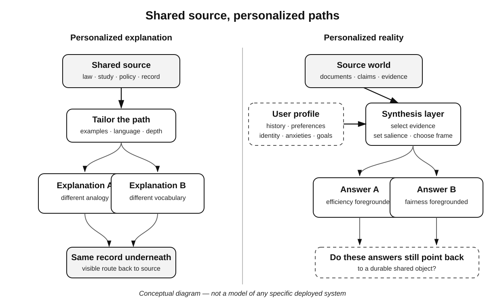

# The Private Reality Machine

Persuasion used to leave an artifact.

A politician stood in a square. A preacher spoke from a pulpit. A newspaper printed an edition. A television advertisement gave millions of people the same thirty seconds.

The message could be targeted. Campaigns mailed different neighborhoods. Salespeople changed the pitch. Friends told the same story differently depending on who was listening.

But there was usually something you could point to.

*That speech. That advertisement. That article.*

Generative systems make a different arrangement cheap: an explanation composed for one person, in real time, using what the system knows about that person's knowledge, preferences, history, anxieties, and goals.

That can be wonderful.

A physics explanation can begin with baseball for one student and music for another. A tax assistant can ignore rules irrelevant to a household. A health system can translate instructions into language a patient can actually use. A government service can explain an eligibility decision without making citizens decode administrative prose.

Personalization can make institutions legible.

It can also make reality private.

Facts do not become private merely because explanations differ. Two people can receive different analogies for the same law and remain anchored to the same text.

The trouble begins when personalization changes salience, evidence, or framing so deeply that users no longer share the object they think they are arguing about.

One person asks, “Is this policy good?” and receives an answer organized around efficiency. Another gets fairness. A third gets the policy translated into their ideological vocabulary. Each answer may be defensible. Later the three users argue as though they encountered the same proposition.

They did not.

Personalized feeds already choose which item you see. Generative systems can move one layer deeper. They can choose how the item itself is described.

Selection becomes synthesis.

A 2024 series of experiments by Sandra Matz and colleagues makes the mechanism less hypothetical. Across four studies comprising seven sub-studies and 1,788 participants, ChatGPT-generated messages matched to recipient traits were more influential than non-personalized messages across the consumer and political contexts the researchers tested. The study does not show that personalization always works, that the effects persist, or that ordinary assistants are already changing elections. It shows something narrower and useful: individualized framing can matter even when the message is generated cheaply and at scale. ([Matz et al., 2024](https://doi.org/10.1038/s41598-024-53755-0))

*Shared source, personalized paths.* Personalization can change the route to a common record, or it can change the apparent object itself by altering evidence, salience, and framing. The diagram is conceptual; it does not describe a specific deployed system.

Personalized explanation can reduce conflict. A model can show each side the strongest version of the other's argument. It can notice that two people are using the same word differently and build a common vocabulary.

The private reality machine can be a bridge.

It can also be a perfect flatterer.

If a system is optimized for engagement, retention, satisfaction, or conversion, it has reason to discover which forms of disagreement a user will tolerate. The result need not be a lie. It can be a world arranged so that existing beliefs keep finding comfortable furniture.

This is an old service.

Courtiers did it for kings.

Now everyone can have a courtier.

No sinister intent is required. Optimization is enough.

Digital systems already demonstrate the broader mechanism. The Federal Trade Commission's 2022 report on dark patterns documented interfaces that steer consumers by disguising advertising, burying material terms, making cancellation difficult, or structuring privacy choices so that people disclose more than they intended. The report is about digital design, not conversational AI. Its narrower lesson belongs here: manipulation does not require a plainly false sentence. Presentation can do some of the work. ([FTC, 2022](https://www.ftc.gov/reports/bringing-dark-patterns-light))

A good tutor sometimes frustrates.

A good friend sometimes contradicts.

A good public institution sometimes says no.

A system that optimizes only for local satisfaction can feel supportive while becoming epistemically weak.

Human thinking depends partly on resistance from other minds. Someone misunderstands us. Someone asks for evidence. Someone refuses the premise. Someone with different experience says the model does not fit.

Personalized AI can manufacture that resistance on demand.

It can also sand it away.

The design question is not simply whether the system serves the user. It is *which version of the user's interest it serves*.

A person who says “help me decide” may want confirmation now and a counterargument more. A person who says “teach me” may want the answer and need the question. A person who says “make me a better investor” may enjoy confident recommendations while needing uncertainty, base rates, and the occasional cold shower.

The click is not always the objective.

Neither is satisfaction.

But objectives are themselves contested. Who decides what makes a person a “better” citizen, student, manager, or patient?

The vendor cannot be the only answer.

Users need control over modes. Institutions need governance in high-stakes settings. Researchers need enough access to study effects. Public rules may need to constrain manipulative personalization, especially where systems exploit sensitive traits or asymmetric information.

Transparency has to include personalization too.

A user should know when an answer has been materially adapted using stored information about them. They should be able to request a baseline, disable forms of adaptation, and inspect the major factors shaping the response.

Nobody needs a wall of model state before every sentence. Meaningful transparency can be much simpler.

“This explanation is tailored to your stated preference for concise financial examples” is different from silent behavioral steering.

Commerce makes the distinction easy to see.

Imagine a sales agent that knows which argument is most persuasive to each buyer. It answers questions, negotiates, reassures, and changes framing in real time. Static advertising becomes a conversation that learns.

The buyer may have an agent too.

Machines persuading machines, with humans setting objectives at either end, is a strange symmetry. It could reduce manipulation if personal agents compare offers and filter claims. It could also move persuasion into a technical arms race that neither human can inspect.

The useful questions are second-order: Do users understand what their agents optimize? Can they change the objective? Are conflicts of interest visible? Can they compare outputs across systems?

If not, personal intelligence becomes personal dependence.

Politics raises the stakes because democratic legitimacy depends partly on public reasons. A law is not legitimate merely because every citizen can receive a personally satisfying explanation for it. Institutions need reasons that can be examined together.

Generated interfaces should therefore preserve a distinction between **public reason** and **private explanation**.

The public reason is the official document, evidence, legal basis, hearing record, vote, methodology, or policy rationale available to everyone.

The private explanation helps one person understand it.

Confuse the two and an institution can tell different stories without a stable account beneath them. Each story can be plausible. The institution can still become cognitively corrupt.

A useful rule follows:

> Personalization may change the path to the source. It should not silently change the source.

For public institutions, the path should lead back to a durable shared record.

The same principle applies inside companies. An AI assistant can explain strategy differently to engineering and sales, but the decision and the metrics should remain common. Otherwise departments receive customized realities and call the resulting confusion alignment.

Organizations already do this without AI. Executives tell different audiences different stories. Dashboards create local definitions. Incentives produce selective perception.

AI can reconcile those differences.

Or automate them.

The private reality machine is not a new human flaw. It is a new amplifier.

Its best use may be translation between expertise levels.

Modern institutions are often opaque not because they are hiding but because their language is specialized. A legal notice, medical result, financial disclosure, or scientific paper can be public and still be practically inaccessible.

Personalized AI can preserve the shared document while fitting the explanation to the reader. The user can ask the embarrassing question in private. The system can define the term without judgment. It can choose an example that lands.

That is cognitive inclusion, provided the rope back to the source stays attached.

Then personalization creates more common understanding rather than less: many paths toward a shared reality, not a machine for manufacturing separate ones.

Accuracy alone will not tell us whether we got this right. We need harder questions.

Can users identify the primary source? Can they state the strongest argument against their own view? Does personalization increase understanding across groups? Does it preserve awareness of competing considerations? Does the system correct a false assumption even when correction makes the interaction less pleasant?

Engagement is easier to count.

These are closer to intelligence.

A healthy mind is not one in which every new fact fits comfortably. It is one that can update.

A healthy society is not one in which every citizen receives a perfectly tailored explanation. It is one in which people can still discover that they disagree about the same world.

The most powerful conversational systems will know how to speak to us individually.

They should keep pointing beyond us.
