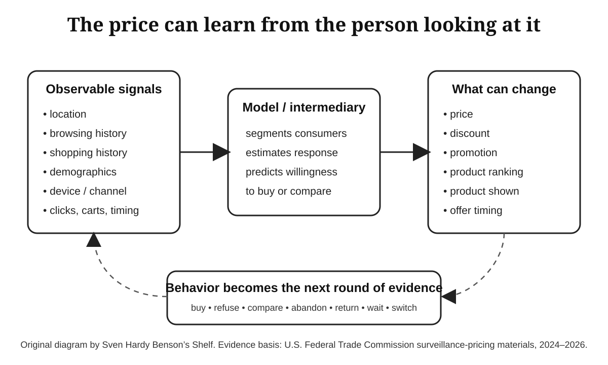

# Chapter 10 media enrichment — surveillance pricing

## Added asset

**Asset:** `../assets/ch10-surveillance-pricing-loop.svg`

**Purpose:** A reader-facing explanatory figure for *The Price Looking Back at You*. It visualizes the feedback loop at the center of the chapter: observable consumer signals can feed a model or intermediary; the resulting inference can change a price, promotion, ranking, product, or offer; the consumer's response then becomes fresh behavioral evidence.

**Recommended manuscript placement:** immediately after the paragraph ending, “The consumer influences the machine by behaving. The machine influences the consumer by changing the environment built from that behavior.” That placement makes the figure explanatory rather than decorative and lets the reader see the loop before the chapter turns to strategic consumer behavior.

**Recommended Markdown:**

```md


*Figure 10.1 — The surveillance-pricing loop. A consumer's location, browsing and shopping history, demographics, device or channel, and behavioral signals can inform segmentation or inference; those outputs can influence prices, discounts, promotions, rankings, or offers; the response becomes new data. Original diagram. Evidence basis: U.S. Federal Trade Commission surveillance-pricing materials, 2024–2026.*
```

## Rights and provenance

The figure is an **original project-created diagram**. It does not reproduce the layout, artwork, screenshots, logos, seals, photographs, or other expressive elements of an FTC publication. It translates factual relationships documented by the FTC into a new visual composition.

### Evidence sources

1. **Federal Trade Commission — “FTC Surveillance Pricing Study Indicates Wide Range of Personal Data Used to Set Individualized Consumer Prices,” January 17, 2025.**
   - URL: https://www.ftc.gov/news-events/news/press-releases/2025/01/ftc-surveillance-pricing-study-indicates-wide-range-personal-data-used-set-individualized-consumer
   - Supports: use of location, demographics, browsing patterns, shopping history, mouse movements, cart behavior, and other data in targeted pricing or promotional systems; intermediary role; differentiated products/prices/promotions.

2. **Federal Trade Commission — “Issue Spotlight: The Rise of Surveillance Pricing,” January 2025.**
   - URL: https://www.ftc.gov/system/files/ftc_gov/pdf/sp6b-issue-spotlight.pdf
   - Supports: data-source taxonomy, data-broker/intermediary role, prices and other outputs that can vary between consumers, and the distinction between personalized pricing and adjacent forms of targeting.

3. **Federal Trade Commission — “Federal Trade Commission’s Proposed Enforcement Policy Statement Regarding Personalized Pricing,” August 19, 2026.**
   - URL: https://www.ftc.gov/legal-library/browse/federal-trade-commissions-proposed-enforcement-policy-statement-regarding-personalized-pricing
   - Supports: current FTC definition of personalized pricing as use of personal data to set prices according to an estimate of what an individual consumer is willing to spend; proposed disclosure/enforcement posture.

4. **Federal Trade Commission — Website Policy, copyright permission section.**
   - URL: https://www.ftc.gov/policy-notices/website-policy
   - Rights note: the FTC states that most material on its website is U.S. Government work in the public domain under 17 U.S.C. §105, while warning that third-party material can remain copyrighted and that government seals/logos must not be misused. This asset avoids those edge cases by using no FTC artwork at all.

5. **U.S. Copyright Office — 17 U.S.C. §105.**
   - URL: https://www.copyright.gov/title17/92chap1.html#105
   - Rights note: U.S. copyright protection is generally unavailable for works of the United States Government, subject to statutory exceptions. This is useful as a rights-screening rule, not as a blanket assumption that everything hosted on a `.gov` page is free of third-party rights.

## Source-integrity correction identified

The current Chapter 10 text says:

> “On August 31, 2026, the FTC sought comment on a draft enforcement policy statement addressing personalized pricing practices.”

The underlying proposed enforcement policy statement is dated **August 19, 2026**. The FTC press release was later **updated on August 31, 2026** to correct an earlier error. The manuscript should therefore use August 19, 2026 when dating the policy statement itself.

The FTC subsequently extended the public-comment deadline to **September 25, 2026**. If the manuscript mentions the comment period, use the extended deadline rather than the original September 18 deadline.

Source: https://www.ftc.gov/news-events/news/press-releases/2026/09/ftc-extends-public-comment-proposed-policy-statement-regarding-personalized-pricing

## Formatting specification for the reader

- Keep the figure at full text-column width in reflowable digital editions; do not place prose beside it.
- Preserve the SVG viewBox so the figure remains sharp in EPUB/web and can be rasterized at print resolution if a print workflow requires PNG/TIFF.
- Keep caption text below the figure, left aligned, with the figure number and short title first.
- Do not place the legal/provenance detail in the visible caption. Put full source and rights information in research metadata or endnotes; the visible caption should remain readable.
- Keep alt text descriptive rather than interpretive. It should state the flow shown, not tell the reader what conclusion to draw.
- Do not use the FTC seal or imply agency endorsement.

## High-value next media opportunities

1. **Chapter 11 — feed allocation experiments:** build an original three-panel comparison figure distinguishing *exposure changed / attitudes did not measurably move*, *exposure changed / attitudes moved under specific conditions*, and *feed design is not a binary choice between algorithmic and chronological*. Use effect directions and study design labels, not copied journal figures.
2. **Chapter 7 — work for the score:** create an original worker/platform asymmetry diagram showing one worker's observed outcome versus the platform's population-level experiment and optimization view.
3. **Chapter 13 — answer engines:** create a before/after information-flow figure showing publisher → search result → user versus publisher → answer engine synthesis → user, with source visibility and click-through represented separately.
4. **Historical media:** search Library of Congress and National Archives collections for public-domain material that can establish historical continuity in scoring, catalog commerce, direct marketing, audience measurement, and political persuasion. Record item-level rights statements; do not infer public-domain status solely from repository ownership.
