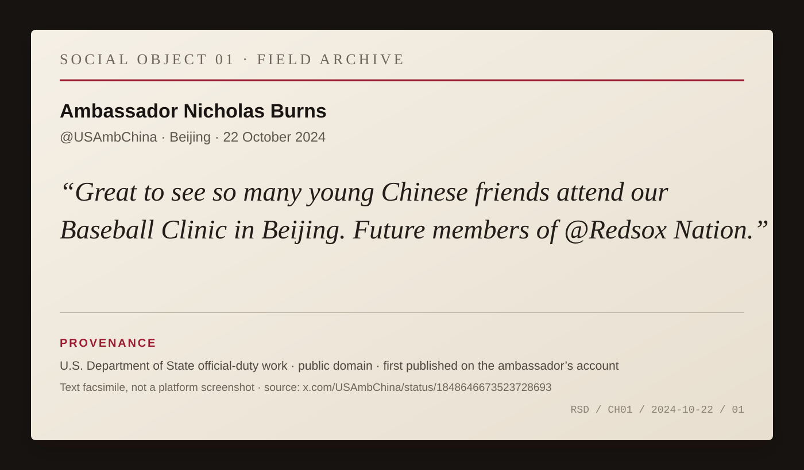
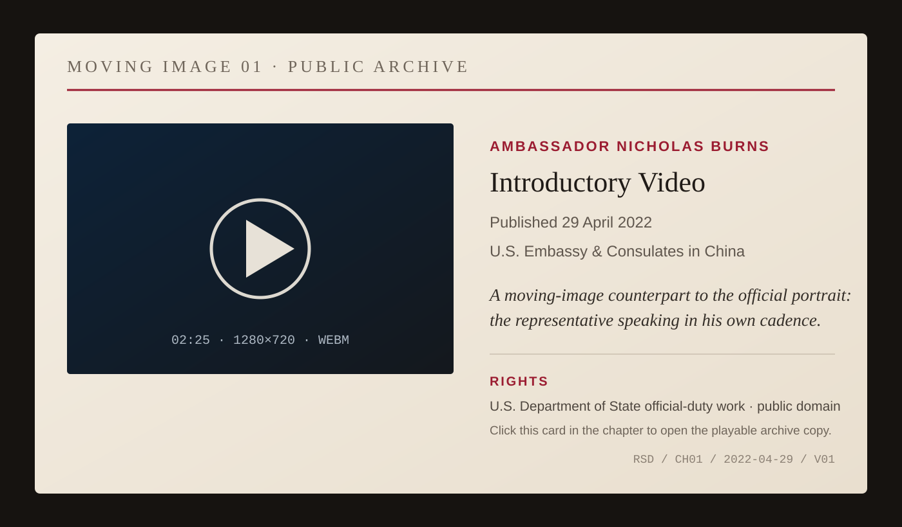

# Chapter 1 — Boston Before Washington

Before a diplomat represents a country, he has to come from somewhere.

This sounds too obvious to mention. Official biographies encourage the opposite impression. They begin with appointments. Ambassador to this country. Assistant secretary for that region. Degrees, dates, decorations. The person appears to enter history already wearing a suit.

*FIG. 01 — R. Nicholas Burns, official portrait as U.S. Ambassador to China, January 25, 2022. U.S. Department of State. Public domain. A late-career portrait placed here deliberately: the official image arrives before the hometown. [Archive record.](https://commons.wikimedia.org/wiki/File:Nicholas_Burns,_U.S._Ambassador.jpg)*

Nicholas Burns came from Massachusetts.

More particularly, he grew up in Wellesley.

Years later, when a sportswriter asked about his own baseball credentials, Burns located the high point of his playing career in the Wellesley Babe Ruth League. It is a wonderfully modest credential. Not college ball. Not a tryout. Not some lost almost-professional mythology. Organized youth baseball in a Massachusetts town.

That matters because it gives the baseball in this story a physical beginning.

Before Red Sox Nation became a phrase Burns could use behind a State Department podium, baseball was a game he had actually played.

The surviving evidence does not yet tell us his position, his team, his batting average, or which fields he played on. It does not justify placing a glove on one hand or a particular uniform on his back. But it does establish the important thing cleanly: the sport was not merely watched from a distance.

That fact would remain visible.

Boston is unusually generous to biography because it supplies its residents with identities they can carry elsewhere without explanation. The accent may fade. The affiliations do not. Neighborhood, school, parish, university, politics, teams: each can become a shorthand for belonging.

The Red Sox are among the most portable.

For a child growing up in Massachusetts in the second half of the twentieth century, the team offered something more complicated than uncomplicated civic pride. Fenway Park was old even then. The club possessed history in abundance and championships in scarcity. Generations inherited stories of seasons that had ended before they were born.

Burns's own family supplied one version of that inheritance.

In a 1997 State Department briefing, after reporters pulled him once again into Red Sox talk, Burns said his mother was a fan. Then he supplied the older family warning in his own words:

> *“My father, however, said they broke his heart in the 1930s. He advised us never to root for them.”*

And then, after the laughter:

> *“But I didn’t follow his advice.”*

*ARCHIVE NOTE — U.S. Department of State Daily Press Briefing, June 16, 1997. [Primary transcript.](https://1997-2001.state.gov/www/briefings/9706/970616db.html)*

There is no need to improve that story.

A father says: spare yourself.

A son roots for them anyway.

By the time Burns was eleven, the 1967 Red Sox had produced the Impossible Dream season. At nineteen came Carlton Fisk waving a home run fair in the 1975 World Series and Cincinnati winning the championship the next night. In Burns's Boston College graduation year, 1978, the Yankees erased a huge summer deficit and Bucky Dent put a home run over the Green Monster in the division tiebreaker. Those are facts about the baseball culture surrounding his Massachusetts life, not yet memories we can assign to him. The distinction matters. We do not know where he watched those games, whether he attended them, or which one mattered most.

We know enough without pretending.

He played baseball in Wellesley. His mother rooted for the Red Sox. His father carried an older generation's disappointment and warned the children away. Burns chose the team anyway.

That is already a real inheritance.

Burns would later speak publicly and casually about being part of Red Sox Nation. The phrase mattered less than the ease with which he used it. Baseball did not appear as a hobby appended to the official biography. It functioned as identification.

I am from there.

I am one of those people.

This is useful information in diplomacy.

Not because foreign officials need to know an ambassador's team.

Because diplomats spend their lives translating abstractions into people.

The United States is too large to be represented by a single biography. The American ambassador abroad nonetheless becomes a recurring human encounter with it. A counterpart may understand American policy through documents, intelligence, newspapers, and presidential speeches. Then the ambassador walks into the room carrying a regional accent, a school history, a spouse, children, habits, jokes, impatience, loyalties, and preferences that were not written into the instructions cable.

The contradiction cannot be eliminated.

It can be used honestly.

Burns's later career would depend on the ability to separate personal identity from official authority without pretending personal identity had vanished. He could be from Boston and speak for Washington. He could serve presidents of both parties without requiring counterpart governments to care about his private politics. He could love the Red Sox and negotiate with someone who had never watched an inning.

The point was not to become neutral as a human being.

It was to become reliable as a representative.

There is a difference.

Reliability is one of the least romantic virtues in diplomacy and one of the most valuable. Does this person carry the message accurately? Will he report my answer accurately? Does he distinguish what he personally thinks from what his government has decided? If he says he will take something back to Washington, will it actually reach Washington in recognizable form?

A counterpart who trusts those things can disagree with almost everything else.

This book will follow Burns through rooms where reliability mattered more than charm. But charm, humor, and cultural fluency have their uses because trust does not develop only through formal propositions.

People test one another at the edges.

They talk before the meeting begins. They notice what the other person remembers. They discover whether a joke lands. They ask about children, cities, schools, weather, food, sports. None of this replaces the negotiation. Sometimes it determines whether the negotiation begins between strangers or between people who have acquired a small reserve of social credit.

Baseball gave Burns one such reserve.

It was also a reminder of home during a career structured around leaving it.

The Foreign Service repeatedly uproots the ordinary architecture of belonging. A posting is temporary by design. Families move. Children change schools. Friendships compress. An officer learns a city intensely while knowing that departure is already built into arrival.

Sports fandom behaves differently.

The team stays put.

The fan moves.

That asymmetry makes teams strangely useful companions to expatriate life. A box score crosses borders easily. A season supplies continuity. The games continue in the home city while the fan wakes in another time zone.

There is a danger in making too much of this. Burns did not choose diplomacy because of baseball, and no responsible biography should reverse-engineer foreign policy from childhood fandom.

The useful connection is smaller.

He carried a local identity into a global profession.

That identity kept surfacing because it was real.

*FIG. 02 — Ambassador Burns with young Chinese baseball fans, Beijing, October 22, 2024. U.S. Department of State / @USAmbChina. Public domain. This is a later-life echo, not evidence about Wellesley: the local allegiance has simply survived the distance. [Archive record.](https://commons.wikimedia.org/wiki/File:Ambassador_Burns_with_Chinese_baseball_fans.png)*

The American diplomatic tradition has often struggled with how its representatives should present the country abroad. Too much ceremony and the ambassador can look imperial. Too much informality and the office loses weight. Too much patriotic performance and foreigners hear propaganda. Too much distance from home and the diplomat risks becoming the caricature of a cosmopolitan elite who understands every capital except his own.

A baseball team solves none of these problems.

It can puncture them.

To say you are a Red Sox fan is to make a claim about America that is modest enough to be believable. It says the country contains loyalties that are not ideological. It contains inherited disappointment. It contains ridiculous hope. It contains arguments that matter intensely and not at all.

That America can be easier to meet than the superpower.

Years later, Burns would stand behind the State Department podium speaking officially for the United States. He would represent the country in Athens. He would sit at NATO during the aftermath of the deadliest terrorist attack on American soil. He would negotiate nuclear questions with governments whose decisions carried consequences far beyond a baseball season.

The scale would change.

The person would not disappear.

Boston came with him.

*MOVING IMAGE 01 — Ambassador Nicholas Burns’s introductory video, U.S. Embassy & Consulates in China, April 29, 2022, 2:25. Public domain. The prose ends at home; the archive keeps moving.*
