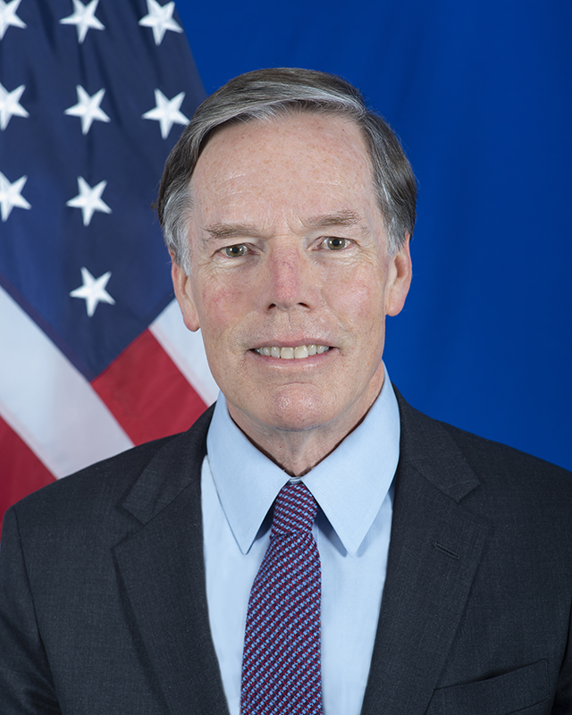
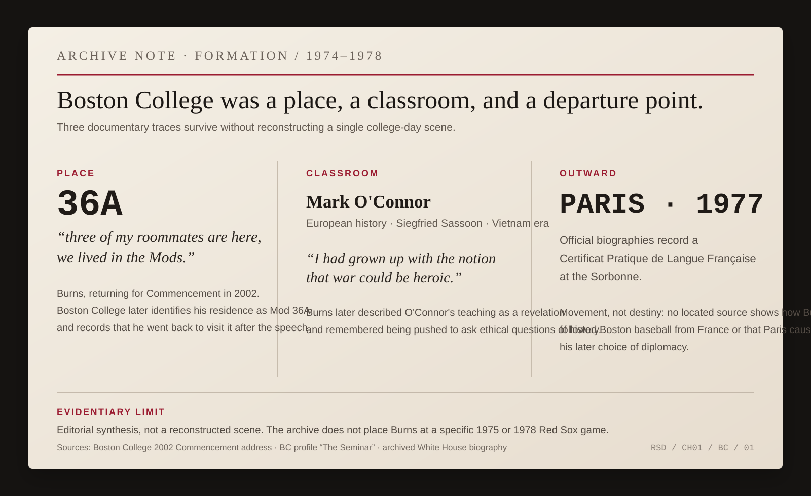
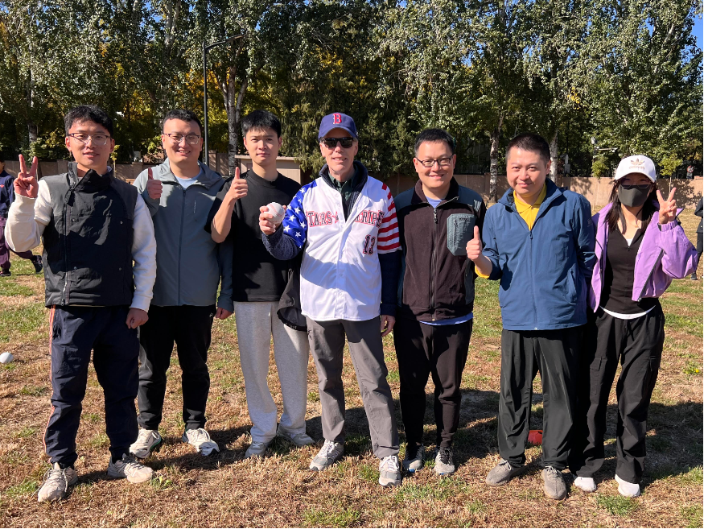

# Chapter 1 — Boston Before Washington

Before a diplomat represents a country, he has to come from somewhere.

Official biographies make this easy to forget. They begin with appointments. Ambassador to this country. Assistant secretary for that region. Degrees, dates, decorations. The person seems to enter history already wearing a suit.

*FIG. 01 — R. Nicholas Burns, official portrait as U.S. Ambassador to China, January 25, 2022. U.S. Department of State. Public domain. A late-career portrait placed here deliberately: the official image arrives before the hometown. [Archive record.](https://commons.wikimedia.org/wiki/File:Nicholas_Burns,_U.S._Ambassador.jpg)*

Nicholas Burns came from Massachusetts.

More particularly, he grew up in Wellesley.

For a long time, the cleanest evidence for his own playing life began at Babe Ruth League age. Then, in Beijing in 2024, Burns supplied an earlier memory himself.

He was speaking at the American embassy's Independence Day celebration. The theme was *America the Beautiful*. Burns explained that the song carried a particular Wellesley resonance for him. As a boy, he and his friends had played Little League baseball at Bates School, the school named for Katharine Lee Bates, the Wellesley writer who gave the country the words to *America the Beautiful*.

The memory is almost suspiciously well shaped for this book.

That is why the source matters.

The connection is Burns's, not ours.

He was the American ambassador in Beijing, on the Fourth of July, reaching back to a Wellesley Little League field beside a school named for the author of the patriotic song around which the embassy had organized the evening.

No metaphor has to be manufactured around it.

It happened.

*ARCHIVE NOTE — U.S. Embassy & Consulates in China, “Ambassador Nicholas Burns' Remarks on Independence Day,” July 4, 2024. Burns says the song had “special resonance” for him and his friends as they played Little League at Bates School. [Primary transcript.](https://china.usembassy-china.org.cn/ambassador-nicholas-burns-remarks-on-independence-day/)*

The local geography still exists. Wellesley municipal records identify the athletic complex beside Bates as Kelly Field, a cluster of youth fields that includes baseball diamonds. That does not let us assign Burns to a present-day diamond or reconstruct the 1960s layout. His own memory gives us enough: Little League, friends, Bates School, Wellesley.

Years later, when a sportswriter asked about his baseball credentials, Burns located the high point of his playing career in the Wellesley Babe Ruth League.

It is a wonderfully modest credential.

Not college ball. Not a tryout. Not some lost almost-professional mythology. Organized youth baseball in a Massachusetts town.

Taken together, the two recollections give the playing life a sequence.

Little League at Bates School.

Then the Wellesley Babe Ruth League.

The surviving evidence does not tell us his team, position, batting average, coach, uniform number, or exact seasons. It does not justify putting a glove on one hand or a particular jersey on his back. One location is secure because Burns named it himself. The rest should remain blank until the archive earns it.

Before Red Sox Nation became a phrase Burns could use behind a State Department podium, baseball was a game he had actually played.

The team he inherited was not an uncomplicated institution.

Burns was born in 1956. Three years later, Pumpsie Green became the first Black player to appear for Boston, making the Red Sox the last major-league club to integrate. Burns was a small child; there is no basis for assigning him any awareness of that history at the time.

But the history belongs to the team he inherited.

Fenway, family loyalty and civic romance came with older exclusions too. A hometown polished into nostalgia would be less accurate and less interesting.

Burns's own family supplied the more intimate inheritance.

In a 1997 State Department briefing, after reporters pulled him once again into Red Sox talk, Burns said his mother was a fan. Then he supplied the older family warning in his own words:

> *“My father, however, said they broke his heart in the 1930s. He advised us never to root for them.”*

And then, after the laughter:

> *“But I didn’t follow his advice.”*

*ARCHIVE NOTE — U.S. Department of State Daily Press Briefing, June 16, 1997. [Primary transcript.](https://1997-2001.state.gov/www/briefings/9706/970616db.html)*

There is no need to improve that story.

A father says: spare yourself.

A son roots for them anyway.

That spring, the family briefly occupied the same public frame. At Worcester Polytechnic Institute's commencement, Burns introduced himself as a native New Englander and a long-suffering Red Sox fan. He traced an uncle, three cousins and a family manufacturing business into Worcester, then pointed out that his parents, Bob and Esther Burns, were sitting in the audience.

The transcript does not tell us how either parent reacted to the baseball line.

It does something better. It places the people behind the inheritance in the room while their son was already using that inheritance as public identification.

*ARCHIVE NOTE — U.S. Department of State, “Preparing for the International Age,” commencement address at Worcester Polytechnic Institute, May 24, 1997. The surviving web transcript identifies Burns as a native New Englander and long-suffering Red Sox fan, names Worcester family ties, and says Bob and Esther Burns were present. The next clause after “were raised” is truncated in the web archive and is not reconstructed here. [Primary transcript.](https://1997-2001.state.gov/policy_remarks/970524.burns.html)*

The Massachusetts life had already begun to open outward before college.

The 1974 *Wellesleyan* yearbook records that the high school sent Nick Burns to Luxembourg for three months through American Field Service while another student went to Belgium. The club's motto, printed beneath the account, was “Walk Together, Talk Together.”

It would be too neat to treat a high-school exchange as the origin story of a diplomatic career. Adolescents do not become ambassadors because a yearbook slogan tells them to talk together.

But the juxtaposition is real. The boy whose local world included Little League and Red Sox inheritance also left Wellesley early enough to discover what it meant to be the American somewhere else.

At Boston College, the outward movement continued.

Burns entered BC in 1974. When he returned to deliver the university's commencement address in 2002, three of his old roommates were in the audience and he reminded them that they had lived in the Mods. Boston College later identified his student residence as Mod 36A and reported that, after the speech, he went back to visit it.

The address gives the undergraduate years an actual place without pretending we know what happened inside it on any particular night. The public record does not establish when Burns occupied 36A, much less place him there for a specific Red Sox game. We do not know where he watched Carlton Fisk's Game 6 home run in 1975, whether he watched the 1978 tiebreaker from campus, or whether either game became a shared roommate memory. The address survives. The baseball scene does not.

The more consequential surviving memory comes from a classroom.

One of the teachers Burns later named as formative was the European historian Mark O'Connor. In a Boston College profile, Burns remembered O'Connor reading Siegfried Sassoon's antiwar poetry during the closing phase of the Vietnam War. Burns recalled the assumption he brought with him:

> *“I had grown up with the notion that war could be heroic.”*

He remembered the encounter as a revelation and credited O'Connor with pushing students to ask ethical questions of history, not merely to master its sequence.

This does not give us a secret key to Burns's later foreign policy judgments. A memory recovered decades later cannot be made to explain Cairo, Jerusalem, NATO, Iraq, or China. It does tell us something official biographies usually flatten: history at Boston College was not only a subject he completed. At least one class disturbed an assumption he had brought into it.

The same undergraduate period carried him abroad again. In 1977 Burns earned the *Certificat Pratique de Langue Française* at the Sorbonne. He returned to Boston College and graduated in 1978 with a B.A. in history, summa cum laude and Phi Beta Kappa. We do not yet know how he followed the Red Sox from Paris, or whether he did. That blank is more useful than an invented story about box scores arriving across the Atlantic.

*ARCHIVE NOTE — Boston College formation, 1974–1978. Editorial synthesis, not a reconstructed scene. Burns's 2002 commencement address supplies the roommates-and-Mods memory and his retrospective link from Boston College to the Foreign Service; Boston College identifies Mod 36A; a later BC profile preserves Burns's recollection of Mark O'Connor and Sassoon; the archived White House biography and Burns's Harvard CV record the 1977 Sorbonne certificate and his 1978 Boston College degree. [2002 commencement address.](https://www.bc.edu/bc-web/bcnews/campus-community/alumni/r--nicholas-burns-2002-commencement-address.html) [Mod 36A.](https://www.bc.edu/bc-web/bcnews/campus-community/around-campus/mod-world.html) [O'Connor profile.](https://www.bc.edu/bc-web/bcnews/campus-community/faculty/the-seminar.html) [White House biography.](https://georgewbush-whitehouse.archives.gov/government/nburns-bio.html) [Harvard CV.](https://apps.hks.harvard.edu/faculty/cv/NicholasBurns.pdf)*

When Burns spoke at BC in 2002, he described the education retrospectively as a call to service and named John Heineman, Thomas Gray and Mark O'Connor among the professors who had mattered to him. In the compressed rhetoric of a commencement address, he said the Foreign Service was the choice he made *“when I left Boston College.”* The chronology was less direct—graduate study at Johns Hopkins SAIS came next—but the retrospective connection is Burns's own. The biography does not need to make it cleaner than he did.

The baseball calendar continued alongside all of this. Burns was eleven when the 1967 Red Sox produced the Impossible Dream season. At nineteen, during his Boston College years, he lived through the 1975 pennant and World Series. In his graduation year, 1978, the Yankees erased a huge summer deficit and Bucky Dent put a home run over the Green Monster in the division tiebreaker.

Those are facts about the baseball culture surrounding his Massachusetts life, not memories we can assign to him. We do not know where he watched those games, whether he attended them, or which one mattered most.

The dates also keep the baseball story inside the country around it. The 1967 pennant race unfolded while the United States was deep in Vietnam and being transformed by the civil-rights struggle and racial conflict. Burns entered Boston College in 1974 as court-ordered school desegregation produced protest, political upheaval and violence in Boston. The 1975 World Series arrived as the country moved from Vietnam and Watergate toward the Bicentennial and argued over what exactly it was celebrating.

Baseball did not explain any of it.

It shared the calendar.

That distinction is enough. The game was one place Americans kept gathering while the country around it changed. Burns's college record adds something the baseball chronology cannot: roommates, a numbered residence, a teacher, an antiwar poem, a year in Paris, and a later memory of service.

Deeply local. Already outbound.

That combination lasted.

Burns would later use Red Sox Nation as easy public identification. The allegiance did not need to carry a theory. Its value was that it was specific. Boston. Family. A team chosen despite a father's warning. A game he had played before the profession took him anywhere.

*FIG. 02 — Ambassador Burns with young Chinese baseball fans, Beijing, October 22, 2024. U.S. Department of State / @USAmbChina. Public domain. This is a later-life echo, not evidence about Wellesley: the local allegiance has simply survived the distance. [Archive record.](https://commons.wikimedia.org/wiki/File:Ambassador_Burns_with_Chinese_baseball_fans.png)*

*SOCIAL OBJECT 01 — @USAmbChina, Beijing, October 22, 2024. Text facsimile of Burns’s public post after a youth baseball clinic. [Original post.](https://x.com/USAmbChina/status/1848646673523728693)*

That photograph was made more than half a century after the Bates School games.

The distance is the point.

An official career would eventually give Burns larger identities to carry: Foreign Service officer, spokesman, ambassador, under secretary, professor, ambassador again. Those titles would come and go. The hometown did not require reappointment.

Before Washington, there was Wellesley.

Before the diplomatic biography, there was a boy playing baseball with his friends.

Boston came first.