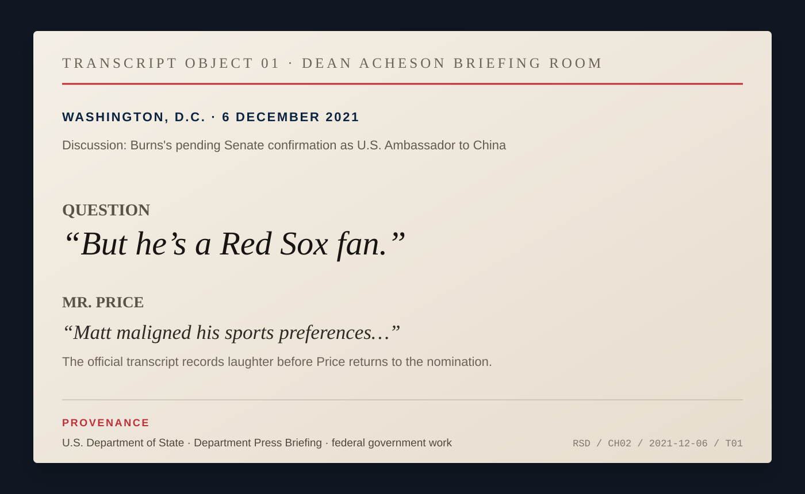
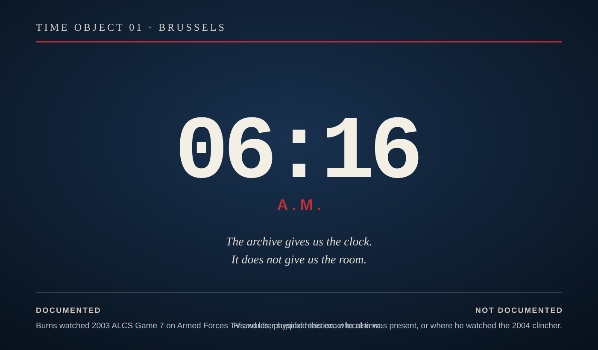
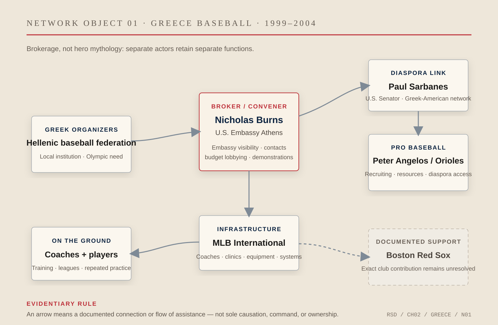

# Chapter 2 — The Useful Fan

In December 2021, Nicholas Burns was waiting to go to China.

The Senate had confirmed him as ambassador to Beijing. At the State Department, a reporter asked about the confirmation and the work ahead in a relationship already crowded with trade disputes, military tension, human rights, technology controls, climate negotiations, and the possibility that the two most powerful countries in the world were becoming structurally hostile to one another.

Then somebody interrupted.

> *“But he’s a Red Sox fan.”*

The spokesman laughed.

Burns had not been State Department spokesman for twenty-four years.

It did not matter.

The room still knew.

.jpg)

*FIG. 03 — Department Spokesperson Ned Price in the State Department briefing room, Washington, D.C., December 6, 2021. Freddie Everett / U.S. Department of State. Public domain. Burns is not in the photograph; that is the point. This is the room and the day on which a reporter could invoke his Red Sox identity twenty-four years after he left the podium. [Photo record.](https://www.flickr.com/photos/statephotos/51728591887/) [Primary transcript.](https://2021-2025.state.gov/briefings/department-press-briefing-december-6-2021/)*

*TRANSCRIPT OBJECT 01 — The official State Department record preserves the interruption, laughter, and immediate return to the substance of Burns’s appointment. Federal government work. The joke survives because the room already knows the biography.*

There are public officials whose personal details have to be reintroduced every time they take a new job. A hometown appears in the biography. A hobby arrives in the profile. A favorite team is supplied by staff because somebody has decided the person needs one recognizable thing.

Burns did not have that problem.

By the time he was being sent to Beijing, the Red Sox affiliation had survived seven presidents’ worth of baseball seasons, two World Series drought narratives, several diplomatic jobs, Harvard, NATO, negotiations with Iran and India, retirement from the Foreign Service, and a return to government.

It had outlived the joke that first made it visible.

That is why the fandom is useful to this book.

Not because baseball explains Nicholas Burns.

It does not.

Not because the Red Sox taught him diplomacy.

They did not.

And not because sports metaphors contain secret instructions for negotiating with Russia, China, Iran, Greece, or anybody else. They mostly do not.

The useful thing is smaller.

Burns carried a piece of himself through institutions designed to make the individual subordinate to the office.

He did it without confusing the two.

That distinction can look trivial until one notices how often public life gets it wrong.

The State Department spokesman speaks for the United States government. The ambassador speaks under presidential authority. The negotiator arrives with instructions. The career Foreign Service officer is expected to serve administrations whose politics may differ dramatically from his own. Personal conviction matters. Personal preference matters. Neither is the same thing as policy.

The profession depends on people who can remember the difference.

Baseball gave Burns a place where he did not have to be neutral.

He could be unreasonable in public.

He could complain about Roger Clemens leaving Boston. He could tell a Yankees fan that the rules of admission had been violated. He could declare the Yankees intolerable, wear the wrong-colored loyalty on his head, follow pitching statistics too closely, and suffer a loss at six in the morning in Brussels.

None of it required clearance.

The government did not have a position on Bucky Dent.

This freedom mattered because so little else in the job worked that way.

At the State Department podium in 1997, Burns spent his days making distinctions. Confirmed versus unconfirmed. Policy versus proposal. Negotiation versus rumor. What Washington had decided versus what a foreign government claimed Washington had decided. A phrase could move a market, become a headline, reassure an ally, alarm an adversary, or create a problem for the secretary of state before dinner.

Then somebody would ask about the Red Sox.

The pressure dropped.

Reporters learned the ritual quickly. They brought up Clemens. They tested visitors’ team loyalties. Burns asked foreign journalists whether they knew Fenway Park. On one occasion he announced, with the timing of a man who knew exactly what room he was standing in, that this had become the *“baseball briefing.”*

Then he returned to foreign policy.

The return is the important part.

Anyone can be informal.

The professional skill is knowing when informality ends.

A personal register becomes useful only if everyone trusts the boundary around it. The reporters could laugh about the Yankees and then press Burns on Bosnia, Israel, Turkey, Russia, proliferation, terrorism, or whatever crisis had arrived that morning. There is no evidence baseball softened their questions. There is no reason to pretend it did.

Familiarity was not deference.

That was the arrangement.

By the time Burns left the podium, other people had absorbed the identity. President Clinton sent him a signed Red Sox cap. A reporter gave him a Red Sox alarm clock. His successor, James Rubin, joked that the Department was retiring baseball analogies in Burns’s honor.

The persona had become collaborative.

Burns supplied the allegiance. The room supplied the repetition.

Years later, the same thing happened in a different institution.

At NATO in Brussels, the Red Sox were no longer press-room punctuation. They had entered the office.

A reporter visiting Burns found an autographed photograph of Tony Conigliaro, a baseball signed by Ted Williams, and a bat signed by Nomar Garciaparra. The objects covered different Red Sox generations. They were not the decoration of somebody following only that week’s standings. They looked more like a portable archive.

*FIG. 04 — U.S. Ambassador to NATO R. Nicholas Burns, left, with Secretary of Defense Donald Rumsfeld and Gen. Peter Pace during a press conference at NATO headquarters, Brussels, December 2, 2003. Tech. Sgt. Andy Dunaway / U.S. Air Force. Public domain. The photograph documents Burns inside the NATO institution; it is not a photograph of the Red Sox objects in his office or of the October game. [Archive record.](https://commons.wikimedia.org/wiki/File:Defense.gov_News_Photo_031202-F-2828D-413.jpg)*

Then came October 2003.

Burns was the U.S. ambassador to NATO. The alliance was living through arguments over Iraq, Afghanistan, Europe’s relationship with the United States, and the meaning of NATO after September 11. The work was not light.

The baseball game was on Armed Forces television.

Boston and New York were playing Game 7 of the American League Championship Series.

Burns later remembered the exact local time when Aaron Boone ended it.

6:16 a.m.

That number is better than anything a biographer could invent.

It tells us he watched long enough for an eleven-inning game in New York to reach morning in Brussels. It tells us the moment stuck. It does not tell us whether he shouted, went silent, woke anyone, called home, cursed the Yankees, or walked directly into a NATO meeting.

The archive gives us the clock.

That is enough.

*TIME OBJECT 01 — Brussels, October 2003. ESPN’s profile records Burns saying he watched Game 7 on Armed Forces television and could supply the exact minute on his clock: 6:16 a.m. The object makes the asymmetry visible: the time is documented; the room, reaction, company, and dialogue are not. [Source.](https://www.espn.co.uk/espn/magazine/archives/news/story?page=magazine-20040119-article32)*

A year later, Boston won.

The record becomes strangely less intimate.

We know the baseball sequence exactly: the 0–3 hole against the Yankees, the Dave Roberts steal, David Ortiz, Curt Schilling, the comeback no Major League team had completed before, then four straight wins over St. Louis. We know Burns was serving at NATO. We know that months later he used his own word for what New England had experienced.

*Redemption.*

What we do not know is where he watched the last out.

The archive remembers the loss at 6:16 in the morning more precisely than the championship.

That imbalance is useful too.

Real lives are not documented according to narrative need.

A biographer does not get to move the 2003 television into 2004 because the second scene would be more satisfying.

Burns’s baseball identity becomes more revealing when the gaps are left visible.

It was present often enough that we do not need to manufacture continuity.

In Greece, the fandom became something else entirely.

There, a host country preparing for the 2004 Olympics had a practical problem. Greece needed baseball infrastructure, coaches, players, equipment, money, and eventually an Olympic-caliber roster in a place where the game barely had a domestic system.

Burns did not solve that problem because he liked the Red Sox.

He became useful because the interest was already real and the office gave him access to networks that could do things fandom could not.

He could call people.

He could convene.

He could get Greek organizers into contact with Greek-American politicians and professional baseball institutions. He could lend embassy visibility to a sport that needed legitimacy. He could lobby the Greek government for a budget.

And, according to his own later account, he could do some of the ridiculous practical work himself.

He went on Greek television from a batting cage to demonstrate how to hit.

He played catch with Greek children.

That is a different kind of use.

At the State Department podium, baseball revealed the person inside the office.

In Athens, the same personal competence became available to the office.

The distinction matters because authenticity alone is not public diplomacy. Lots of diplomats genuinely love things that are diplomatically useless. The useful moment comes when an authentic interest intersects with somebody else’s actual need.

Greece needed baseball help.

The ambassador happened to know the game and know people who could help build a network around it.

That does not make baseball a grand strategy.

It makes it a resource.

The project survived him, which is one of the better tests of whether it mattered. His successor, Thomas Miller, inherited the effort. Major League Baseball remained involved. The Orioles and Peter Angelos became central to finding Greek-eligible players. Coaches and organizers did work Burns could not do. A national team eventually reached the Olympics.

The ambassador became less important to the story as the project became more real.

That is how brokerage is supposed to work.

The fan opens a door.

Other people walk through it carrying equipment.

*NETWORK OBJECT 01 — Greece baseball, 1999–2004. The diagram separates Greek organizers, Burns and the U.S. Embassy, Senator Paul Sarbanes, Peter Angelos and the Orioles, MLB International, coaches and players, and the Boston Red Sox club. An arrow indicates a documented connection or flow of assistance, not sole causation. The exact Red Sox club contribution remains unresolved. [Research map.](../research/ch02-visual-archive.md)*

By 2007, there was no longer any plausible argument that the Red Sox identity was a youthful press-office affectation.

Burns could discuss Boston’s rotation, bullpen, West Coast schedule, the previous season’s collapse, and the importance of pitching in the postseason in an official State Department interview. He predicted the Red Sox would win the World Series.

They did.

The morning after the championship, Burns stood before an audience at the State Department and asked how many people were members of Red Sox Nation.

The transcript records applause.

Winning had changed the team’s history.

It had not ended the identity.

That is important because *“long suffering”* could no longer do all the work. After 2004, and then 2007, and later 2013 and 2018, Red Sox fandom had to mean something other than waiting for rescue from eighty-six years of failure.

Burns’s own language changed with it.

Community became more visible.

Regional belonging.

Recognition.

A way of finding your people when you were somewhere else.

That is the version that reached China.

In Beijing, Burns was operating in a relationship where people-to-people contact had itself become politically contested. He publicly complained that Chinese authorities were obstructing American embassy events and exchanges. Strategic competition was tightening the space in which ordinary contact could occur.

And there he was, still carrying the hat.

Official images show him pitching a baseball at the embassy’s Independence Day celebration. At the Great Wall, the Red Sox language appears again in public-affairs posts. At a Beijing baseball clinic in 2024, Burns posed with young Chinese participants and called them future members of Red Sox Nation.

After leaving government, he explained that he had worn his battered Red Sox cap in public around China whenever he could—at the Great Wall, on the Bund, in Xiamen, in Chengdu, even during a television interview.

He also admitted that the campaign had not exactly conquered the market.

Dodgers hats were everywhere.

He remained irritated that Boston had traded Mookie Betts.

This is not evidence that the cap improved U.S.–China relations.

That claim would be ridiculous.

It is evidence of something narrower and more durable: the same personal identity remained available to Burns in the hardest bilateral posting of his career.

The useful fan did not become useful because baseball carried diplomatic power of its own.

He became useful because people are easier to meet when they are not pretending to be only their titles.

The trick is not to confuse that human access with the substance that follows.

A Red Sox hat cannot settle a trade dispute.

A joke about the Yankees cannot deter a war.

A baseball clinic cannot repair a strategic rivalry between nuclear powers.

The value lies in refusing the opposite mistake: the idea that serious work requires the people doing it to become featureless.

Burns spent a career inside institutions larger than himself. The State Department. The White House. NATO. An embassy. Harvard. The government again.

Each required discipline.

None required disappearance.

That is the distinction this book keeps returning to.

The representative carries authority that is not his own.

He also carries a self the government did not issue.

The useful diplomat knows which is which.

The useful fan never quite takes off the cap.