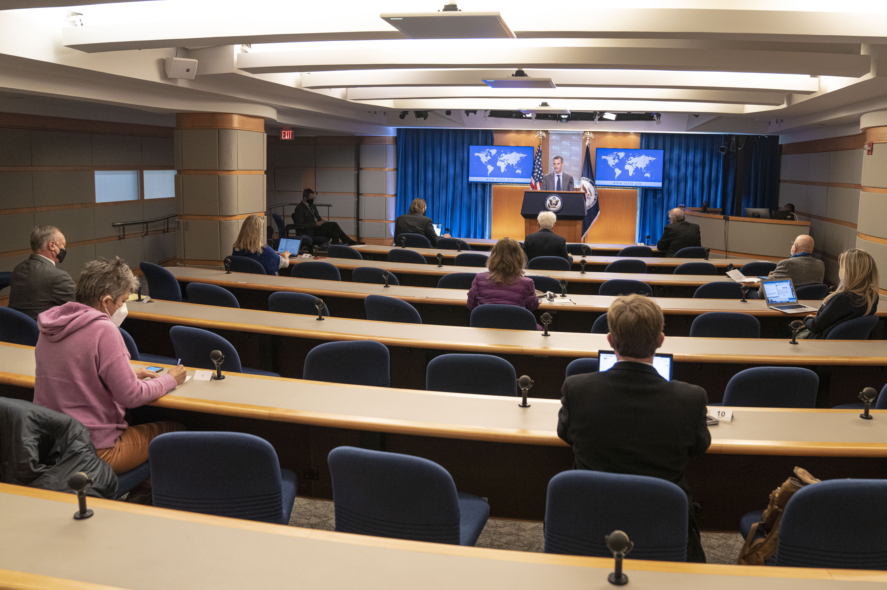

# Chapter 2 — The Useful Fan

In December 2021, Nicholas Burns was waiting to go to China.

His nomination had cleared the Senate Foreign Relations Committee but not the full Senate. At the State Department, a reporter asked about getting him to Beijing and the work waiting there: trade, military tension, human rights, technology controls, climate.

Then somebody interrupted.

> *“But he’s a Red Sox fan.”*

The spokesman laughed.

Burns had not stood at that podium for twenty-four years. The room still knew.

*FIG. 03 — Department Spokesperson Ned Price in the State Department briefing room, Washington, D.C., December 6, 2021. Freddie Everett / U.S. Department of State. Public domain. Burns is not in the photograph; this is the room and the day on which a reporter invoked his Red Sox identity twenty-four years after he left the podium. [Photo record.](https://www.flickr.com/photos/statephotos/51728591887/) [Primary transcript.](https://2021-2025.state.gov/briefings/department-press-briefing-december-6-2021/)*

*TRANSCRIPT OBJECT 01 — The official State Department record preserves the interruption, laughter and immediate return to the substance of Burns’s pending nomination. Federal government work.*

No one explained the joke. Five words about a baseball team entered a discussion of Burns's most consequential late-career assignment, got a laugh, and disappeared. The briefing moved on.

In the 1990s, speaking for the State Department required constant boundary work. Confirmed was different from reported. Policy was different from proposal. What Washington had decided was different from what somebody said Washington had decided. A stray phrase could become a headline before the briefing ended. Within those constraints, Burns could complain about Roger Clemens leaving Boston or tease a Yankees fan, and reporters could tease him back. For thirty seconds the briefing room could become ridiculous because everyone understood where the ridiculousness stopped.

The material accumulated without much stage management. Burns supplied the allegiance; reporters remembered it; colleagues repeated it; eventually other people supplied the props. On his last day as spokesman in 1997, President Clinton sent a signed Red Sox cap. A reporter gave Burns a Red Sox alarm clock. His successor later joked about retiring the baseball analogies. By then the affiliation required no introduction.

The allegiance also had an origin story less polished than a résumé. Asked about the family inheritance in 1997, Burns said his father had already learned the lesson and tried to pass it down.

> **NICK / INHERITANCE**
>
> ### “He advised us never to root for them. But I didn't follow his advice.”
>
> *State Department briefing · June 16, 1997 · [Primary transcript](https://1997-2001.state.gov/www/briefings/9706/970616db.html)*

Its triviality was an advantage. A diplomat's official biography is crowded with abstractions: bilateral relations, deterrence, democracy, nonproliferation, alliance cohesion. Baseball offered irrational allegiance without policy consequences. Other people could know this about Burns without having to parse it as the position of the United States government.

That did not make him trustworthy. Charm can coexist with bad judgment, and familiarity can be manipulated. A counterpart who likes an ambassador can still reject the proposal; a journalist who knows the joke can still ask the damaging question. The distinction mattered because the fan was not the office.

Later, baseball would become office decoration, public diplomacy, a network in Greece, a piece of home followed across time zones and a visible marker in China. Those episodes do not amount to one diplomatic method. The same stubborn personal fact simply found different uses in different rooms.

The 2021 interruption asks little of the evidence. It does not prove baseball made Burns a better diplomat. It shows something smaller and stranger: twenty-four years after he stopped briefing reporters for the State Department, a reporter could identify him by his team and expect the room to understand.
