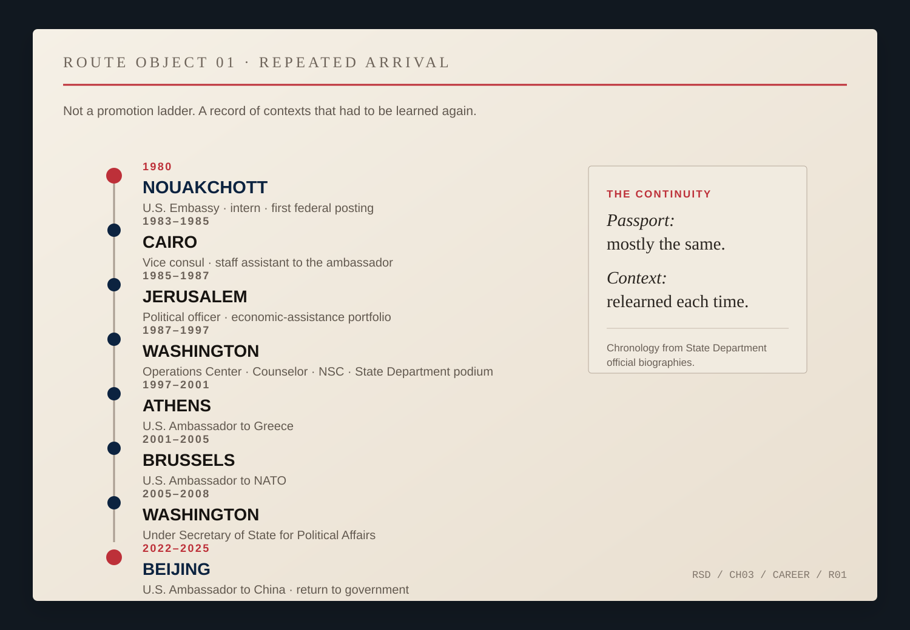
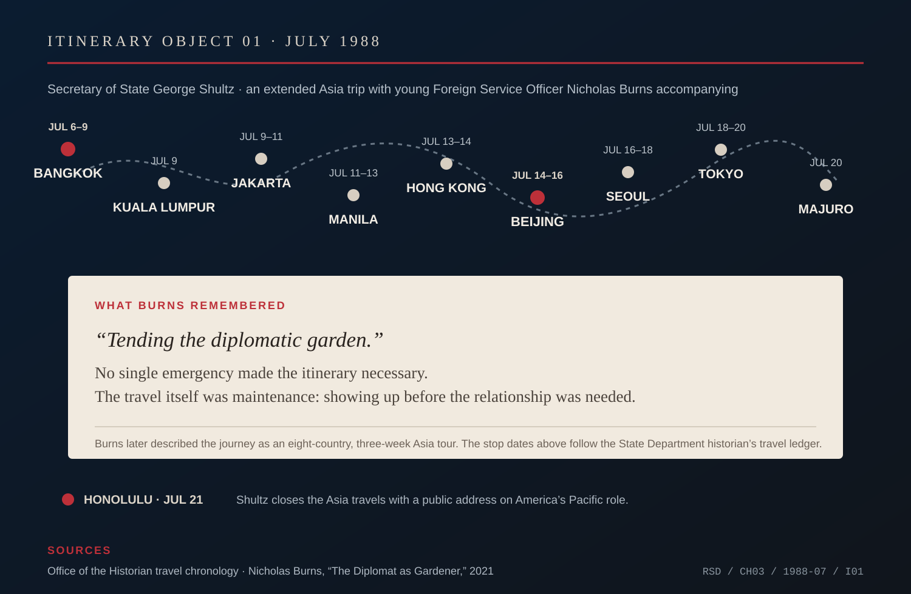

# Chapter 3 — The Road Team

A diplomat spends much of a career arriving.

New country. New building. New chain of command. New names to learn quickly and remember accurately. Political sensitivities everybody else in the room has had years to absorb.

The passport changes less than the context.

Nicholas Burns's career began that way before it acquired any grandeur. He served as an intern at the American embassy in Nouakchott, Mauritania, then worked for a nonprofit development organization before entering the Foreign Service. Cairo and Jerusalem came next. Later: Washington, the National Security Council, the State Department podium, Athens, NATO, the upper reaches of the Department and, after thirteen years outside government, Beijing.

Burns later described the distance between the beginning and the senior ranks by saying he had gone from a *“lowly intern”* in Nouakchott to under secretary of state.

*ROUTE OBJECT 01 — Repeated arrival, 1980–2025. The sequence is built from State Department biographies: Nouakchott, Cairo, Jerusalem, Washington, Athens, Brussels, Washington again, and eventually Beijing. It is deliberately a chronology rather than a promotion ladder; nothing in the line claims that one post made the next inevitable. [1997 State biography.](https://1997-2001.state.gov/about_state/biography/burns.html)*

Diplomatic careers are usually remembered backward. The ambassadorial portrait goes on the wall. The title survives. The first years collapse into résumé lines.

But the first years teach the terms of the profession.

Foreign Service officers repeatedly enter somebody else's political world. The baseball phrase *away park* is useful only up to that point. An embassy is not trying to defeat the host country, and a government that treats every negotiation as a game with a winner and loser eventually discovers that the other side is still there after the applause ends.

The relevant fact is location.

At home, much of social life is legible without effort: accent, gesture, humor, rank, school, class, the meaning of a pause. Abroad, the representative becomes a beginner again.

Burns had studied European history at Boston College, spent time at the Sorbonne and earned a graduate degree at Johns Hopkins SAIS. He spoke French and Arabic and would later study Greek. Preparation mattered. It did not abolish arrival.

A posting still required learning which official actually understood a file, which formal answer was an opening bid, which silence meant hesitation and which meant refusal, which relationship was ceremonial and which could carry weight in a crisis.

The institution teaches some of this through repetition. A posting ends. Another begins. The officer carries forward habits that worked and, ideally, some memory of the ones that did not.

Years later Burns found a language for this in George Shultz.

As a young Foreign Service officer, he watched Secretary of State Shultz travel through Asia in 1988. Burns remembered the trip decades later through Shultz's phrase *“tending the diplomatic garden.”* The lesson was not a single crisis. Shultz traveled because relationships needed in a crisis have to exist before the crisis.

*ITINERARY OBJECT 01 — July 1988. Bangkok, Kuala Lumpur, Jakarta, Manila, Hong Kong, Beijing, Seoul, Tokyo, Majuro; Shultz concluded the Asia travels with a July 21 address in Honolulu. Burns later described the underlying journey as an eight-country, three-week tour and remembered it as a lesson in tending relationships before crisis. Stop dates follow the State Department historian’s travel ledger. [Burns, “The Diplomat as Gardener.”](https://www.hks.harvard.edu/publications/diplomat-gardener) [Official travel chronology.](https://history.state.gov/departmenthistory/travels/secretary/shultz-george-pratt)*

Maintenance is hard to dramatize. A summit produces photographs. A breakthrough produces headlines. A relationship quietly kept in working order rarely produces either.

Most ordinary meetings probably remain ordinary. The profession still requires making the investment.

That is a better guide to Burns's early career than the hindsight that makes Cairo seem to lead neatly to Jerusalem and Jerusalem to Washington. A young officer does not know which language will become useful, which colleague will reappear, which government will become central or which temporary assignment will supply a durable habit.

What accumulates is not mastery of one place. It is a method for entering places without pretending to have mastered them.

Learn the names. Return calls. Know who actually knows. Distinguish a friendly conversation from an unofficial one. Remember that the minister has a staff and the staff has politics. Do not mistake access for agreement. Do not assume a sentence means abroad what it meant in the room where Washington drafted it.

Burns had the last problem available even in public speeches at home.

At Worcester Polytechnic Institute's commencement in 1997, he was explaining what he called the coming “international age.” Globalization, he argued, was arriving in ordinary American life as surely as in diplomacy and trade. One example was baseball: Japanese players were moving into American ballparks. Then the local complaint—somehow, he joked, this international migration had skipped Fenway Park and the Red Sox bullpen.

*ARCHIVE NOTE — U.S. Department of State, “Preparing for the International Age,” Worcester Polytechnic Institute commencement address, May 24, 1997. Burns cites Japanese baseball players moving into U.S. ballparks as an example of internationalization and jokes about Fenway and the Red Sox bullpen. [Primary transcript.](https://1997-2001.state.gov/policy_remarks/970524.burns.html)*

The joke proves nothing about diplomacy. It shows a reflex: take something large, find an ordinary example, return to the argument.

The road-team metaphor should stop there too.

A baseball club travels to win. An embassy may need the government across the table to remain stable, capable and willing to keep talking even while the countries disagree sharply. The point is not hostility.

It is adjustment.

You are not at home. Act like you noticed.

Nouakchott was not Cairo. Cairo was not Jerusalem. Each place changed which facts mattered and which memories Washington did not share.

The diplomat stands near the point where an official American sentence lands. Sometimes it travels cleanly. Sometimes it arrives carrying meanings its authors never intended. The officer close to the receiving country is supposed to notice before Washington mistakes intention for effect.

That is the durable part of Shultz's gardening lesson. Relationships need maintenance before emergency. Presence matters. The ordinary meeting may turn out not to have been ordinary.

Before the crises attached themselves to Burns's name, there were postings where the stakes were real and the officer was not important enough for anyone to preserve his day in detail.

Cairo was one of them.

Burns arrived there in the early 1980s as a vice consul and staff assistant to the ambassador.

No one had sent him to Egypt to learn a baseball lesson.

He was there to learn the job.