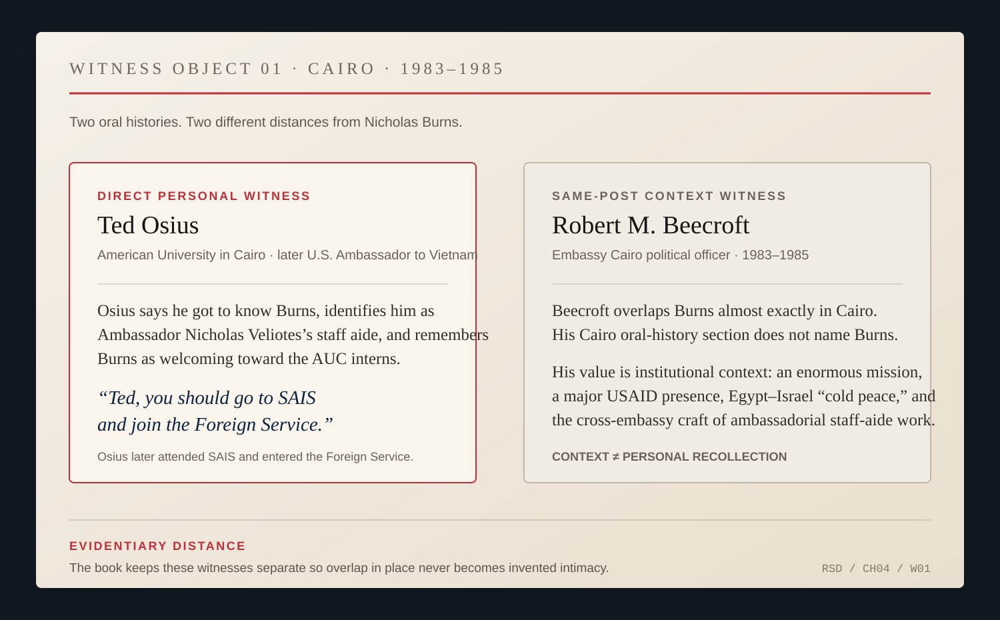

# Chapter 4 — Cairo: Learning the Away Park

The first useful fact about Nicholas Burns's first Foreign Service posting is that the official record gives him two jobs.

Vice consul in Cairo.

Staff assistant to the ambassador.

The surviving public record does not cleanly tell us when one role gave way to the other, or whether they overlapped. It does tell us what kind of education the two titles put within reach.

One job pointed toward the individual.

The other pointed toward the institution.

At the consular end of an embassy, foreign policy becomes stubbornly specific. There is a person at the window. A passport. A visa. An American in trouble. A rule written thousands of miles away that now has to be applied to a case with a name attached to it. A 1999 profile of Burns, looking back on Cairo, reduced some of the work to its practical dimensions: stamping passports and helping American workers who had landed in jail.

There is not much grandeur in that description.

Good.

Diplomatic biographies tend to begin where the photographs begin. The young officer disappears so the later ambassador can enter on cue. But the state is not experienced only in summit rooms. For many people, a consular officer is the United States government in its most immediate form.

Burns was learning that form while also working near another one.

A staff assistant sits close to the ambassador without becoming the ambassador. The value of the job is not borrowed power. It is exposure to flow: cables, visitors, requests from Washington, questions from the front office, disputes among sections, matters that look minor until the ambassador asks for an answer now.

Cairo was a large place to see that machinery.

Robert Beecroft, a political officer there during roughly the same 1983–85 period, later remembered Embassy Cairo as the largest American embassy in the world at the time, with roughly two thousand people and an enormous USAID mission alongside it. Beecroft does not mention Burns in his account of those years. In a mission that size, that absence is not surprising and should not be converted into a relationship.

The scale is what matters.

This was not a tidy outpost where everybody crowded around one table. Political officers, economic officers, consular officers, public-affairs specialists, military personnel, aid officials, intelligence officers, administrators, local employees and visiting delegations all operated under the same flag without necessarily seeing the same problem from the same angle.

The ambassador when Burns arrived was Alfred Atherton, one of the senior American diplomats associated with the long Arab-Israeli negotiating process. Nicholas Veliotes succeeded him in November 1983. Ted Osius, the one direct witness in the current record who remembers Burns personally in Cairo, identifies Burns as Veliotes's staff aide.

That is enough to place Burns in the front-office orbit during the Veliotes period.

It is not enough to assign exact dates the archive has not yet supplied.

The embassy itself occupied a peculiar moment in the history of American diplomacy in Egypt.

The great breakthrough had already happened.

Egypt and Israel had signed peace. Sinai had been returned. The Camp David photographs belonged to an earlier chapter. What remained was the less photogenic work of maintaining a relationship that had not become warm simply because the treaty existed.

*CONTACT SHEET 01 — White House Photo Collection roll C19990 (02), Cabinet Room, Washington, D.C., February 14, 1984. President Reagan’s working visit with Egyptian President Hosni Mubarak. The Reagan Library record lists George Shultz, Robert McFarlane, Caspar Weinberger, Richard Murphy, Egyptian officials, Ambassador Nicholas Veliotes and others among the personal references, noting that not every person appears in every frame. Kightlinger / White House Photo Collection / National Archives. U.S. government work. Burns is not placed in this meeting or in these frames; the object shows the senior bilateral relationship Embassy Cairo was helping maintain while he served there as a junior officer. [Archive record.](https://www.reaganlibrary.gov/archives/photo/c19990-02)*

Beecroft, whose portfolio covered Egypt-Israel relations, remembered a cold peace. Egypt was also trying to restore its standing in an Arab world that had punished it for the separate peace with Israel. American assistance was immense. Military cooperation mattered. So did Egyptian suspicion of permanent foreign military presence.

Veliotes's oral history gives that last tension a physical form.

Washington had considered a large American military facility at Ras Banas on Egypt's Red Sea coast. From one angle it was logistics: access, infrastructure, the ability to move American forces in a dangerous region. From Cairo it carried a different history. Egyptians had lived with British power and then Soviet presence. A permanent foreign footprint could not be understood only as a Pentagon plan.

Veliotes later argued that senior officials in Washington did not fully grasp the depth of the Egyptian sensitivity.

That recollection is not evidence that Burns participated in the Ras Banas argument. The record does not put him in the negotiations, a Mubarak meeting, or a particular military-policy discussion.

It is evidence of the environment through which a large embassy had to translate Washington.

A policy leaves the capital with an intended meaning.

It arrives somewhere with a past.

The embassy works in the difference.

For a junior officer, the two jobs offered opposite views of that difference. Consular work reduced the government to one person and one case. Staff work expanded it into a building full of sections, authorities and incomplete information.

The staff assistant learns quickly that the organizational chart is not the organization.

Beecroft had held a similar staff-aide job earlier in his own career. His recollection is not Burns's daily routine, but it explains the craft. An aide needed discreet working relationships across an embassy—people in political, economic, administrative, consular, public-affairs and defense sections who could answer a question without every inquiry becoming a bureaucratic production.

The aide learned whom to call.

That sounds minor until an institution needs an answer and nobody knows who has it.

There is one witness who brings Burns himself out from behind the résumé.

Ted Osius was then a young American associated with the American University in Cairo. Decades later, after his own Foreign Service career had taken him to the ambassadorship in Vietnam, he remembered getting to know Burns in Cairo.

He remembered Burns as Veliotes's staff aide.

He also remembered the manner: friendly, kind, inclusive, welcoming toward the interns.

At some point Burns encouraged Osius toward the Johns Hopkins School of Advanced International Studies and the Foreign Service. Osius later described the suggestion as a seed Burns had planted.

Osius went to SAIS.

Then he joined the Foreign Service.

It is a small story. That is why it belongs here.

Burns was not yet the ambassador inviting young people into public service from a commencement stage. He was a junior officer himself. He had no famous title to lend the advice. To an intern, though, the ambassador's aide was already somebody inside the profession.

Before Burns represented the United States as an ambassador, he was representing the Foreign Service to somebody standing just outside it.

*WITNESS OBJECT 01 — Cairo, 1983–85. Ted Osius says he got to know Burns and identifies him as Ambassador Nicholas Veliotes’s staff aide; his oral history preserves Burns’s advice to attend SAIS and join the Foreign Service. Robert Beecroft served in the same enormous mission during almost exactly the same years, but his Cairo recollection does not name Burns; it supplies institutional context rather than personal testimony. The design keeps those evidentiary distances visible. [Osius oral history.](https://adst.org/OH%20TOCs/Osius.Ted.pdf) [Beecroft oral history.](https://adst.org/OH%20TOCs/Beecroft%2C%20Robert%20M.toc.pdf)*

The oral-history passage still requires page-image verification before exact quotation in a published edition. Its substance can be used conservatively now because Osius is a named witness remembering his own encounter.

The Cairo around them was not calm in any broad historical sense. Lebanon remained violent. The Iran-Iraq War continued. The Soviet Union occupied Afghanistan. Egypt under Hosni Mubarak was consolidating after Anwar Sadat's assassination while trying to manage its peace with Israel and recover regional standing.

Yet Beecroft remembered much of the work in Cairo itself as a long slog rather than a sequence of dramatic crises.

That may be the more useful setting for Burns's first posting.

The young officer's education took place after the breakthrough and before the next headline.

A treaty had to be maintained. Aid had to be administered. A congressional delegation arrived. An American got detained. A military proposal acquired political meaning once the proposed concrete was in Egypt rather than on a Washington map. The ambassador needed an answer. Somebody had to find it.

The title of this chapter offers a baseball metaphor and then immediately needs restraint.

Egypt was not an opposing ballpark. The United States and Egypt were partners on some questions, frustrated with each other on others, and embedded in a relationship too consequential for a scoreboard.

The useful part of being away is narrower.

Assumptions become visible.

Beecroft remembered slowly recognizing the force of Egyptian historical self-consciousness. Veliotes remembered Washington failing to appreciate how foreign military presence could sound in a country whose modern history included British and Soviet power.

Neither recollection should be rewritten as young Burns's private revelation.

They show the embassy environment around him.

What Cairo gives us about Burns is rougher and more concrete.

A junior officer working both ends of an embassy.

Individual cases and institutional flow.

A mission large enough to show that American policy is not made by one mind.

A host country with its own memory.

And an intern who remembered being welcomed.

That last detail does not need to carry the whole theory of Burns's later career. It only has to remain what it is: evidence of how one young Foreign Service officer treated somebody who had not yet entered the service.

Osius remembered the invitation.

The profession got another diplomat.

That is enough of a result to keep.