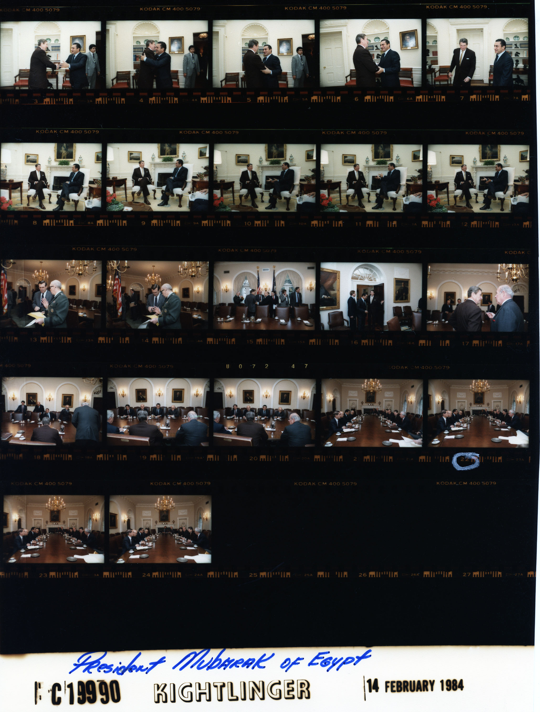

# Chapter 4 — Cairo: Learning the Away Park

Nicholas Burns's first Foreign Service posting gave him two jobs.

Vice consul in Cairo.

Staff assistant to the ambassador.

The surviving public record does not cleanly tell us when one role gave way to the other, or whether they overlapped. It does show two different ways into the same institution.

At the consular end of an embassy, foreign policy becomes stubbornly specific. There is a person at the window. A passport. A visa. An American in trouble. A rule written thousands of miles away that now has to be applied to a case with a name attached to it. A 1999 profile of Burns, looking back on Cairo, reduced some of the work to practical dimensions: stamping passports and helping American workers who had landed in jail.

Good.

Diplomatic biographies tend to begin where the photographs begin. The young officer disappears so the later ambassador can enter on cue. But for many people, a consular officer is the United States government in its most immediate form.

A staff assistant sees the other direction. The value of the job is not borrowed power but exposure to flow: cables, visitors, requests from Washington, questions from the front office, disputes among sections, matters that look minor until the ambassador wants an answer now.

Cairo was a large place to see that machinery.

Robert Beecroft, a political officer there during roughly the same 1983–85 period, later remembered Embassy Cairo as the largest American embassy in the world at the time, with roughly two thousand people and an enormous USAID mission alongside it. Beecroft does not mention Burns in his account of those years. In a mission that size, the omission should not be turned into a relationship.

Political officers, economic officers, consular officers, public-affairs specialists, military personnel, aid officials, intelligence officers, administrators, local employees and visiting delegations worked under the same flag without necessarily seeing the same problem from the same angle.

The ambassador when Burns arrived was Alfred Atherton, one of the senior American diplomats associated with the long Arab-Israeli negotiating process. Nicholas Veliotes succeeded him in November 1983. Ted Osius, the direct witness in the current record who remembers Burns personally in Cairo, identifies Burns as Veliotes's staff aide.

That places Burns in the front-office orbit during the Veliotes period. It does not supply exact dates the archive has not yet produced.

The great U.S.-Egyptian breakthrough had already happened. Egypt and Israel had signed peace. Sinai had been returned. The Camp David photographs belonged to an earlier chapter. What remained was the less photogenic work of maintaining a relationship that had not become warm simply because the treaty existed.

*CONTACT SHEET 01 — White House Photo Collection roll C19990 (02), Cabinet Room, Washington, D.C., February 14, 1984. President Reagan’s working visit with Egyptian President Hosni Mubarak. The Reagan Library record lists George Shultz, Robert McFarlane, Caspar Weinberger, Richard Murphy, Egyptian officials, Ambassador Nicholas Veliotes and others among the personal references, noting that not every person appears in every frame. Kightlinger / White House Photo Collection / National Archives. U.S. government work. Burns is not placed in this meeting or in these frames; the object shows the senior bilateral relationship Embassy Cairo was helping maintain while he served there as a junior officer. [Archive record.](https://www.reaganlibrary.gov/archives/photo/c19990-02)*

Beecroft, whose portfolio covered Egypt-Israel relations, remembered a cold peace. Egypt was also trying to restore its standing in an Arab world that had punished it for the separate peace with Israel. American assistance was immense. Military cooperation mattered. So did Egyptian suspicion of permanent foreign military presence.

Veliotes's oral history gives that last tension a physical form.

Washington had considered a large American military facility at Ras Banas on Egypt's Red Sea coast. From one angle it was logistics: access, infrastructure, the ability to move forces in a dangerous region. From Cairo it carried a different history. Egyptians had lived with British power and then Soviet presence. A permanent foreign footprint could not be understood only as a Pentagon plan.

Veliotes later argued that senior officials in Washington did not fully grasp the depth of that sensitivity.

The record does not put Burns in the Ras Banas negotiations or in a particular Mubarak meeting. The episode belongs here as environment, not borrowed biography.

A policy leaves Washington with an intended meaning. It arrives somewhere with a past.

For a junior officer, consular work reduced the government to one person and one case. Staff work expanded it into a building full of sections, authorities and incomplete information.

Beecroft had held a similar staff-aide job earlier in his own career. His recollection is not Burns's daily routine, but it explains the craft. An aide needed discreet working relationships across an embassy—people who could answer a question without every inquiry becoming a bureaucratic production.

The aide learned whom to call.

There is one witness who brings Burns himself out from behind the résumé.

Ted Osius was then a young American associated with the American University in Cairo. Decades later, after his own Foreign Service career had taken him to the ambassadorship in Vietnam, he remembered Burns as Veliotes's staff aide: friendly, kind and welcoming toward the interns.

Burns encouraged Osius toward the Johns Hopkins School of Advanced International Studies and the Foreign Service. Osius later described the suggestion as a seed Burns had planted.

Osius went to SAIS. Then he joined the Foreign Service.

Burns was not yet the ambassador inviting young people into public service from a commencement stage. He was a junior officer himself. To an intern, though, the ambassador's aide was already someone inside the profession.

*WITNESS OBJECT 01 — Cairo, 1983–85. Ted Osius says he got to know Burns and identifies him as Ambassador Nicholas Veliotes’s staff aide; his oral history preserves Burns’s advice to attend SAIS and join the Foreign Service. Robert Beecroft served in the same enormous mission during almost exactly the same years, but his Cairo recollection does not name Burns; it supplies institutional context rather than personal testimony. The design keeps those evidentiary distances visible. [Osius oral history.](https://adst.org/OH%20TOCs/Osius.Ted.pdf) [Beecroft oral history.](https://adst.org/OH%20TOCs/Beecroft%2C%20Robert%20M.toc.pdf)*

The oral-history passage still requires page-image verification before exact quotation in a published edition. Its substance can be used conservatively because Osius is remembering his own encounter.

Cairo around them was not calm. Lebanon remained violent. The Iran-Iraq War continued. The Soviet Union occupied Afghanistan. Egypt under Hosni Mubarak was consolidating after Anwar Sadat's assassination while trying to manage its peace with Israel and recover regional standing.

Yet Beecroft remembered much of the work in Cairo itself as a long slog rather than a sequence of dramatic crises.

That is a good setting for a first posting.

A treaty had to be maintained. Aid had to be administered. A congressional delegation arrived. An American got detained. A military proposal acquired political meaning once the proposed concrete was in Egypt rather than on a Washington map. The ambassador needed an answer. Somebody had to find it.

The chapter title offers a baseball metaphor and then needs restraint.

Egypt was not an opposing ballpark. The United States and Egypt were partners on some questions, frustrated with each other on others, and embedded in a relationship too consequential for a scoreboard.

The part worth keeping is simpler: being away makes assumptions visible.

Beecroft remembered slowly recognizing the force of Egyptian historical self-consciousness. Veliotes remembered Washington failing to appreciate how foreign military presence could sound in a country whose modern history included British and Soviet power.

Neither recollection should be rewritten as young Burns's private revelation. They describe the embassy environment around him.

What Cairo gives us about Burns is rougher and better documented: a junior officer working both ends of an embassy, individual cases and institutional flow, a mission large enough to show that American policy is not made by one mind, a host country with its own memory, and an intern who remembered being welcomed.

That last fact does not need to carry a theory of Burns's later career.

Osius remembered the invitation.

The profession got another diplomat.