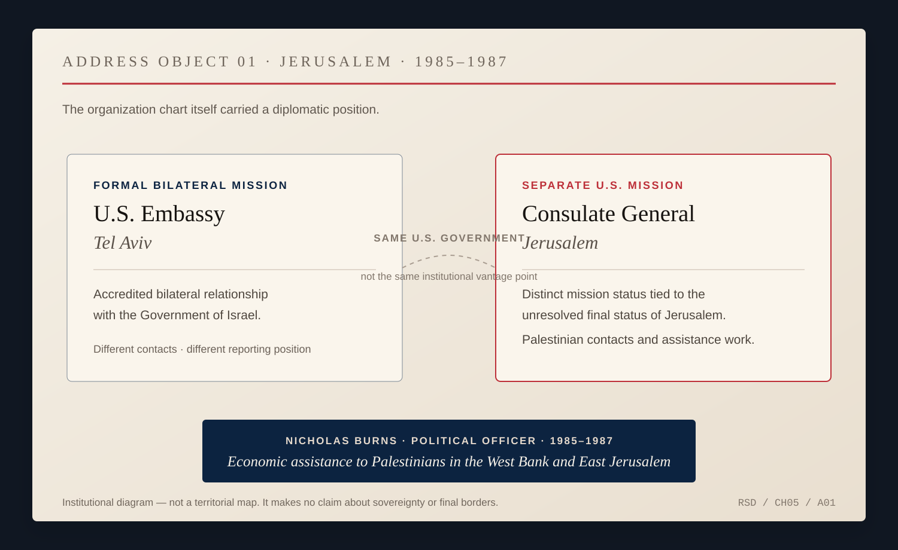
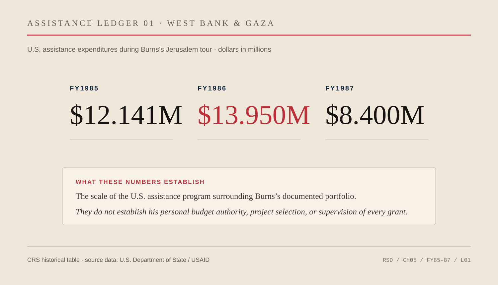

# Chapter 5 — The Unresolved Address

Jerusalem made even an address political.

The American Consulate General was not simply another office beneath the United States embassy in Tel Aviv. Its peculiar institutional position reflected a larger American position: the final status of Jerusalem had not been settled, and the United States did not treat the city as though the argument over sovereignty had disappeared because somebody had printed a letterhead.

*ADDRESS OBJECT 01 — U.S. representation during the institutional world Burns entered in Jerusalem. Embassy Tel Aviv carried the formal bilateral relationship with Israel; the Consulate General in Jerusalem occupied a separate mission status tied to the unresolved status of the city and maintained distinctive Palestinian and Jerusalem responsibilities. This is an institutional diagram, not a territorial map, and it makes no claim about sovereignty or final borders. [State Department background.](https://2009-2017.state.gov/outofdate/bgn/israel/35872.htm)*

Nicholas Burns arrived there in 1985.

He had spent the previous two years in Cairo, moving between consular work and the ambassador's front office. Jerusalem gave him a different assignment. He was a junior political officer, and the portfolio that survives most clearly in the record was economic assistance to Palestinians in the West Bank and East Jerusalem.

Years later official biographies compressed the work into a sentence.

Burns himself eventually supplied more weight to it.

Looking back in 2025, after Beijing and after the senior jobs for which he was much better known, he called Jerusalem *“a seminal very important experience for me.”* At that stage of his life, he said, he expected to spend his career in Africa and the Arab world. He spoke Arabic. The later turn toward Soviet affairs had not happened yet.

This matters because successful careers are usually narrated by destination.

Once Burns became the American ambassador to NATO, his early Middle East assignments could look like preliminaries to the real story. Once he became a Russia specialist at the White House, Cairo and Jerusalem could be reduced to proof that he had served abroad before Washington discovered where it wanted him.

That is not how he remembered Jerusalem.

The work itself was practical.

Douglas Keene, the deputy principal officer at the consulate during the first part of Burns's tour, later described an American aid program operating through grants to nongovernmental organizations. A junior officer would ordinarily serve as the point of contact. Keene remembered one of the officers who worked with him on that program: a young Nick Burns.

That small piece of testimony does more than a page of retrospective praise could do.

It gives the résumé line machinery.

Economic assistance was not a speech. It required grants, organizations, proposals, contacts, judgments and follow-through. Somebody had to know which institution was responsible, who could legally receive money, whether a project could function, what Washington had authorized, and how an American program would be interpreted in a political environment where almost nothing was merely administrative.

The amounts were modest by the standards of later American foreign assistance. The politics around them were not.

*ASSISTANCE LEDGER 01 — U.S. assistance to the West Bank and Gaza during Burns’s Jerusalem tour: FY1985, $12.141 million; FY1986, $13.950 million; FY1987, $8.400 million. CRS reports the historical figures from State/USAID records. These are program-wide expenditures, not Burns’s personal budget and not evidence that he selected or supervised every project. [CRS historical table.](https://www.everycrsreport.com/reports/RS21594.html)*

Palestinians in the West Bank and East Jerusalem lived under Israeli occupation. There was no Palestinian Authority; Oslo was years away. The Palestine Liberation Organization existed, but American policy sharply constrained official dealings with it. Israeli politics were divided. Palestinian politics were divided. Jerusalem itself was the subject of incompatible national claims.

Then there was the American bureaucracy.

Keene remembered relations between the Jerusalem consulate and the embassy in Tel Aviv as poor when he arrived: mutual suspicion, clashing cables, different readings of the same landscape. The relationship improved. Liaison mechanisms were built. Jerusalem officers began attending embassy country-team meetings.

The organizational friction was not incidental.

Two American posts could look at the same country and territory from different positions because they were built to see different things.

Embassy Tel Aviv maintained the formal bilateral relationship with Israel. The consulate in Jerusalem had its own history, its own contacts, its own reporting responsibilities and a distinctive role with Palestinians and Jerusalem affairs. The boundary between those functions was never only bureaucratic.

Burns entered the profession at a place where the organization chart itself was foreign policy.

That is a useful education for a diplomat.

Governments like nouns. Ally. Adversary. State. Territory. Capital. Embassy. Consulate. Aid recipient. Terrorist organization. Negotiating partner.

Jerusalem was a reminder that reality does not always respect the filing system.

An assistance program could be developmental and political at the same time. A road, clinic, school, water project or small business could improve ordinary life while also raising questions about authority, permanence and control. An American conversation could be unofficial in one sense and deeply consequential in another. A building could perform a diplomatic position before anyone inside it said a word.

The junior officer working the aid portfolio did not resolve those contradictions.

He had to operate inside them.

This is where the original baseball architecture of this book has to know when to get out of the way.

There is no responsible Red Sox–Yankees analogy for Jerusalem in the mid-1980s. Sports rivalry depends on agreed rules, accepted boundaries and a shared institution that tells everybody when the game is over. The conflict Burns encountered had none of those conveniences. It involved sovereignty, occupation, violence, national identity, religion, security and competing historical claims.

Calling that rivalry would make it smaller than it was.

What baseball can still contribute is only the biographical contrast.

Burns carried a stable personal identity into an environment where public identities were politically loaded. He knew where he was from. The people he dealt with could not always describe where they were from without making a political statement.

The American representative therefore had to listen carefully to nouns.

Keene's oral history captures the density of the environment around the consulate. Officers traveled through the West Bank. They maintained Palestinian contacts. They dealt with Israeli officials, international organizations, journalists, academics, American citizens and congressional visitors. They watched settlement expansion. They handled consular cases involving Arab Americans. They learned which formulations could trigger accusations that the consulate was biased toward one side or the other.

None of that establishes that Burns personally participated in every activity Keene remembered.

The distinction matters.

We know Burns worked with Keene on the aid program. We know his portfolio covered Palestinian economic assistance. We know he later regarded the experience as formative. We do not have a diary of his daily movements, a complete list of his Palestinian counterparts, or a transcript of the conversations that shaped his judgment.

A documentary biography should leave that negative space visible.

It is tempting to fill it because Jerusalem supplies almost unlimited atmosphere. Stone walls. checkpoints. church bells. calls to prayer. armed patrols. crowded markets. diplomats driving from one political reality into another.

Those images may be true of the city.

They are not automatically memories of Nicholas Burns.

The safer and more revealing fact is bureaucratic: he managed an aid program.

Bureaucracy sounds bloodless until one asks what the bureaucracy is trying to do.

American assistance to Palestinians in those years moved through organizations because there was no Palestinian state apparatus through which Washington could simply run a conventional bilateral development program. Nongovernmental channels were therefore not a decorative feature of the policy. They were part of the solution to a diplomatic problem.

How do you help a population when recognition, sovereignty and political representation are unresolved?

You build mechanisms that can function before the larger dispute is solved.

This is one of diplomacy's less celebrated forms.

The dramatic version of diplomacy ends with an agreement. The practical version often begins from the assumption that the agreement is not coming soon enough. People still need institutions. Students still need schools. Businesses still need capital. Municipalities still need equipment. Families still need medical care. Governments still need information. Officials still need channels.

A diplomat cannot suspend ordinary life until history becomes cooperative.

That idea would recur in Burns's later career even though the circumstances changed radically.

At NATO he would work inside an alliance whose strength depended on maintenance before crisis. On India he would argue for a relationship whose payoff required years. On Iran he would defend diplomacy without pretending diplomacy guaranteed success. In China he would insist on communication and people-to-people ties while openly describing the relationship as intensely competitive.

Jerusalem should not be turned into the origin story for all of those positions.

People are not that tidy.

But Burns's own description of the posting as seminal gives us permission to take it seriously as formation rather than merely chronology.

There is another reason.

He left Jerusalem in 1987.

The First Intifada began later that year.

That timing creates a hard boundary for this chapter. Burns should not be inserted into events he did not experience in post. But the boundary also reveals something about diplomatic careers. Officers rotate out. The place continues. A portfolio that seemed difficult can become more difficult after departure. Contacts stay behind. Policies outlast the people administering them. History does not respect tour dates.

The Foreign Service teaches impermanence from the inside.

The officer becomes important to a place for a few years and then leaves it.

That can encourage arrogance—the belief that the diplomat has accumulated countries as expertise—or the opposite: a recognition that every posting is partial.

Burns would later become famous for relationships maintained over decades. Jerusalem belonged to an earlier stage, when he was still learning how much of diplomacy consisted of working through institutions that could not settle the argument around them.

The consulate could not determine Jerusalem's final status.

The aid program could not end the occupation.

A junior American officer could not reconcile Israeli and Palestinian national claims.

The work still had to be done.

That may be the most useful distinction between diplomacy and spectatorship.

A spectator can wait for the final score.

A diplomat often works precisely because there isn't one.