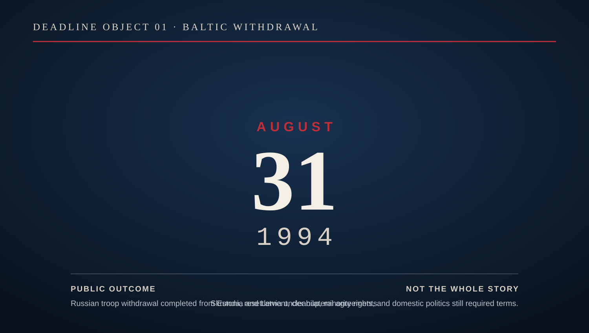
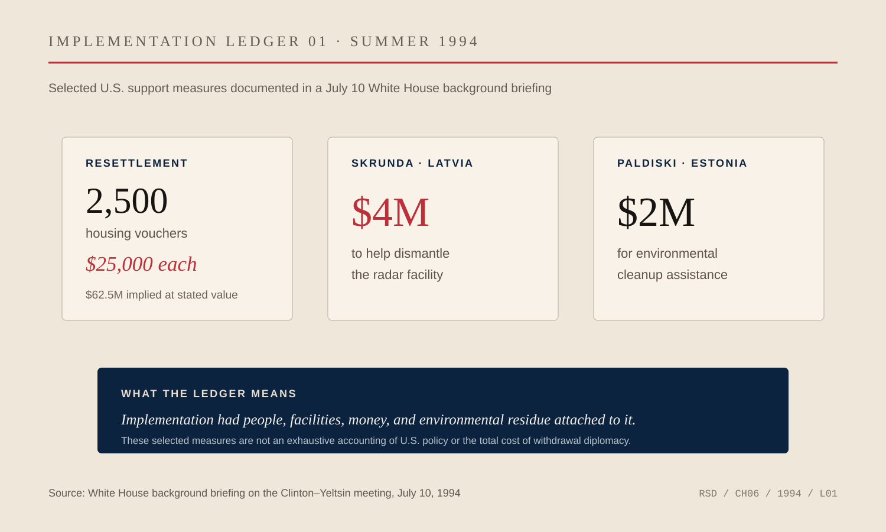

# Chapter 6 — The Score Is Not the Game

By the beginning of 1994, the problem looked simple enough to fit inside a date.

August 31.

Russian troops were supposed to be out of Latvia and Estonia by then.

*DEADLINE OBJECT 01 — August 31, 1994. President Clinton’s statement that day recorded completion of Russian military-force withdrawals from Estonia and Latvia under bilateral agreements. The date is clean enough to become historical shorthand; the object deliberately leaves the temporary Skrunda arrangements and other implementation terms outside the headline. [Presidential statement.](https://www.presidency.ucsb.edu/documents/statement-withdrawal-russian-forces-from-eastern-europe) [GovInfo record.](https://www.govinfo.gov/app/details/PPP-1994-book2/PPP-1994-book2-doc-pg1514/context)*

A deadline is one of the cleanest objects in foreign policy. It gives officials something to repeat, newspapers something to print, presidents something to defend and opponents something to measure. Either the troops leave or they do not.

The work required to make that sentence true was not clean at all.

Nicholas Burns had reached the National Security Council after years spent closer to the edge of American power: Cairo, Jerusalem, the State Department Operations Center, Soviet and Eastern European work. By the Clinton administration he was the senior White House official for Russia, Ukraine and Eurasia. The Soviet Union had disappeared. The consequences had not.

Fifteen independent states now occupied the map where one superpower had stood. Some transitions were peaceful. Some were not. Nuclear weapons had to be accounted for. Economies were collapsing and being rebuilt at the same time. Political institutions were changing faster than habits of authority. Borders that had existed inside one state became international borders.

And Russian troops were still sitting in countries that regarded them as an occupying force.

Lithuania got the last Russian troops out in 1993. Latvia and Estonia were harder.

The score was obvious.

Withdrawal.

Everything underneath it was negotiation.

Russian officials linked the issue to the rights of Russian-speaking minorities in the Baltic states. Retired military personnel and their families needed legal status and somewhere to live. Latvia wanted control over its territory but still had the Skrunda early-warning radar complex on its soil, a facility Moscow considered militarily important. Estonia had its own unresolved questions, including Russian military pensioners and the aftermath of Soviet installations. Washington wanted the troops out without turning Boris Yeltsin's domestic political weakness into an argument for Russian nationalists who already believed Moscow was surrendering too much.

Diplomacy often looks indecisive when described at this level because every problem has another problem attached to it.

That was the point.

In early February 1994, a Latvian delegation came to Washington carrying almost the entire argument with it. Foreign Minister Georgs Andrejevs was joined by leaders of all eight political factions in Latvia's parliament. Their schedule included senior figures across the administration. One session in the White House Situation Room lasted roughly an hour and a half with Nick Burns.

The composition of the delegation mattered.

Washington was not merely negotiating with the Latvian government. Latvia itself had to decide what compromise it could live with. Any agreement with Russia would be judged at home by people whose country had spent decades under Soviet control. A technically elegant bargain that looked like submission would not survive its own politics.

The dispute over Skrunda captured the difficulty.

Russia wanted to keep the radar operating longer than Latvia wanted to permit. Latvia wanted Russian military infrastructure gone. The gap was measured in years, but the argument was larger than arithmetic. For Latvia, the installation belonged to a history it was trying to end. For Russia, it remained part of a security system it was not prepared to abandon overnight.

President Clinton proposed a compromise: four years of operation, then eighteen months for dismantling.

Burns communicated the proposal to the Latvian side.

There was nothing cinematic about the mechanism. No secret channel in a hotel room. No lone envoy flying through the night with a final offer. A delegation, a conference table, competing domestic pressures, technical details and a White House official trying to keep the larger objective from being consumed by one component of it.

This is where scorekeeping becomes misleading.

The United States wanted Russian troops out. Latvia wanted Russian troops out. Estonia wanted Russian troops out. Even Yeltsin had accepted the principle of withdrawal.

Agreement on the headline did not produce agreement on the implementation.

Foreign policy is full of these false endings. A treaty is signed and the hard part begins. A war ends and the peace reveals its own arguments. Independence is recognized and foreign soldiers remain. Leaders agree in principle and bureaucracies discover a hundred reasons the principle cannot be executed on schedule.

The diplomat spends most of his time after the applause.

Burns's job put him in that territory.

The Latvian negotiations eventually produced an agreement for Russian forces to leave by August 31. Clinton publicly credited the engagement of both sides and emphasized the constructive role played by Sweden as well as the United States. That matters because successful diplomacy is often rewritten around the most visible capital. Washington was important. It was not alone.

Estonia remained more difficult.

The Clinton administration had to keep pressure on Moscow while also addressing the argument Yeltsin kept making about Russian minorities. Washington did not accept the continued military presence as an answer to minority-rights concerns. It did, however, treat those concerns as politically real enough to require attention.

That distinction is easy to flatten later.

In Riga in July 1994, Clinton publicly pressed for the complete Russian withdrawal while also urging the Baltic states to build inclusive democratic societies. The language did not produce universal applause. It was not supposed to.

The president was talking to more than one audience at once.

So were the officials behind him.

*IMPLEMENTATION LEDGER 01 — Selected U.S. support measures documented by the White House in July 1994: 2,500 housing vouchers for departing Russian military officers at a stated value of $25,000 each; $4 million to help dismantle the Skrunda radar facility in Latvia; and $2 million for environmental cleanup assistance at Paldiski in Estonia. The voucher figures imply $62.5 million at the stated value. These are implementation mechanisms, not an exhaustive accounting of Baltic policy or the cost of the diplomacy. [White House background briefing.](https://clintonwhitehouse6.archives.gov/1994/07/1994-07-10-backgrounder-on-clinton-yeltsin-meeting.html)*

The United States increased support for housing vouchers that could help Russian officers resettle. It backed environmental cleanup at the former Soviet nuclear training site at Paldiski in Estonia. It worked the remaining differences between Moscow and Tallinn and carried proposals from Estonian president Lennart Meri to Yeltsin.

The final result would be remembered as a date.

August 31, 1994.

The last Russian troops left Estonia. Russian forces also completed their withdrawal from Latvia, apart from the temporary arrangements connected to Skrunda.

In the official record that summer, Clinton described what the deadline would mean more precisely: for the first time since the end of World War II, there would be no Russian troops in Germany or elsewhere in Eastern Europe.

That was a line history could use.

Burns had spent years inside the parts history usually discards.

A Latvian parliamentary delegation that needed persuading. An Estonian ambassador trying to make Washington understand why the problem could not be allowed to drift. Russian officers who required somewhere to go. A radar station whose operating life could not be reduced to symbolism because the technical and political terms still had to be negotiated. A Russian president who could agree privately and still face resistance from his own military and parliament. Baltic governments that had recovered sovereignty but could not yet assume that sovereignty would enforce itself.

None of those details diminishes the outcome.

They explain it.

Sports teach people to love the final score because it resolves argument. Foreign policy rarely offers that relief. A country can win independence and remain insecure. It can achieve a military withdrawal and inherit a minority dispute. It can secure an agreement with today's Russian president and still have to think about tomorrow's Russia.

Burns knew enough by then not to confuse completion with permanence.

He had entered government during the Cold War. By 1994 the Soviet flag was gone and the Baltic states were free. If foreign policy were scored only by visible outcomes, this should have looked like a finished game.

It did not.

The question was what kind of order would replace the one that had disappeared.

That required a different kind of work from defeating an adversary.

It required building habits, institutions and relationships strong enough to survive after the dramatic event had passed.

Burns would spend much of the next decade inside that problem. NATO enlargement would force Washington to decide how far westward institutions should expand and what relationship, if any, Russia could have with the system taking shape around it. The Balkans would demonstrate that Europe's old violence had not vanished with the Soviet Union. Later, India and Iran would show him again that the most important negotiations rarely fit neatly into victory and defeat.

The Baltic withdrawal was smaller than those later questions in scale, but unusually clear in form.

The objective was measurable.

The means were not.

That is the difference between a score and a game.

A score tells you what happened.

The game tells you what had to be held together long enough for it to happen.
