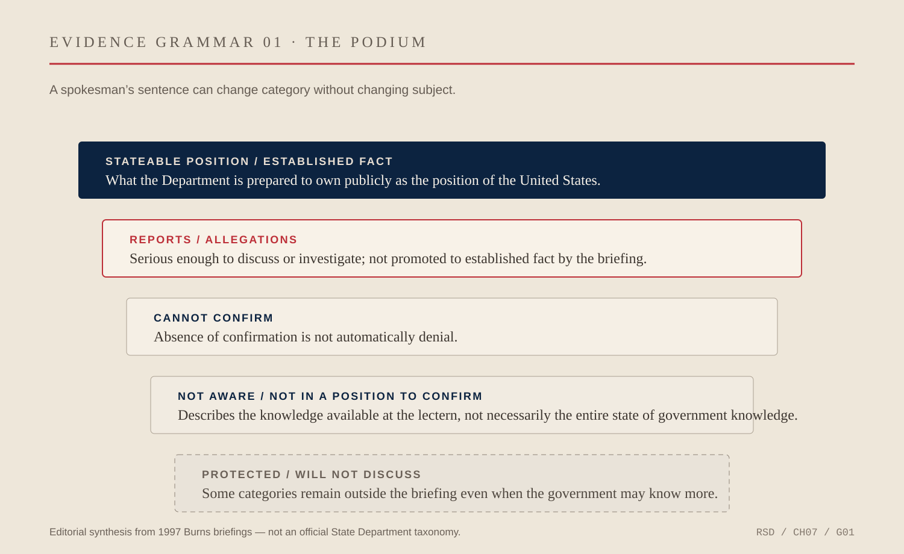
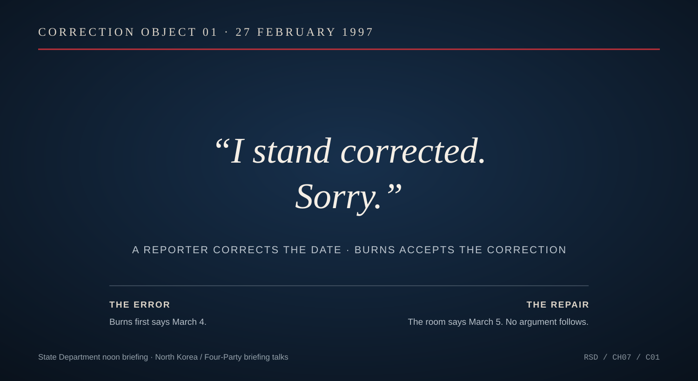

# Chapter 7 — Speaking for America

The dangerous word at a government podium is often not *yes* or *no*.

It is *is*.

A reporter asks whether something happened. Whether a government supplied a weapon. Whether a leader agreed to a proposal. Whether a rumor is true. Whether an American plan exists. Whether an event abroad means what somebody says it means.

The spokesman has to decide what kind of sentence the United States can afford to make.

Nicholas Burns took the State Department podium in 1995 after five years on the National Security Council staff. He had spent much of that period inside the rooms where policy was argued, revised, escalated, compromised and sent upward. Now he moved into a different kind of room.

Here, the work was public.

The questions arrived in sequence. The transcript survived. A careless adjective could become a headline before the briefing ended.

Burns served as State Department spokesman and a senior public-affairs official for Warren Christopher and Madeleine Albright. The Department's own biography says he gave daily press conferences on American foreign policy, traveled with both secretaries and coordinated public outreach.

The description sounds almost administrative.

The archive does not.

It contains wars, coups, terrorism, proliferation, sanctions, hostage crises, peace negotiations, diplomatic immunity, elections, assassinations, border disputes, nuclear programs, allegations of intelligence activity, and the recurring problem of governments saying things that other governments deny.

It also contains a surprising amount of uncertainty.

That is where the job becomes interesting.

The spokesman is called a spokesman because the words are not entirely his.

He stands at the podium as a person, but the sentences acquire institutional ownership. A reporter can ask Nick Burns a question. The answer can become the position of the United States.

The distance between those two facts is the profession.

In April 1997, after Secretary Albright met Chinese Vice Premier Qian Qichen, Burns briefed reporters on the discussion. China, Iran, Pakistan, missiles and chemical weapons were all in the mix. A reporter heard a distinction in Burns's wording: perhaps he had described Chinese assistance to Iran's chemical-weapons program as established while referring to missile transfers merely as reports.

That distinction mattered.

Burns looked at his notes.

He clarified that he had placed both categories under *reports and allegations*.

The exchange is small enough to disappear inside the larger history of U.S.-China relations. It is almost absurdly small compared with the subjects involved.

That is precisely why it reveals the job.

A noun had nearly crossed a border.

An allegation was in danger of becoming a fact because of the way a sentence had been heard and repeated. Burns's task was not to win the exchange. It was to put the claim back in its proper category.

The podium had its own grammar.

There was what the government knew.

There was what it believed.

There was what it had seen reported.

There was what it could confirm.

There was what it could not confirm.

There was what it would not discuss.

There was what it had not yet decided.

There was what Burns himself did not know.

Those categories overlap in ordinary conversation. At the State Department they can carry different diplomatic consequences.

*EVIDENCE GRAMMAR 01 — A synthesis of recurring states in Burns’s briefing language: an established U.S. position, reports or allegations, inability to confirm, limits on the briefer’s own awareness, and categories the Department will not discuss publicly. This is an editorial diagram built from transcripts, not an official State Department taxonomy. The April 28 China exchange is the clearest compact example: Burns checked his notes and returned both disputed transfer claims to the category of reports and allegations. [April 28 briefing.](https://1997-2001.state.gov/regions/eap/970428_burns_us-chin_bilat.html) [June 13 briefing.](https://1997-2001.state.gov/briefings/9706/970613db.html)*

In July 1997, as Cambodia descended into crisis, reporters pressed Burns about reports of Vietnamese involvement and arrests. He repeatedly declined to convert what had been reported into what the United States could establish. At one point he explained the distinction directly: inability to confirm a rumor did not mean the government was denying it.

This is not evasiveness by definition.

Sometimes it is evasiveness. Government spokespeople can hide behind formulae. They can answer a question adjacent to the one asked. They can repeat approved language until the room gives up.

But there is another possibility.

The government may genuinely not know.

A mature public language needs a way to say that.

The pressure of a briefing works against such modesty. The room rewards answers. Television rewards confidence. Officials are expected to know what their institutions know, and reporters are professionally correct to test that claim.

Yet the spokesman who turns uncertainty into certainty for the sake of fluency creates a different problem. He spends credibility that the government may need later.

Burns was not infallible.

In February 1997, during questioning over talks involving North Korea, he gave the wrong date. Reporters corrected him. Burns accepted it immediately.

> *“I stand corrected. Sorry.”*

*CORRECTION OBJECT 01 — State Department noon briefing, February 27, 1997. Burns initially said March 4 for the planned New York briefing talks; reporters supplied March 5. His repair occupied four words. The artifact is useful because correction itself becomes part of the institution’s credibility mechanism. [Briefing transcript mirror.](https://www.globalsecurity.org/wmd/library/news/dprk/1997/970227a.htm)*

There is no grandeur in the sentence.

There is value in that too.

A podium can tempt its occupant into defending every statement because admitting a small error feels like surrendering authority. The opposite can be true. Authority becomes more believable when it includes a mechanism for correction.

The harder cases involved not mistakes but boundaries.

In April 1997 a reporter asked whether the United States intended to seek a six-month freeze on Israeli settlement activity. The question concerned ideas being discussed amid active diplomacy. Burns refused to describe publicly the proposals Washington was putting to Israelis and Palestinians.

The public spokesman was defending private negotiating space.

That tension cannot be solved with a slogan about transparency.

Democratic government owes citizens an account of what it is doing. Diplomacy sometimes requires room to test an idea before turning it into a declared position. A proposal that can be explored privately may become impossible the moment every party has to defend it before a domestic audience.

The spokesman lives on the seam.

He must say enough to make policy intelligible without making negotiation impossible.

He must also know the limits of his own knowledge.

In June 1997 reporters questioned Burns about how visa processing for people in Taiwan might change after Hong Kong's approaching handover. Burns said he was not aware of a specific timetable. A reporter pushed the statement further: with the deadline so close, had the United States decided nothing?

Burns stopped the inference.

That was not what he had said.

There is a large difference between *I am not aware of a timetable* and *the United States has no timetable*.

One describes the knowledge available to the person at the podium.

The other describes the state of the government.

A careless spokesman can erase that distinction in half a sentence.

The same discipline applies across institutions. When reporters asked in 1996 about alleged Syrian military movements near Israel, Burns resisted pretending the State Department was the government's tactical intelligence desk. Other parts of the government watched the military situation closely. State could speak to the policy judgment: Washington did not see an imminent conflict. It could not responsibly turn the briefing into a unit-by-unit military assessment.

Speaking for America did not require claiming that every American government function belonged behind one lectern.

Sometimes the institution itself made the mistake.

In 1997 language in a letter from Vice President Al Gore referred to civil conflict in Khalistan. Sikh separatists seized on the wording as evidence that Washington recognized an independent Khalistan. India reacted angrily.

Burns had to stand at the podium and say, in substance, that the government had made a mistake. The United States did not recognize a Republic of Khalistan. Washington apologized to India.

There are easier forms of representation than apologizing for somebody else's sentence.

But that is representation too.

The spokesman does not get to claim institutional authority when the government is right and personal distance when it is wrong.

By 1997 Burns had developed a theory around this work.

Speaking to Foreign Service officers that May, he argued that public diplomacy was being undervalued inside the Department. Officers should not be judged only by the quality of the memoranda they wrote. They should also be expected to leave the building and explain what the United States was doing to people beyond Washington.

That argument reaches further than press technique.

Foreign policy is made by institutions whose language can become self-contained. Acronyms multiply. Experts speak to experts. A sentence can become perfectly clear inside the government and almost meaningless outside it.

Representation requires translation in both directions.

The diplomat abroad explains Washington to another country and another country to Washington.

The public diplomat explains foreign policy to citizens who finance it, vote on the leaders who make it, fight the wars it can produce and live with its consequences.

Burns understood the podium as part of that larger obligation.

He was also good at television.

Those facts should not be confused.

A polished spokesman can communicate bad policy effectively. A clumsy spokesman can represent sound policy badly. Communication is not evidence of wisdom.

The archive instead shows a narrower craft worth taking seriously: making institutional language usable without quietly changing its meaning.

That required repetition.

It required telling reporters that he did not know.

It required saying that a report could not be confirmed.

It required refusing to speculate even when the speculation was informed.

It required noticing when a question smuggled a disputed premise into its first clause.

It required occasionally correcting himself.

And it required doing all of this in front of the same people day after day.

That last fact matters.

A press corps has memory.

Reporters remember what was said yesterday. They remember the answer that was avoided last week. They know when a phrase changes. They compare guidance. They ask the same question again because sometimes the second answer is different.

The spokesman therefore accumulates something like diplomatic credit with an unusually skeptical constituency.

Not friendship.

Credibility.

On Burns's final day at the podium in July 1997, White House spokesman Mike McCurry came over to say goodbye. McCurry knew the peculiar exposure of a government lectern. He said that no one in the Clinton administration had commanded the State Department podium better than Burns.

Reporters had their own assessment. Contemporary coverage described Burns as cooperative, unflappable and relatively forthright. It also noted that he could answer at length and that, when the government wanted to condemn something, his language could become notably undiplomatic.

The room had learned him.

That familiarity is the bridge to the next part of this story.

Because Burns did something else at the podium.

He remained conspicuously from somewhere.

Boston appeared. The Red Sox appeared. Reporters learned the rituals and weaknesses of the fan standing behind the seal of the United States Department of State. Baseball became part of the room's social language.

It would be easy to treat that as decoration around the serious work.

It was not the serious work.

But it changed the human environment in which the serious work was done.

First, though, the distinction has to remain clear.

The joke was Nick Burns.

The answer belonged to the United States.