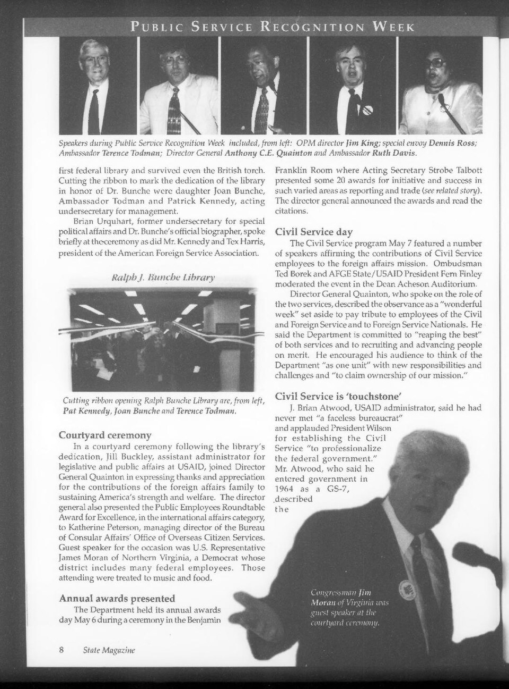

# Chapter 7 — Speaking for America

The dangerous word at a government podium is often not *yes* or *no*. It is *is*.

A reporter asks whether something happened: whether a government supplied a weapon, whether a leader agreed to a proposal, whether an American plan exists. The spokesman has to decide what kind of sentence the United States can afford to make.

Nicholas Burns took the State Department podium in 1995 after five years on the National Security Council staff, where policy had been argued, revised, compromised and sent upward in rooms the public could not see. Now the questions arrived in public and in sequence. The transcript survived. A careless adjective could become a headline before the briefing ended.

Burns served as spokesman and a senior public-affairs official for Warren Christopher and Madeleine Albright. The Department's biography says he gave daily press conferences on American foreign policy, traveled with both secretaries and coordinated public outreach. The archive is less administrative. It contains wars, coups, sanctions, hostages, peace negotiations, elections, border disputes, nuclear programs, intelligence allegations—and a surprising amount of uncertainty.

In April 1997, after Secretary Albright met Chinese Vice Premier Qian Qichen, Burns briefed reporters on China, Iran, Pakistan, missiles and chemical weapons. A reporter heard a distinction in his wording: perhaps Burns had described Chinese assistance to Iran's chemical-weapons program as established while referring to missile transfers merely as reports. Burns checked his notes and put both categories back under *reports and allegations*.

A noun had nearly crossed a border. An allegation was in danger of becoming a fact because of the way a sentence had been heard and repeated. Burns's job was not to win the exchange. It was to restore the claim to the category the government could support.

*EVIDENCE GRAMMAR 01 — A synthesis of recurring states in Burns’s briefing language: an established U.S. position, reports or allegations, inability to confirm, limits on the briefer’s own awareness, and categories the Department will not discuss publicly. This is an editorial diagram built from transcripts, not an official State Department taxonomy. The April 28 China exchange is the clearest compact example: Burns checked his notes and returned both disputed transfer claims to the category of reports and allegations. [April 28 briefing.](https://1997-2001.state.gov/regions/eap/970428_burns_us-chin_bilat.html) [June 13 briefing.](https://1997-2001.state.gov/briefings/9706/970613db.html)*

The podium had a grammar: what the government knew, what it believed, what it had seen reported, what it could confirm, what it would not discuss, what it had not decided and what the spokesman himself did not know. Those categories could sound fussy until one of them moved.

In July 1997, as Cambodia descended into crisis, reporters pressed Burns about reports of Vietnamese involvement and arrests. He repeatedly declined to turn reporting into established U.S. knowledge. At one point he made the boundary explicit: inability to confirm a rumor did not mean the government was denying it. Sometimes the government genuinely did not know. Certainty manufactured for the briefing room could spend credibility the government might need later.

Burns made mistakes too. In February 1997, during questioning over talks involving North Korea, he gave the wrong date. Reporters corrected him.

> **NICK / CORRECTION**
>
> “I stand corrected. Sorry.”
>
> *State Department briefing · February 27, 1997 · [Transcript mirror](https://www.globalsecurity.org/wmd/library/news/dprk/1997/970227a.htm)*

Four words repaired the date. The briefing moved on.

The harder cases involved boundaries rather than mistakes. In April 1997 a reporter asked whether the United States intended to seek a six-month freeze on Israeli settlement activity. Burns refused to describe publicly the proposals Washington was putting to Israelis and Palestinians. The government owed the public an account of its policy and was also trying to preserve room to test an idea before declaring it.

The same precision applied to Burns's own knowledge. In June 1997 reporters questioned him about visa processing for people in Taiwan after Hong Kong's approaching handover. Burns said he was not aware of a specific timetable. A reporter pushed the statement further: had the United States decided nothing? No. That was not what he had said.

*I am not aware of a timetable* describes the person at the podium. *The United States has no timetable* describes the government. Half a sentence separates them.

Sometimes the institution itself made the mistake. In 1997 language in a letter from Vice President Al Gore referred to civil conflict in Khalistan. Sikh separatists seized on the wording as evidence that Washington recognized an independent Khalistan. India reacted angrily. Burns had to say that the government had made an error: the United States did not recognize a Republic of Khalistan, and Washington apologized to India. The spokesman could not claim institutional authority when the government was right and personal distance when it was wrong.

By 1997 Burns had developed a larger argument about public diplomacy.

*ARCHIVE PLATE 01 — State Magazine, June 1997, p. 10. Department spokesman R. Nicholas Burns appears at the podium as the afternoon plenary speaker at Foreign Service Day on May 9, 1997. Photograph by Ann Thomas / U.S. Department of State. Public domain. The full magazine page is preserved so the contemporary caption and institutional context remain attached to the image. [Archive record.](https://commons.wikimedia.org/wiki/File:State_Magazine_1997-06-_Iss_406_(IA_sim_state-magazine_1997-06_406).pdf)*

Speaking to Foreign Service officers that May, he argued that public diplomacy was undervalued inside the Department. Officers should not be judged only by the memoranda they wrote; they should leave the building and explain what the United States was doing to people beyond Washington. He gave the institutional case in one compact line—“our first line of defense is our diplomacy”—before describing embassies and consulates as the first lines of national defense. [The May 9 address](https://1997-2001.state.gov/policy_remarks/970509.burns.html) makes the hierarchy explicit. Foreign-policy institutions easily become fluent in language clear only inside the institution. Representation required translation in several directions: Washington abroad, the foreign country back to Washington, policy to the public that financed it and lived with its consequences.

Burns was also good at television. That is not the same thing. A polished spokesman can communicate bad policy effectively. What the archive supports is narrower: a craft of making institutional language usable without quietly changing its meaning. That meant saying he did not know, declining to confirm a report, refusing to speculate, catching a disputed premise buried in a question and correcting himself in front of people who would be back the next day.

Those people remembered. Reporters could compare the answer avoided last week with the phrase that changed today. On Burns's final day at the podium in July 1997, White House spokesman Mike McCurry came over to say goodbye. Contemporary coverage described Burns as cooperative, unflappable and relatively forthright, while noting that he could answer at length and become notably undiplomatic when the government wanted to condemn something.

The room had learned him, including the Red Sox jokes. Boston appeared; reporters picked up the rituals and weak spots of the fan standing behind the State Department seal. Baseball became part of the room's social language without becoming part of policy.

The joke was Nick Burns. The answer belonged to the United States.