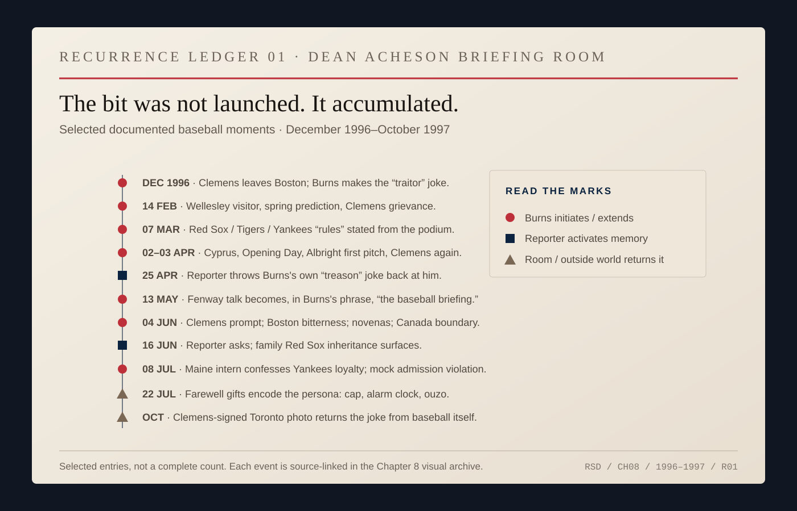
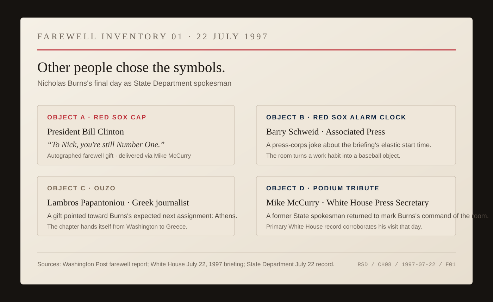
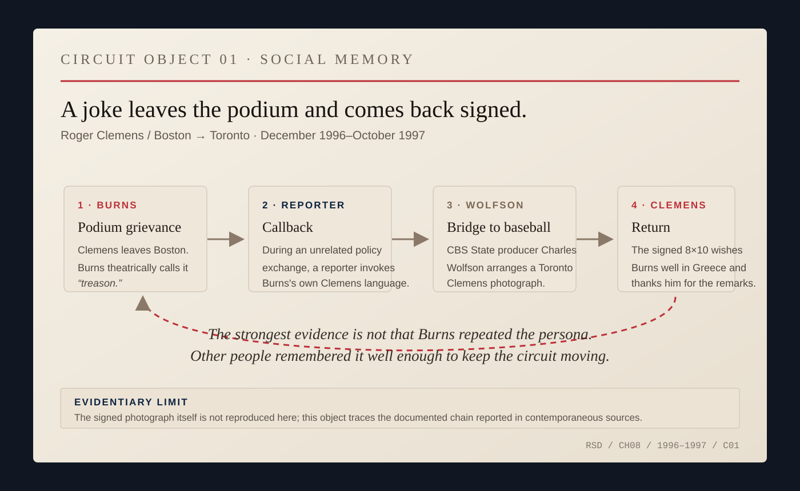

# Chapter 8 — The Briefing Room Bleachers

By the end, everyone knew the rules.

Red Sox good. Yankees bad.

The rules were not foreign policy. That was why they worked.

Nicholas Burns spent two and a half years at a podium where nearly every sentence carried institutional weight. Bosnia. Russia. China. Israel. North Korea. Terrorism. Arms control. A coup, a bombing, a negotiation, a rumor outrunning confirmation.

Then someone would ask about baseball.

The timing matters a little. Burns's spokesman years came just after the 1994 strike had erased the World Series and as Major League Baseball was trying to recover its ordinary place in American life. The game he treated as harmless shorthand had itself just demonstrated that a national ritual could be damaged by a fight over labor, ownership and money.

That history never entered the briefing room jokes explicitly.

It sat behind them.

By 1997, baseball could again feel routine enough to interrupt Bosnia or NATO for thirty seconds and then disappear.

*ARCHIVE NOTE — The 1994 players' strike ended the season and canceled the postseason. MLB's 1995 retrospective records a shortened return season and a substantial attendance drop as fans came back slowly. [1994 postseason history.](https://www.mlb.com/postseason/history/1994) [MLB 1995 year in review.](https://www.mlb.com/news/mlb-1995-year-in-review)*

The shift could happen in a line.

In March 1997 Burns was welcoming visitors when the talk wandered toward team loyalties. He announced the local rules:

> *“We do like the Boston Red Sox. We don't mind the Tigers. We hate the Yankees. Those are the rules.”*

A moment later he was back to Secretary Madeleine Albright's meetings and European security.

*ARCHIVE NOTE — U.S. Department of State Daily Press Briefing, March 7, 1997. [Primary transcript.](https://1997-2001.state.gov/briefings/9703/970307.html)*

Nothing had changed except the register.

The briefing room existed to test what the United States government meant. Reporters pressed the difference between policy and rumor, certainty and inference, public language and private maneuver.

Baseball occupied a territory everyone could identify as Burns's own.

By late 1996, the pattern was established. When Roger Clemens left Boston for Toronto, Burns jokingly denounced the pitcher as a traitor and declared the grievance the official position of the State Department.

The line was funny because it was obviously false.

The baseball judgment underneath it was real enough. Burns contrasted Clemens with Ted Williams and Carl Yastrzemski. Those men, he said, could say something Clemens no longer could: they had been lifelong Red Sox.

The standard was not greatness.

Clemens was already one of the best pitchers of his generation.

The standard was staying.

A few months later, the joke came back from the room.

During a serious exchange about the evidentiary basis for accusations against American citizens, a reporter reminded Burns that he had accused Roger Clemens of treason.

The room laughed.

Burns replied that the Clemens case had already been confirmed. Another reporter pointed out that Clemens merely worked for Toronto's baseball team. Burns answered with the previous night's result: Boston had beaten Baltimore 2–1 in twelve innings. Then he teased an Orioles supporter in the room.

Burns had not introduced baseball into the exchange. A reporter had remembered his language and thrown it back at him.

A persona can be announced by one person. Social shorthand requires other people to carry it.

*RECURRENCE LEDGER 01 — Selected documented baseball moments, December 1996 through October 1997. The marks distinguish Burns-initiated exchanges, reporter callbacks, and moments when the room or the outside world returned the persona to him. This is a curated evidentiary sequence, not a complete count. [Source map.](../research/ch08-visual-archive.md)*

The repetition mattered more than any single joke.

Burns would ask visitors about their teams. Reporters would test him with Yankees references. He could complain about Clemens, be teased about the complaint, and turn immediately back to settlements, proliferation or military deployments.

There is no evidence that the ritual bought him easier questions.

It did something smaller. The room knew a trivial fact about the man behind the institutional voice, and the fact was real enough to recur without being reintroduced.

On June 4, 1997, Burns said Boston was still bitter and announced, describing the condition of the team, that New England was saying novenas for the Red Sox. He extended the joke through mock-devotional language about resuscitation and the patron saint of lost causes.

Do not turn that into a claim about Burns's theology. The joke sounded like somewhere: a New England Catholic vocabulary of ritual, endurance and impossible cases attached to a baseball team whose failures had become communal folklore.

Then Burns marked the boundary himself.

Toronto had taken Clemens. That was baseball grievance. Canada remained one of America's closest friends and neighbors.

A few days later came the more biographically useful exchange.

Burns said his mother had been a Red Sox supporter. His father, by Burns's telling, had been hurt badly enough by the club's failures going back to the 1930s that he warned the children not to make the same mistake.

Burns ignored him.

The fandom had a family history. It was not a prop acquired by a government spokesman who discovered that baseball played well with reporters.

His father's warning was perfectly rational advice.

The team had caused disappointment. Stop caring.

The son cared anyway.

On July 8, a Colby College intern from Maine appeared at the briefing. Burns identified Maine as Red Sox territory and asked the obvious question.

The intern said he was a Yankees fan.

Burns acted as though a security violation had occurred. He jokingly invoked the rules of admission and directed the intern toward the doors before granting an All-Star Game reprieve.

No explanation was necessary. The script had become ritual.

The spokesman still defended policy. The reporters still tried to break through the defense. Familiarity coexisted with scrutiny.

On July 22, 1997, Burns gave his final State Department briefing before leaving for his next assignment.

Other people chose the symbols.

President Clinton sent an autographed Red Sox cap. Barry Schweid of the Associated Press gave Burns a Red Sox alarm clock and used it to tease him about the briefing's famously elastic start time. Mike McCurry, the White House press secretary and a former State Department spokesman, came to the podium to praise Burns's command of it.

Lambros Papantoniou, a Greek journalist whose detailed questions about Greek-Turkish disputes had repeatedly tested Burns from the press seats, brought a bottle of ouzo.

*FAREWELL INVENTORY 01 — July 22, 1997. President Clinton's autographed Red Sox cap, Barry Schweid's Red Sox alarm clock, Lambros Papantoniou's ouzo, and Mike McCurry's return to the podium make the room's accumulated memory physical. The strongest contemporaneous farewell photograph remains research-only pending publication rights. [Source map.](../research/ch08-visual-archive.md)*

The objects summarized the room's memory of him.

The government spokesman.

The guy from Boston.

The official who could spend one minute arguing about the Yankees and the next telling reporters exactly what the United States was—and was not—prepared to say about a crisis.

The baseball bit did not quite leave with him.

By October, while Burns was waiting for Senate confirmation to go to Athens, the Clemens joke returned from outside the Department. *The Washington Post* reported that CBS State Department producer Charles Wolfson, another long-suffering Red Sox fan, had arranged for an eight-by-ten photograph of Roger Clemens in his Toronto uniform. Clemens signed it to Burns with good wishes for the new job and thanks for Burns's earlier “kind words.”

*CIRCUIT OBJECT 01 — December 1996–October 1997. Burns's theatrical grievance becomes a reporter callback, then leaves the room through CBS producer Charles Wolfson and returns as a signed Clemens photograph. The original photograph is not reproduced; the diagram shows only the documented chain. [Source map.](../research/ch08-visual-archive.md)*

A player changed teams. A government spokesman complained theatrically. Reporters remembered. One used Burns's own language against him during a policy exchange. Another carried the joke into baseball itself. The player sent it back.

Other people had learned the script well enough to keep writing it after Burns left the room.

Greece was next.

In Washington, the Red Sox had been a mark of personality inside an American institution whose press corps already knew the rules. In Athens, Burns would represent the United States inside another country's politics, history and suspicions.

The cap could travel.

The room could not.