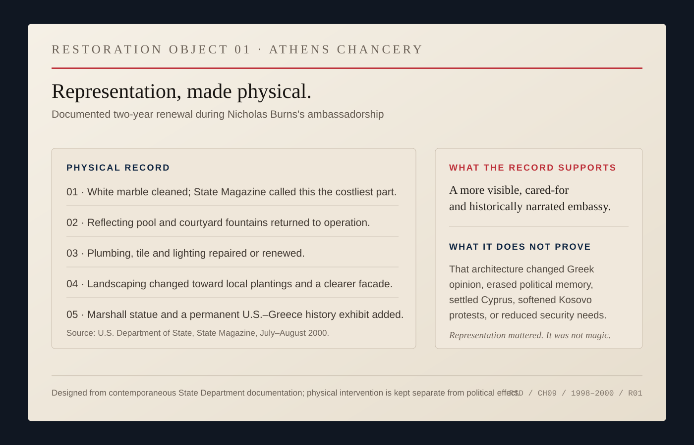
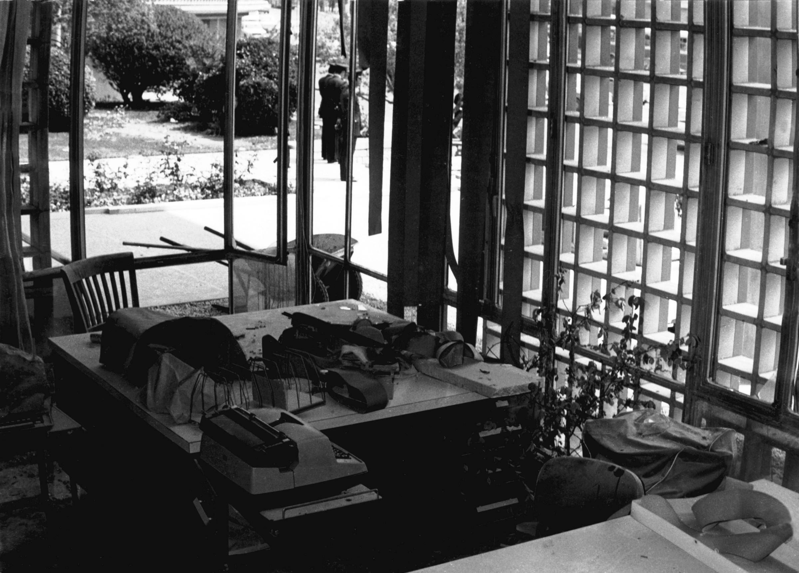
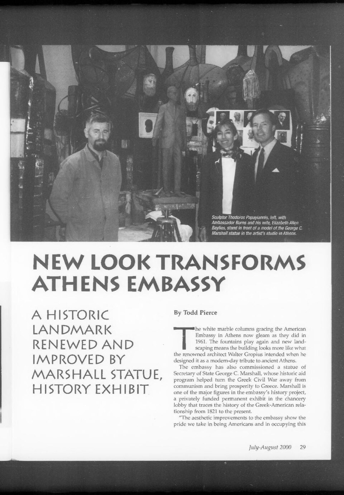
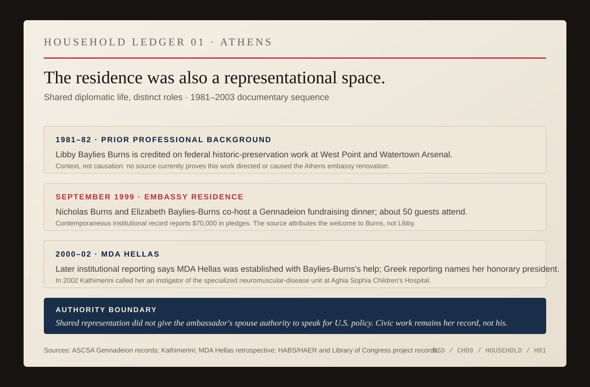

# Athens

The embassy was supposed to be seen.

That sounds obvious until an embassy becomes a target.

The American chancery in Athens had been designed by Walter Gropius's firm as a modern building in the middle of the city, an architectural statement as well as a workplace. By the time Nicholas Burns arrived as ambassador in 1997, the statement had become harder to read. Security measures had accumulated. Hedges and vines crowded the exterior. The fountain had stopped running. The building still represented the United States because that was its function. The question was what kind of United States it represented when people looked at it.

Burns cared about the answer.

During his tenure, the embassy cleaned the exterior marble, repainted stucco, removed dense and inappropriate plantings, replaced them with local landscaping, and turned the fountain back on. The changes were modest compared with the problems handled inside the building. They were also intentional. A contemporary account in the *Foreign Service Journal* described the project as an attempt to increase the appearance of openness without increasing exposure. Burns wanted the property to show respect for Greece. A permanent exhibit on the history of the U.S.-Greek relationship went into the chancery. A sculpture of George C. Marshall went into the newly visible garden.

This was not landscaping as foreign policy. It was landscaping as representation.

There is a difference.

*RESTORATION OBJECT 01 — Athens chancery, 1998–2000. The contemporaneous State Department record documents cleaned marble, revived fountains, plumbing, tile and lighting work, new landscaping, and the Marshall statue/history-exhibit projects. The object separates those physical interventions from outcomes they cannot prove: political consent, erased memory, reduced security needs, or agreement with U.S. policy. [Primary source.](https://1997-2001.state.gov/publications/statemag/statemag_jul2000/feature5.html)*

Burns had spent the previous two and a half years standing behind a State Department lectern, where representation was mostly verbal. The seal was fixed to the podium. The American flag stood nearby. Reporters supplied the friction. His task was to make policy intelligible without changing it in the act of explanation.

Athens enlarged the instrument.

Now the building represented America. The residence represented America. The people at the visa window represented America. The cultural program represented America. A defense sale represented America. A meeting with a newspaper editor represented America. So did a motorcade, a security barrier, a school visit, a speech, a delayed appointment, a party, a protest outside the gate.

The ambassador could not control all of these things. He was nevertheless responsible for the accumulation.

That responsibility was unusually complicated in Greece.

The bilateral relationship carried more historical memory than its formal alliance suggested. The United States and Greece were NATO allies. The United States had played a major role in Greece's postwar recovery. Greek Americans formed one of the strongest human bridges between the countries. Yet American power also arrived in Greek political memory through the civil war, the junta years, Cyprus, rivalry with Turkey, and a long habit of suspecting Washington of managing Greek affairs from above.

*FIG. 05 — U.S. Embassy Athens chancery, 1975. U.S. National Archives, series “Photographs Related to Embassies, Consulates, and Other Overseas Buildings.” The finding aid identifies “Demonstration Damage Following Riots.” This predates Burns's arrival by twenty-two years and is not evidence of the physical condition he inherited; it shows that the same chancery had long functioned as a public political object. Public-domain federal archive route; vendor and re-verify exact NARA metadata before release. [Archive record.](https://nara.getarchive.net/topics/athens/history%2Bof%2Bathens%2Bgreece)*

Burns did not arrive with a blank sheet of paper. No ambassador does.

In a 1998 appearance at Harvard, he said his first priority was to strengthen a relationship that ought to be close. One mechanism he emphasized was almost embarrassingly simple: leaders needed personal relationships and reliable ways to talk to one another. He also pointed toward economics, NATO, the Balkans, terrorism, Cyprus, and Greek-Turkish relations. The agenda was broad because the relationship was broad.

Inside the embassy, John Koenig saw what that breadth looked like from the working level.

Koenig headed political-military work and spent roughly three years working closely with Burns. Two of the major projects in his portfolio were American arms sales to the Hellenic armed forces and efforts to reduce tensions between Greece and Turkey, including military issues. The arms relationship was substantial: Koenig remembered F-16s and Patriot systems among the major sales. He also remembered accompanying Burns repeatedly to see Defense Minister Akis Tsochatzopoulos.

Koenig's judgment of Burns was admiring, and it should be read as the judgment of a colleague who later continued working for him. But it is valuable because it describes something observed at close range. Burns, Koenig recalled, was unusually effective at face-to-face persuasion. The communication skill familiar from the State Department podium did not disappear when the cameras did. It became directed at one person across a table.

That was one side of the embassy.

Another was being built in classrooms, seminars, cultural programs, press contacts, and relationships that would never produce a defense contract or a summit communiqué.

Barbara Nielsen arrived in Athens as cultural affairs officer in 1999. She remembered Burns as deeply interested in public diplomacy. His years as spokesman mattered: he knew how he wanted the mission to conduct that work, she said, and he set the tone.

The programs Nielsen described were not glamorous. There was an American studies seminar. There were discussions of biotechnology when European audiences were skeptical of genetically modified foods. There was work explaining the American election system to Greek media and audiences during the strange presidential contest of 2000. There were efforts involving American-style higher education and cultural programming. Greek-American organizations came through frequently, and Nielsen remembered Burns as welcoming their involvement.

The relationship with the diaspora could become more embedded than receiving delegations.

AHEPA's own institutional history says Burns developed a friendship with Steve Manta, the organization's 1997–98 supreme president, and joined Manta's Milo Chapter 348 in Chicago. AHEPA was still describing Burns publicly as one of its members years after he left Greece.

The surviving public record does not tell us exactly when he joined, whether the membership was honorary or ordinary, or how active he was inside the chapter. There is no need to guess.

The membership matters because it changes the social geometry. Burns was not only asking Greek Americans to function as a bridge. According to the institution's own record, he stepped into one of their civic organizations himself.

By October 2000, that relationship was visible at institutional scale. The embassy and AHEPA jointly staged a multi-day *Celebration of the U.S.-Greek Relationship*: a press conference, embassy briefings, civic receptions, the rededication of the Philhellenes monument, a tree-planting event, the unveiling of the George C. Marshall statue, an embassy reception, and a conference on the future of the bilateral relationship.

The Marshall statue made the structure especially clear. A contemporary State Department account says Burns approached a major Greek-American association to help fund the memorial. AHEPA later said its Centennial Foundation raised $110,000 for it. Manta himself later served on that foundation.

The monument therefore had more than one institutional author. It stood on American diplomatic property, commemorated an American statesman whose postwar program mattered enormously to Greece, and was financed through a Greek-American civic organization.

That is what a diaspora bridge can look like when it becomes physical.

It is also where the boundary matters most. AHEPA membership did not turn Burns into the organization's policy representative. AHEPA did not become an arm of the embassy. Friendship with Greek-American leaders did not entitle them to dictate American policy.

The useful fact is smaller and more durable: another relationship existed between the official bilateral structure and Americans whose family identity ran through Greece.

*ARCHIVE NOTE — The Order of AHEPA, “Past Supreme President Steve Manta Passes Away,” January 10, 2023, records Burns joining Manta's Milo Chapter 348. A contemporaneous American Hellenic Institute newsletter records the embassy/AHEPA October 10–13, 2000 “Celebration of the U.S.-Greek Relationship.” State Department and AHEPA records separately document the Marshall statue partnership. [AHEPA record.](https://ahepa.org/past-supreme-president-steve-manta-passes-away/) [State Department record.](https://1997-2001.state.gov/publications/statemag/statemag_jul2000/feature5.html)*

The residence belonged to that representational world too, and this is where an ambassador-only account becomes incomplete.

In September 1999, the American School of Classical Studies at Athens used the residence for the final push in a Gennadeion fundraising campaign. Its contemporary newsletter says the dinner was hosted by Nicholas Burns and his wife, Elizabeth Baylies-Burns. About fifty guests came. The evening produced seventy thousand dollars in pledges.

The source records Burns giving the welcome. It does not give Libby a speech, and there is no reason to invent one.

Her documented role is enough.

The diplomatic household was helping convene a Greek-American cultural institution around a concrete project. The residence was not merely where the ambassador slept after the official work ended. It was one of the places where representation happened.

Libby's own Athens record goes further than hosting.

MDA Hellas, the Greek muscular-dystrophy organization, was established in 2000 with her help, according to a later organizational retrospective. By 2002, when Greece's president inaugurated a specialized neuromuscular-disease unit at Aghia Sophia Children's Hospital, *Kathimerini* identified Elizabeth Baylies-Burns as the organization's honorary president and an instigator of the project. A year later she was still being identified as honorary president while MDA Hellas raised money for another unit.

The record now gives one particularly concrete example of initiative. In March 2003, after the Burns family had already left Athens, *Kathimerini* previewed a sold-out Agnes Baltsa benefit performance for MDA Hellas and said the idea for the concert had come from Libby.

That is different from lending a title or appearing at a gala.

It does not tell us that she booked the artist or ran the event. It does tell us that a contemporary Greek source credited her with originating an idea that raised public attention and money for an organization whose medical work continued after the posting ended.

A later Greek column adds one piece of family context that should remain carefully attributed. It says journalists at an MDA Hellas gathering had been told that muscular dystrophy had also affected a beloved cousin in Nicholas Burns's family.

The source does not identify the cousin. It does not establish the diagnosis beyond that muscular-dystrophy context. And it does not say this family experience caused Libby's work.

The restraint matters because the documented work is already substantial without an invented motive.

That work belongs to her record, not as decoration around his.

It also clarifies what a shared diplomatic life can mean without confusing roles. Libby did not acquire authority to speak for the United States because her husband was ambassador. Her civic work was not foreign policy. But a posting creates a household presence as well as an official office, and the surviving Athens record shows that she used that presence for projects with their own institutional life.

There was another piece of background the public biographies usually leave out.

Years before Athens, Libby had worked as a historian on federal historic-preservation projects. In 1981, a Historic American Buildings Survey report credited Libby Baylies Burns with helping assemble a structures inventory of West Point. The next year, the Library of Congress credits Libby Baylies as a historian on the Watertown Arsenal survey; the underlying report identifies Libby Baylies Burns and Betsy Bahr as the historians who did the fieldwork and prepared the study. Their task included documentary research, building inventory, historical and architectural evaluation, and preservation recommendations.

That does not prove she shaped the Athens embassy renovation.

The archive has not earned that sentence.

It does change the background. The ambassador's spouse arrived in Athens with her own prior experience asking how institutional buildings carried history and what parts of them should be preserved.

A State Department feature from the Athens period offers a quieter image. It shows sculptor Thodoros Papayiannis with Burns and Libby standing in front of the model of the George C. Marshall statue that would become part of the embassy's physical retelling of the U.S.-Greek relationship.

The photograph does not tell us who decided what.

It does tell us who was there.

.pdf)

*ARCHIVE PLATE 02 — `State Magazine`, July–August 2000, No. 437, p. 29. Sculptor Thodoros Papayiannis with Ambassador Nicholas Burns and Elizabeth Allen Baylies beside the model of the George C. Marshall statue in the artist's Athens studio. U.S. Department of State; public domain. The full publication page is retained so the magazine's own caption and neighboring context remain visible. The archive filename mislabels the issue as 1998; State's contemporary archive and the issue itself identify July–August 2000. [State feature.](https://1997-2001.state.gov/publications/statemag/statemag_jul2000/feature5.html) [Archive issue.](https://commons.wikimedia.org/wiki/File:State_Magazine_July-August_1998-_Iss_437_(IA_sim_state-magazine_july-august-1998_437).pdf)*

*HOUSEHOLD LEDGER 01 — Athens and earlier background. The ledger distinguishes Libby Baylies-Burns's federal preservation work, the couple's documented Gennadeion residence hosting, and her MDA Hellas role. Its bottom line is an authority boundary: shared diplomatic life did not give the ambassador's spouse authority to speak for U.S. policy, and her civic work remains her record rather than his. [Source map.](../research/ch09-visual-archive.md)*

This is what public diplomacy often looks like when nobody is making a movie about it. Not one transformative speech. Repetition. Invitations. Explanations. People who already disagree showing up anyway.

Nielsen's recollection is useful for another reason. She resisted an easy American story about Greece.

The Kosovo war had made American policy deeply unpopular. The press could be ferociously critical. Demonstrations were loud and visible. Yet Nielsen did not remember ordinary diplomatic work as taking place in a uniformly hostile society. She distinguished political anti-Americanism from the procedural frustrations of Greek bureaucracy and from the generally workable relationships American diplomats had with Greeks in daily life.

That distinction matters.

A country is not its loudest protest. Nor is a protest merely noise to be discounted because an ambassador finds the government cooperative. Diplomacy requires holding both facts at once.

In 1999, the contradiction became impossible to miss.

NATO had bombed Yugoslavia for seventy-eight days during the Kosovo conflict. Greek public opinion was overwhelmingly hostile to the campaign and sympathetic to Serbia. President Bill Clinton planned a visit to Athens that November. The visit became entangled with demonstrations, security disputes, Greek domestic politics, and arguments over whether protesters would be allowed to march toward the American embassy.

The building Burns had tried to make more visibly welcoming remained a natural destination for anger at American policy.

There is no contradiction in that either.

An embassy is simultaneously a workplace, a communications channel, a piece of architecture, a sovereign symbol, and, when people are furious with the country it represents, a target onto which they can project that fury. Cleaning the marble does not change the bombing of Yugoslavia. Turning on a fountain does not settle Cyprus. A historical exhibit does not erase the junta from Greek memory.

The point of openness was not to make disagreement disappear.

It was to make representation less evasive.

When the Clinton visit ran into trouble, Burns and Greek Foreign Minister George Papandreou worked through revised arrangements. Events were shifted. Security and protest had to coexist somehow. The American president came to a country in which his government's recent military policy was intensely unpopular and in which the bilateral relationship was simultaneously improving in important official respects.

That is a more useful picture of diplomacy than popularity.

A diplomat can be effective in a country where his government is unpopular. A government can cooperate with Washington while its citizens march against Washington. A Greek official can work closely with an American ambassador on one issue and resist him on another. An embassy can remove vines from its facade and still need serious physical security.

The work happens inside those contradictions.

Burns's representational instinct in Athens was expansive. The embassy itself became part of the message, but not the whole message. He met journalists. The mission worked with students and universities. Greek-American organizations were treated as partners. Commercial and defense advocacy occupied serious institutional attention. Greek-Turkish relations demanded persistent work. Terrorism remained a painful bilateral issue. The Balkans kept intruding. Cyprus never became simple.

The ambassador had moved a long way from the spokesman's podium, but the underlying discipline was recognizable.

At State, he had learned that a word could be mistaken for policy because it came from the person standing behind the seal.

In Athens, almost anything could be mistaken for policy because it came from the embassy.

A barrier could communicate contempt. A neglected building could communicate indifference. A visiting governor could communicate commercial commitment. A cultural seminar could communicate curiosity. A public criticism could communicate impatience. A repaired fountain could communicate care, provided one did not ask it to communicate more than a fountain possibly could.

That last limitation is important.

There is a temptation in diplomatic biography to turn every small act into evidence of a grand method. Burns cut back vines, therefore he believed in openness. Burns loved the Red Sox, therefore he understood loyalty. Burns met journalists, therefore he understood democracy. The life becomes a collection of symbols arranged after the fact.

The record is better than that.

The contemporary account of the embassy work explicitly connects the physical changes to respect and apparent openness. Nielsen independently remembers a public-diplomacy-minded ambassador setting the mission's tone. Koenig independently remembers an ambassador intensely engaged in direct persuasion on difficult political-military business. The Harvard record shows Burns publicly arguing for stronger personal and institutional connections between the two countries. The AHEPA record adds a diaspora institution Burns joined and with which the embassy built a multi-day representational program. The Gennadeion dinner and MDA Hellas record show that the representational life of the post also had a household and civic dimension that cannot be reduced to the ambassador alone. Libby's earlier preservation work gives that household a professional history of its own without proving a causal role in the Athens redesign. And the protests surrounding Clinton's visit show the limit of all of it.

Representation mattered.

Representation was not magic.

That may be the more interesting lesson of Athens.

The embassy could look better. The channels could become denser. The ambassador could make himself available and recognizable. The two governments could cooperate on consequential issues. None of this entitled the United States to Greek agreement, gratitude, or affection.

An ambassador represents a country to people who are free to dislike what the country does.

The job is not to make that freedom disappear.

The job is to keep showing up inside it.

In Greece, Burns would eventually find a peculiarly American way to do some of that showing up. It began with a sport most Greeks did not understand, a small domestic baseball effort, and a network that would eventually reach into the Greek-American diaspora, Major League Baseball, the Baltimore Orioles, and the Olympic Games.

That story deserves its own inning.
