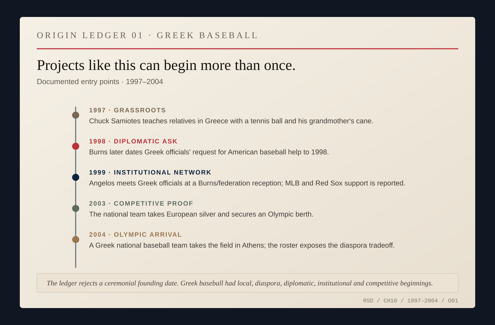
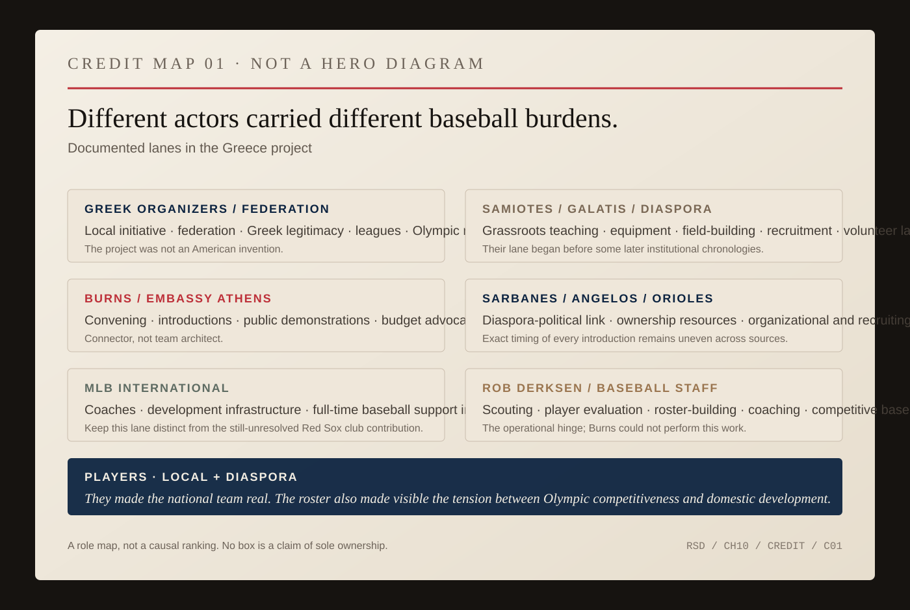
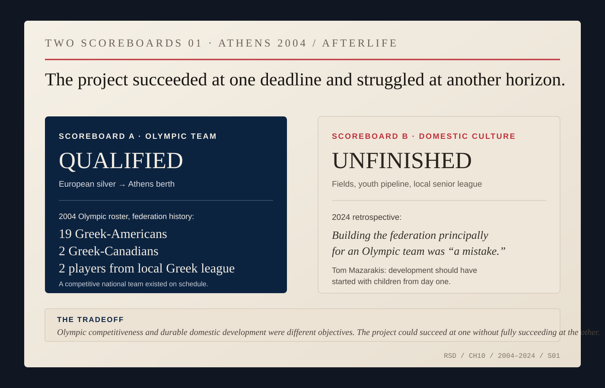

# Bringing Baseball to Greece

The request was not strategic.

It was not about Cyprus. It was not about Greek-Turkish relations. It was not about NATO, terrorism, arms sales, Kosovo, or the Balkans.

It was about baseball.

Greece had been awarded the 2004 Olympic Games. As host, it would be expected to field teams across a wide range of sports. Baseball presented an unusual problem. The country did not have a mature baseball culture, a deep player pool, or the infrastructure required to build an Olympic-caliber team quickly. Contemporary reporting described only a couple of rough diamonds at a former American military base. Most Greeks Burns encountered, he later said, did not really know what to make of the game.

That did not mean baseball was absent from Greece.

Greek organizers were already trying. Panos Mitsiopoulos and others built the Hellenic Amateur Baseball Federation. They had the Olympic deadline and the local problem. What they lacked was a mature baseball system behind them.

So they asked for help.

The exact date of the first approach shifts depending on which later account one reads. Burns's own retrospective places it in 1998. Other reporting points to 1999. A later federation history compresses part of the chain into 2001, although contemporary evidence already shows the American network active before then.

Projects like this do not always begin once.

*ORIGIN LEDGER 01 — Greek baseball, 1997–2004. The ledger refuses a single founder or ceremonial start date: grassroots teaching, the diplomatic request, professional-baseball support, competitive qualification and Olympic participation entered at different moments. [Source map.](../research/ch10-visual-archive.md)*

In January 2000, an Associated Press reporter found Chuck Samiotes, a civil engineer from Wayland, Massachusetts, already carrying his own origin story. On a family visit to Greece in 1997, Samiotes had improvised a baseball game for nieces and nephews with a tennis ball and his grandmother's cane. He returned the next year with balls, bats and gloves and began teaching children in an Athens suburb.

Samiotes did not need an embassy to tell him baseball might travel to Greece. He was a Greek American, a die-hard Red Sox fan, and somebody who wanted to play and teach the game. Years later CNN would describe him and his best friend and business partner Bill Galatis as instrumental in developing Greek baseball: helping build a field, train young people and recruit players.

Their work did not replace the federation's work or Burns's. It complicates the ownership of the story.

By 1999, the network was plainly alive.

The game arriving in Greece was already more than a sealed American cultural export. It moved through Greek-American families, professional clubs, Major League Baseball's international machinery, scouts whose work crossed the Pacific, and athletes formed in baseball systems outside Greece who still had claims on Greek identity.

Greece would not simply receive baseball from the United States.

It would translate it.

Peter Angelos, the Greek-American owner of the Baltimore Orioles, met Greek baseball officials at a reception held by Burns and the Hellenic Amateur Baseball Federation. A contemporary *Washington Post* item reported that the baseball commissioner's office and the Boston Red Sox were also helping.

For Burns, this was almost comically well matched to the person who happened to occupy the embassy. He was a lifelong Red Sox fan. But fandom by itself was useless.

Greece needed coaches, players, equipment, organizational experience, money, political attention, and eventually an answer to the hardest practical question: where would an Olympic-level Greek baseball team find enough Olympic-level baseball players?

Burns's first move was to find people who possessed what the embassy did not.

An ambassador can convene.

Official position creates telephone calls that get returned. It creates rooms people will enter because somebody with institutional authority asked them to come. It allows one network to touch another.

Burns helped activate Greek-American and baseball institutions around a problem the embassy could never solve directly. He was not activating empty space. Samiotes, Galatis and Greek organizers were already moving through it.

Later federation accounts put Senator Paul Sarbanes in the chain connecting Burns to Angelos. The exact sequence should not be overdrawn. What is clear is that Burns, Sarbanes, Angelos, Major League Baseball, the Orioles organization, Greek organizers, Boston-area Greek Americans, and eventually a group of professional baseball people became linked around the project.

*CREDIT MAP 01 — Greece baseball project. The map assigns documented work lanes instead of drawing a hero at the center: Greek organizers supplied local initiative and legitimacy; diaspora volunteers taught and built; Burns and the embassy convened and advocated; baseball institutions supplied expertise; Rob Derksen and staff built a competitive team; players made it real. This is a role map, not a causal ranking. [Source map.](../research/ch10-visual-archive.md)*

Once Angelos was involved, the scale changed.

The Baltimore Orioles could supply something an embassy could not: baseball competence at professional depth.

Angelos committed organizational resources. Major League Baseball's international operation became involved. Scouts and coaches entered the picture. The Boston Red Sox were reported to have offered support, although the surviving public record is still thin on exactly what that support consisted of.

Burns's role did not end with introductions.

American coaches and players came to Greece for demonstrations. Burns appeared on Greek television from a batting cage to show how to hit. He played catch with Greek children. He pressed the Greek government to establish a baseball budget.

An ambassador in a batting cage looks faintly absurd. That is part of the point.

A batting cage is a place where expertise becomes visible quickly. Either you know what the object in your hand is for or you do not. Burns could do something there he could not do with Cyprus or Kosovo.

He could demonstrate.

Burns also understood that the Olympic deadline was not the same thing as building a baseball culture. In the 2000 account, he used a Greek phrase for going slowly and said the change would take a generation.

Samiotes, speaking from the grassroots side, made almost the same distinction. He rejected the idea of treating Athens as a one-off Olympic adventure and talked instead about continuing to teach children afterward.

The project then ran into the arithmetic of elite sport.

You cannot manufacture Olympic-level baseball players in six years.

That forced the project outward into the Greek diaspora. Many of the best available players with Greek eligibility had grown up in the United States, Canada, or other places where baseball already existed as a serious sport.

The effort was no longer only about growing baseball inside Greece.

It was also about constructing a national team across a diaspora.

That is where Rob Derksen enters the story.

Derksen had spent years in professional baseball as a player, coach, manager, and scout. A contemporaneous Associated Press obituary records that he had managed in the minor-league systems of both Milwaukee and the Boston Red Sox before becoming a Pacific Rim scout for the Baltimore Orioles. Minor-league records identify his Boston stop precisely: in 1997 he managed the Sarasota Red Sox, Boston's Class A Florida State League affiliate.

That is a coincidence of networks, not an explanation.

There is no evidence Burns recruited Derksen because of the Red Sox connection. The documented route into Greece runs through Peter Angelos and the Orioles.

Derksen became the operational hinge.

He traveled in search of eligible players. He developed candidate lists. He helped assemble coaching and scouting capacity. He moved the project from public diplomacy into competitive baseball.

Burns could create connection.

Derksen could evaluate a shortstop.

Burns could lobby for a budget.

Derksen could build a team.

The stronger version of this story gives away the credit.

By the early 2000s, that was happening.

Burns left Greece in 2001 to become ambassador to NATO. Thomas Miller succeeded him in Athens. Miller later remembered the baseball effort as something that had begun before his arrival under Burns, whom he described as a baseball obsessive, and then continued under the new embassy leadership.

Miller helped sustain Major League Baseball involvement, training, and the search for players of Greek ancestry.

The Greek federation kept going. Angelos and the Orioles kept going. Major League Baseball kept going. Coaches kept going. Players kept going.

The project had moved beyond Burns.

Under Derksen, Greece won its way through qualifying rounds and reached the 2003 European Championship. It finished second and secured a place in the 2004 Olympic baseball tournament.

Then Derksen died.

In June 2004, only weeks before the Athens Games, he suffered a fatal heart attack while still working on the Greek team.

He was forty-four.

Players later described him as a catalyst. He had recruited them, organized them, coached them, and helped turn an improbable Olympic requirement into an actual team.

His death fixes the limit of any Burns-centered telling. By the time the project reached its culminating event, the person carrying the heaviest baseball burden was not the diplomat who had helped open doors years earlier. It was a baseball lifer whose name would mean almost nothing in the traditional history of American foreign policy.

That is why he belongs here.

The team went to Athens anyway.

It was not a medal contender. It was not evidence that Greece had suddenly become a baseball country. The roster showed the hybrid reality of the project: Greek citizens and Greek-descended players formed through baseball systems largely outside Greece, gathered under a national flag for a sport still new to much of the host country.

That solution carried its own tension.

The competitive case for the diaspora roster was real. Greece's own later history describes a local player pool that international baseball officials judged nowhere near Olympic level. The federation's account says the qualifying team relied on twenty-two North American players and only two from the local Greek league.

The strategy worked at the thing it was designed to do.

Greece qualified.

It also changed what the local players thought they were training for.

During the Athens Games, *Kathimerini* reported that documentary filmmaker Valerie Kontakos had begun following the local players years earlier, when the federation was training Greek amateurs for the national team. By the final Olympic run-up, the paper reported, only two of thirteen locally trained players were selected. Greek coach Dimitris Gousios resigned after the shift toward the diaspora-heavy roster.

Kontakos did not pretend the local players were better than they were. She said they understood the skill gap.

The grievance was about the bargain.

Players who had been encouraged to train as potential Olympians came to believe, late in the process, that the competitive plan had changed around them. One local player told Kontakos that clearer expectations would have allowed them to treat the experience as training and education rather than a roster promise.

A person can accept that someone else is the better shortstop and still object to how he was told the competition would work.

Derksen himself makes the story harder to divide into villains and victims. After his death, a *Washington Post* report said the native Greek players competing for spots adored him because he taught them the game. The scout who helped recruit the diaspora talent that narrowed their Olympic chances was also one of the people who expanded their baseball knowledge.

Help and displacement can arrive through the same door.

Twenty years later, the Greek national program was still arguing with the tradeoff. In a 2024 retrospective, general manager Tom Mazarakis looked back on the Olympic effort with admiration and a sense of missed opportunity. Building a federation principally to field an Olympic team, he said, had been a mistake. The domestic work should have begun with children from the first day.

The modern national team nevertheless remained overwhelmingly composed of players raised or based abroad. Local facilities were scarce. The last Olympic-era baseball fields at Elliniko had disappeared. Federation leaders were again trying to recruit children and create places for them to practice.

The Olympic team had survived as a national-team institution.

A self-sustaining baseball culture had not emerged at the same scale.

*TWO SCOREBOARDS 01 — Athens 2004 and the afterlife. The Olympic objective was achieved: the federation's later history lists a roster of nineteen Greek-Americans, two Greek-Canadians and two players from the local Greek league. The domestic-development objective remained harder; in 2024 Tom Mazarakis argued that the federation should have begun with children from day one. These are different measures of success, not a verdict that one side of the roster debate was morally pure. [Source map.](../research/ch10-visual-archive.md)*

The Olympic deadline had rewarded the result that could arrive on time.

Whether the project succeeded in building baseball in Greece depends on which part of that sentence one emphasizes.

The evidence earns neither ridicule nor romance.

A federation emerged. American and Greek-American networks became involved. Professional baseball institutions contributed expertise. Players found a route into a national team. Youth participation grew. A sport that had barely registered in Greek public life acquired enough structure to field an Olympic side.

No single person did that.

Burns's own later summary is useful precisely because it distributes the ownership.

> **NICK / HELLAS**
>
> ### “It was a joint venture between America and Greece, and it was one of the best things I ever did as ambassador.”
>
> *Nicholas Burns on the Greek baseball project · 2004 · [Christian Science Monitor](https://www.csmonitor.com/2004/0818/p02s01-woeu.html)*

The word *joint* carries more weight than any heroic version of the story.

At the State Department podium, Burns had represented American policy through tightly bounded institutional language.

In Athens, authority could be used differently: not to command, but to connect.

A senator could know an owner. An owner could supply a scout. A scout could find players. A league office could supply expertise. A federation could build legitimacy. A government could create a budget. A civil engineer could teach children with a bat and ball. Two Boston business partners could help build a field.

Baseball did not solve Greece.

It created a field on which people who did not need to agree about everything could still build something together.

And eventually the ambassador became less important to the story.
