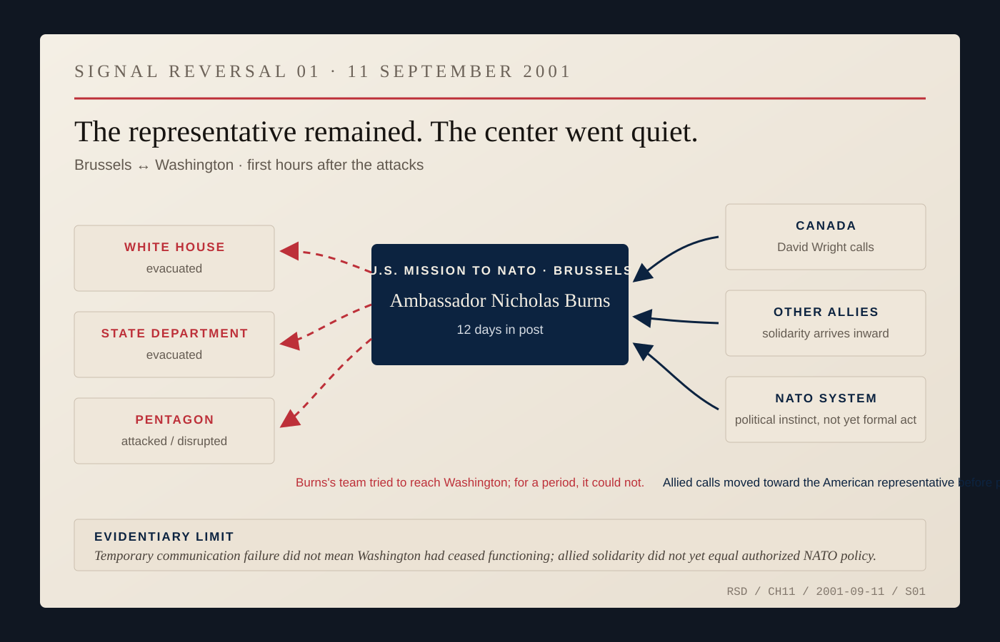
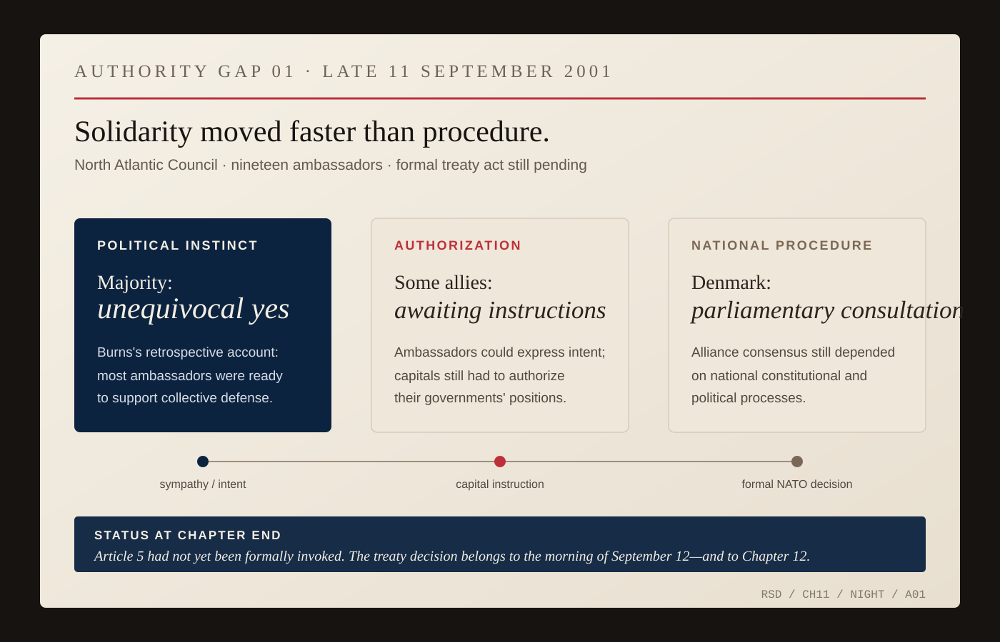

# Twelve Days

Nicholas Burns had been the United States ambassador to NATO for twelve days when a Belgian employee came through a side door at lunch and told him that an airplane had hit the World Trade Center.

Burns's first thought was weather. A small plane. Fog. An accident. That was still a world in which the explanation might be ordinary.

Then the second plane hit.

Burns was sitting among the ambassadors of an alliance built during the Cold War around a promise that had run in one direction for fifty-two years: if Europe were attacked, the United States would come. Article 5 of the North Atlantic Treaty said an armed attack against one would be considered an attack against them all.

On September 11, the geometry reversed. The United States had been attacked, and Burns had barely unpacked the job.

The American ambassador to NATO was supposed to carry Washington into the alliance. Instead, Washington became difficult to reach. The White House and State Department were evacuated. The Pentagon had been hit. Burns and his team tried to call home and, for a period, could not get through.

Then the phones began ringing from the other direction.

Canadian ambassador David Wright called. Burns would remember him for it years later. The suggestion was immediate: had the United States considered Article 5?

Other allies called too. The exact order shifts slightly across Burns's later retellings. The important distinction does not. Allied governments and ambassadors were offering solidarity before the American representative could fully reconnect with his own capital.

*SIGNAL REVERSAL 01 — Brussels, September 11, 2001. Burns's later account records his team initially unable to reach the evacuated White House and State Department or the disrupted Pentagon while allied ambassadors were calling toward him. The diagram shows temporary information flow, not a claim that Washington had ceased functioning; incoming solidarity was political intent, not yet formal NATO policy. [Source map.](../research/ch11-visual-archive.md)*

An ambassador saying *we are with you* is not the same thing as a parliament voting, a cabinet instructing, a military deploying, or the North Atlantic Council taking a formal treaty decision. Several NATO ambassadors did not yet have final instructions from their capitals that night. Denmark, Burns later recalled, needed parliamentary consultation.

For several hours he was working in the gap between political instinct and formal authority: he had standing without full information, and allies speaking to him before he could reliably speak for Washington. The temptation in that kind of silence is to fill it. The job was narrower—to know what had actually been offered, what had not, and which governments still had to convert sympathy into authorization.

That night, the nineteen NATO ambassadors met under Secretary General George Robertson. Burns was asked to speak first about the attack on his country. Casualty numbers were still unstable and terrible. The full structure of the plot was unknown. Burns reported what he could.

Then the question moved around the table: would the allies support invoking Article 5?

Most answered yes. Some were still waiting for instructions.

*AUTHORITY GAP 01 — Late September 11, 2001. Burns's account says a majority of the nineteen ambassadors gave an unequivocal yes, while some were still awaiting instructions and Denmark required parliamentary consultation. The object stops before the formal treaty act: Article 5 had not yet been invoked. That decision belongs to September 12—and to Chapter 12. [Source map.](../research/ch11-visual-archive.md)*

Burns's later retellings emphasize the incoming calls because that is what stayed with him. He had entered NATO as the representative of its strongest member. Twelve days later, he encountered the alliance from the other direction. America had spent half a century promising not to leave Europe alone; now Europe and Canada were telling America it would not be left alone.

On September 11 itself, there was no polished lesson. There were buildings burning in the United States, evacuated institutions, uncertain casualty figures, a new ambassador in Brussels trying to reconnect with Washington, and allied ambassadors calling him. That is enough.

Baseball belongs only after those first hours.

Major League games stopped after the attacks and resumed on September 17. Ballparks became places for mourning, flags, first responders and the uneasy return of ordinary ritual. On October 30, before Game 3 of the World Series at Yankee Stadium, President George W. Bush threw the ceremonial first pitch wearing an FDNY pullover. The Yankees—the comic enemy in Burns's Red Sox vocabulary—were carrying a meaning far larger than the rivalry.

There was American precedent for treating baseball this way in crisis. In January 1942, weeks after Pearl Harbor, Commissioner Kenesaw Mountain Landis asked Franklin Roosevelt whether professional baseball should continue during the war. Roosevelt answered that it should. People working longer and harder, he wrote, needed recreation and a way to take their minds off their work.

Nearly sixty years later, the civic function was visible again. Baseball did not answer the attack or explain Article 5. It offered one familiar public ritual in which grief, patriotism, fear, rivalry and continuity could occupy the same physical space.

None of that belongs inside Nicholas Burns's memory of September 11. It is the American backdrop: ordinary institutions were finding ways to resume while diplomatic institutions were finding ways to respond.

*ARCHIVE NOTE — Major League Baseball resumed play on September 17, 2001. On October 30, forty-nine days after the attacks, President George W. Bush threw the ceremonial first pitch before Game 3 of the World Series at Yankee Stadium. PBS's *The Tenth Inning* describes baseball after September 11 as offering solace and common ground. Roosevelt's January 15, 1942 “Green Light Letter,” preserved by the National Baseball Hall of Fame, urged professional baseball to continue during World War II as recreation for a country at work and war. [MLB retrospective.](https://www.mlb.com/news/featured/yankees-reflect-on-returning-to-baseball-after-9-11/) [White House archive.](https://georgewbush-whitehouse.archives.gov/baseball/) [PBS: Baseball and The Tenth Inning.](https://www.pbs.org/kenburns/baseball/about) [National Baseball Hall of Fame: Green Light Letter.](https://baseballhall.org/discover/inside-pitch/roosevelt-sends-green-light-letter)*

For Burns, the diplomatic sequence was simpler. He had been in the job twelve days. Washington went quiet. The allies called.

By morning, the offers would have to become a treaty decision.
