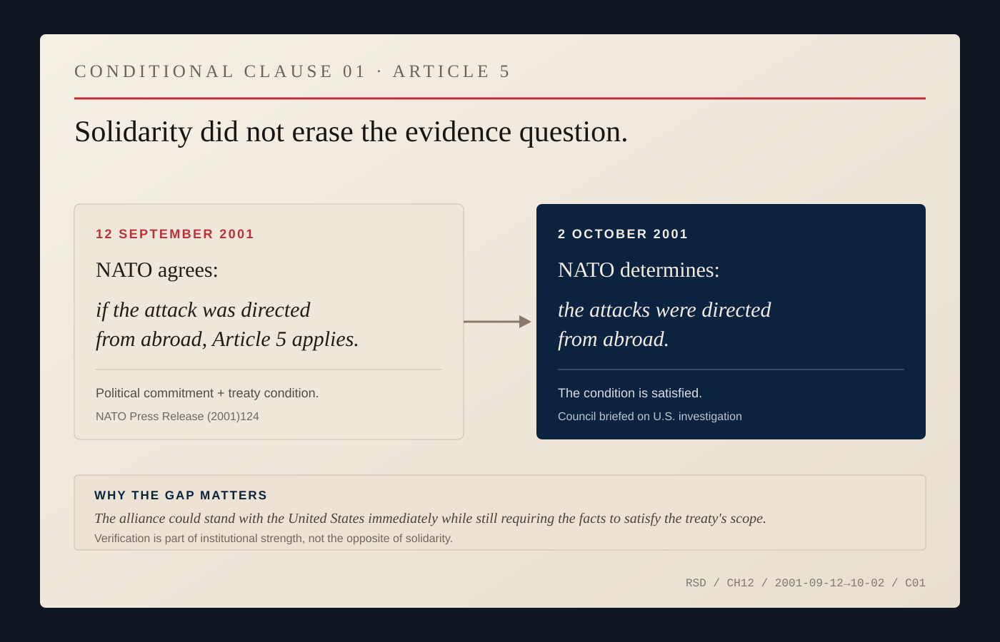
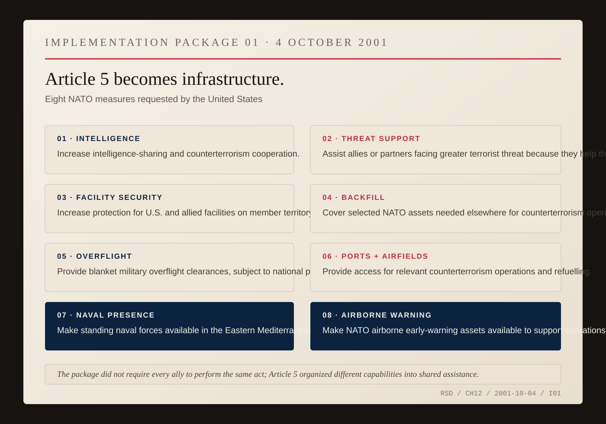
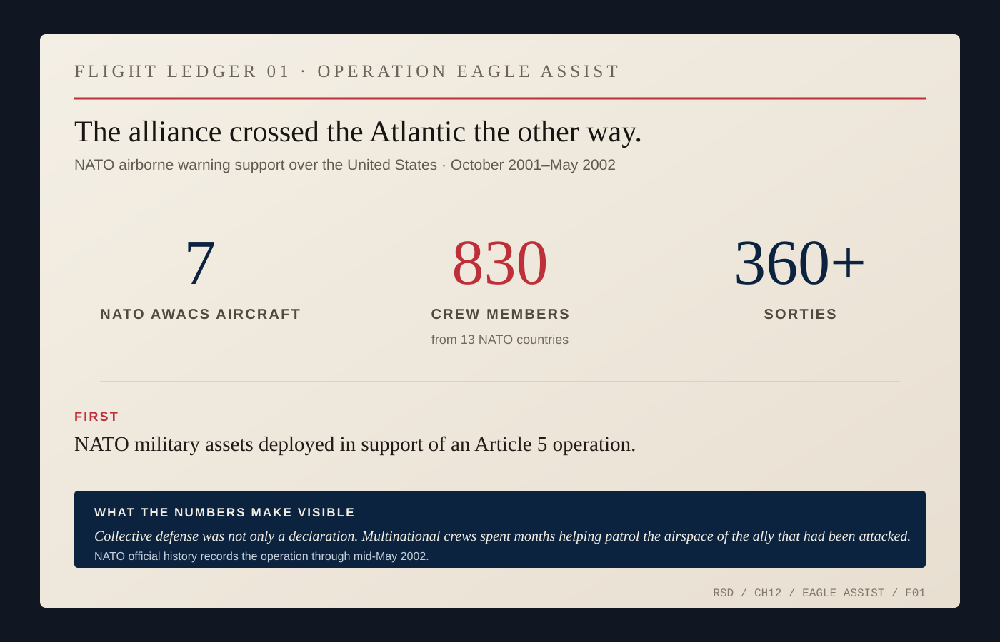

# Article 5

By the morning of September 12, solidarity needed a vote.

The NATO ambassadors had spent the previous day absorbing an attack whose scale was still becoming visible. Most were prepared to invoke the alliance's collective-defense clause. Some still needed instructions from home. Nicholas Burns needed authority from Washington.

He had finally reestablished contact with the government he represented. In his later telling, he called National Security Adviser Condoleezza Rice early that morning and told her what the allies wanted: Article 5.

The clause had existed since 1949 and had never been used. For more than half a century, an attack on one would be treated as an attack on all. The promise was familiar. The procedure was not.

Burns told Rice he thought he needed presidential authorization before casting the American vote. Treaty language is not atmosphere; governments have constitutions, chains of command, parliaments, military authorities, lawyers and consequences.

Rice told him to proceed. Burns would remember one more sentence from the call.

> *“It’s good to have friends in the world.”*

*ARCHIVE NOTE — Condoleezza Rice, as recalled by Nicholas Burns in his 2024 retrospective on NATO and September 11. This is Burns's remembered wording, not a contemporaneous White House transcript. [First-person source.](https://afsa.org/nato-75)*

The North Atlantic Council met again. What it adopted that day was historic, but conditional: if the attacks had been directed from abroad against the United States, NATO said, they would be regarded as covered by Article 5.

That *if* matters. The allies could commit before they knew everything without pretending they already knew everything. On October 2, after NATO received the results of the American investigation, the Council determined that the September 11 attacks had been directed from abroad. The condition had been met.

*CONDITIONAL CLAUSE 01 — September 12 to October 2, 2001. NATO committed to collective defense while retaining a factual condition: the attacks had to be established as externally directed. After the Council received the investigation results on October 2, that condition was satisfied. Verification was part of the alliance process, not the opposite of solidarity. [Source map.](../research/ch12-visual-archive.md)*

Application did not tell nineteen countries to do one identical thing. Each ally agreed to assist by taking such action as it deemed necessary, individually and in concert with the others. That could include armed force, but the treaty left room for different capabilities, legal structures, parliamentary rules, geography, intelligence resources and political constraints.

By early October, the United States had begun identifying the assistance it wanted. Burns was again the channel. At an October 3 State Department briefing, spokesman Richard Boucher identified him as the ambassador who had carried the American list to NATO.

The list read like logistics: more intelligence sharing; better protection for American and allied facilities; allies backfilling selected NATO assets that might be pulled toward counterterrorism operations; overflight clearances for military aircraft; access to ports and airfields; naval forces in the eastern Mediterranean; airborne early-warning aircraft available to support operations.

*IMPLEMENTATION PACKAGE 01 — October 4, 2001. At U.S. request, NATO agreed eight forms of support spanning intelligence, security, backfill, overflight, access, naval presence and airborne warning. The package did not require every ally to perform an identical act; it organized different capabilities into shared assistance. [Source map.](../research/ch12-visual-archive.md)*

NATO approved the eight measures on October 4. Their power was mostly unphotogenic: a military aircraft could cross an ally's airspace; a ship could enter a port; an intelligence service could share more than it had the week before; one military could cover a task another was leaving to fight elsewhere.

Then the alliance crossed the Atlantic in a direction its founders had not imagined.

NATO airborne warning and control aircraft deployed to help patrol American skies. For decades, the United States had stationed forces in Europe as proof that an attack on Europe would involve America. Now multinational NATO crews were flying over the United States because America had been attacked.

*FLIGHT LEDGER 01 — Operation Eagle Assist, October 2001–May 2002. NATO's official history records seven AWACS aircraft, 830 crew members from thirteen NATO countries and more than 360 sorties helping patrol U.S. airspace. It was the first deployment of NATO military assets in support of an Article 5 operation. [Source map.](../research/ch12-visual-archive.md)*

Seven aircraft, 830 crew members from thirteen NATO countries, more than 360 sorties before Operation Eagle Assist ended in May 2002. The treaty sentence had acquired crews, flight hours and American airspace.

Burns would spend years returning to the fact that the United States did not need allies because it lacked power. It needed them because power still had to cross distances, bases, intelligence networks, airspace, law and politics. Allies extended American reach and changed the political meaning of the response.

The alliance would not agree forever. Afghanistan would test endurance. Iraq would split allies badly. Defense spending, enlargement, Russia, strategy and American leadership would produce fights of their own.

But in 2001 the sequence was short and concrete: September 12, a conditional commitment; October 2, the condition met; October 4, the machinery approved. A month after Rice's remembered line, seven NATO aircraft were helping watch the American sky.
