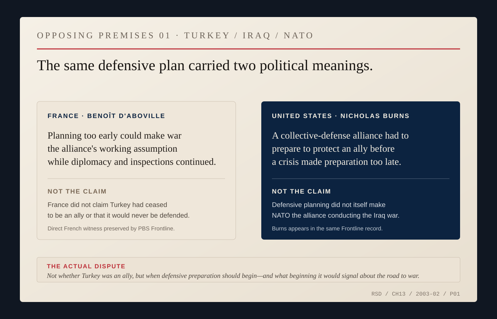
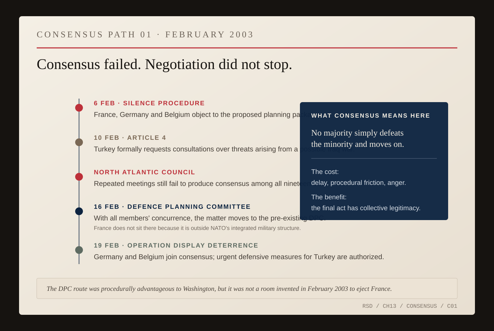
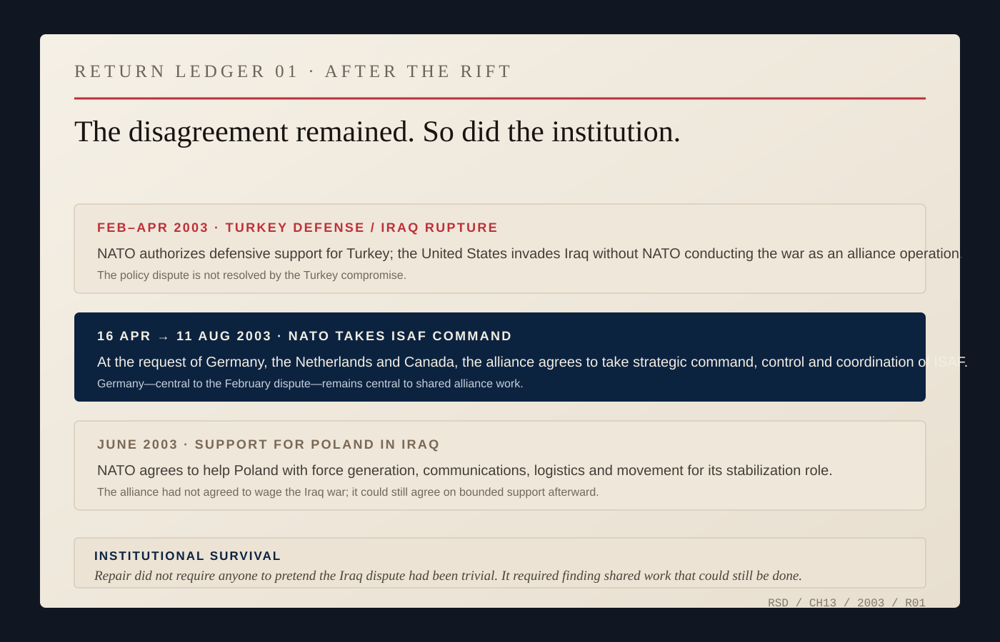

# The Clubhouse Called NATO

The alliance had just learned how to agree when America was attacked. Iraq forced it to learn how to disagree.

By early 2003, Washington was moving toward war with Saddam Hussein while France and Germany resisted. Belgium joined them inside NATO on a narrower question with immediate consequences: when should the alliance begin military planning to defend Turkey if war came?

Turkey bordered Iraq. NATO was considering surveillance aircraft, missile defense and protection against chemical or biological attack. To Nicholas Burns, the American ambassador at NATO, the principle looked elementary: an ally felt threatened; the alliance should prepare to defend it.

France, Germany and Belgium did not publicly reject the obligation to defend Turkey. They objected to the timing. Beginning military preparations while United Nations weapons inspectors were still working in Iraq, they argued, could make war look like the alliance's working assumption before diplomacy had run its course.

Burns was an advocate inside the dispute, not a neutral narrator of it. When Belgium announced that it would block the proposed planning, he called the situation a test of NATO's credibility. In later congressional testimony he said the actions of France, Germany and Belgium had created a crisis of credibility and violated the core fabric of the alliance.

Secretary General George Robertson described the split differently. All the allies, he said, accepted that Turkey would be defended if attacked and accepted Turkey's right to consultations. Sixteen wanted planning to begin. Three thought beginning then would send the wrong signal while the United Nations process continued. Robertson called the differences substantive.

*OPPOSING PREMISES 01 — Turkey, Iraq and NATO, February 2003. French Ambassador Benoît d'Aboville argued that starting military planning while diplomacy continued risked making war the alliance's working assumption; Burns argued that a collective-defense organization had to retain the capacity to prepare quickly for an ally's protection. NATO's own history confirms that the underlying commitment to defend Turkey was not the disputed point. [Source map.](../research/ch13-visual-archive.md)*

Then the argument acquired a clock.

On February 6, Robertson used NATO's silence procedure on a package of planning measures: if no government objected by the deadline, the proposal would take effect. France, Germany and Belgium objected. They broke the silence.

Turkey invoked Article 4 of the North Atlantic Treaty, requesting consultations because it believed its security was threatened. The North Atlantic Council met for days without agreement. Burns warned of a credibility crisis. Belgian Foreign Minister Louis Michel defended the block. Germany continued to argue that diplomacy had not been exhausted.

Yet Germany was prepared to help defend Turkey. Robertson later pointed to Berlin's willingness to provide Patriot missiles. After the compromise, Foreign Minister Joschka Fischer emphasized that German personnel supporting AWACS over Turkey were performing a defensive alliance mission, not joining offensive operations against Iraq. Opposition to the road to war did not require Germany to leave Turkey exposed to its consequences.

After repeated Council meetings, Robertson concluded that consensus among all nineteen governments was unavailable. NATO had another established body: the Defence Planning Committee. France, because it did not then participate in NATO's integrated military structure, did not sit on it.

That can look like a procedural trick designed to remove France from the room. The record is less tidy. Robertson said he delayed using the committee until agreement at nineteen had proved impossible, and NATO's own history says the move occurred with the members' concurrence. France was absent because of a longstanding institutional choice, not because someone invented a new room for the occasion. Germany and Belgium were still in it. They still had to agree.

On February 16 the eighteen ambassadors met for hours. Belgium proposed amendments. The text moved. Consensus followed. Three days later the committee authorized urgent defensive measures for Turkey under Operation Display Deterrence.

*CONSENSUS PATH 01 — February 2003. France, Germany and Belgium broke the silence procedure; Turkey invoked Article 4; the North Atlantic Council remained blocked; with all members' concurrence the matter moved to the pre-existing Defence Planning Committee, where Germany and Belgium still had to agree. On February 19 the DPC authorized Operation Display Deterrence. [Source map.](../research/ch13-visual-archive.md)*

The compromise did not settle Iraq. It found the smaller proposition on which the allies could agree.

The word *clubhouse* captures one useful part of NATO. Its ambassadors meet repeatedly. They accumulate history, grievances, habits and judgments about one another. Burns understood that kind of institutional life. But a baseball clubhouse has a manager and a roster under contract. NATO has sovereign governments. The American ambassador could persuade, pressure and warn that credibility was at stake; the United States could bring enormous political and military weight into the room. It could not cast the other governments' votes.

The February fight exposed the temptation on both sides. Washington could hear dissent as a failure to understand what an alliance was for. Dissenting capitals could hear Washington confusing leadership with entitlement. Procedure did not erase either suspicion. It produced a decision narrower than the quarrel.

The United States invaded Iraq in March without NATO conducting the war as an alliance operation. France and Germany did not decide their objections had been foolish. Washington did not decide its critics had been right.

Within months, however, NATO unanimously agreed to take command of the International Security Assistance Force in Afghanistan. Robertson later pointed out an inconvenient fact for anyone trying to sort the alliance permanently into loyalists and obstructionists: Canada, Germany and the Netherlands had pushed for the NATO role. Germany had been at the center of the February rupture and was now helping move the alliance into a major new mission.

NATO also agreed to support Poland in assembling a multinational stabilization division for Iraq. The alliance had not agreed to fight the war. It could agree to help an ally manage part of the aftermath.

*RETURN LEDGER 01 — 2003. After the Turkey-defense rupture, Germany, the Netherlands and Canada requested the NATO role that led to alliance command of ISAF; NATO also agreed to bounded support for Poland's stabilization role in Iraq. Repair did not require any government to pretend the original war dispute had been trivial. It required enough shared ground to keep working. [Source map.](../research/ch13-visual-archive.md)*

Burns gave a speech in May about healing the transatlantic rift. The word can make the episode sound cleaner than it was. His anger remained real. So did the French, German and Belgian concern that military preparation could acquire political momentum of its own. Turkey remained exposed. United Nations weapons inspectors had still been working when the argument began.

The compromise did not reconcile those facts. It got the governments through one decision narrow enough to survive their disagreement. Then they had to sit down together again.
