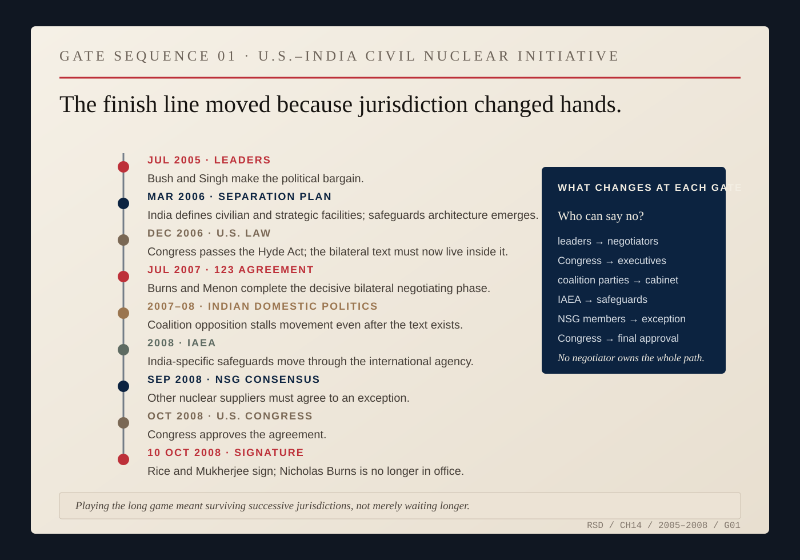
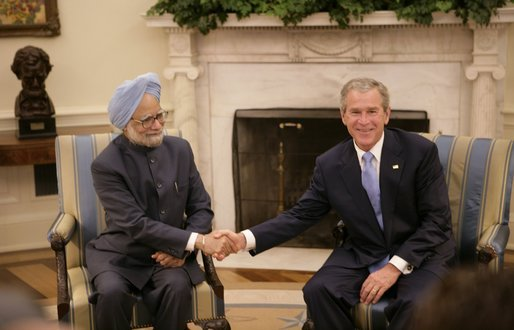
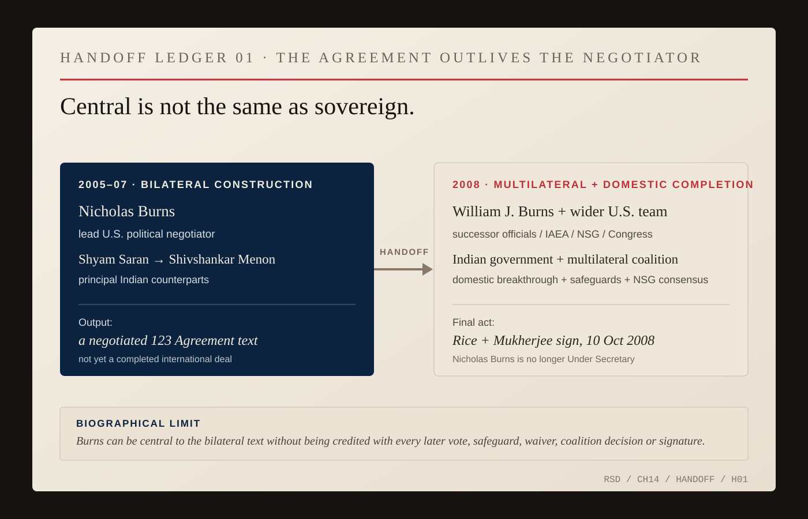

# India: Playing the Long Game

In July 2005, George W. Bush and Manmohan Singh could make the political wager. They could not make it operative.

India still had to separate its civilian and military nuclear facilities. Congress had to change American law. Negotiators had to write a bilateral nuclear agreement. The International Atomic Energy Agency had to accept safeguards. The Nuclear Suppliers Group had to make an exception. Congress would have to vote again. At each stage, somebody new acquired the power to stop the deal.

That was the long game: surviving jurisdiction.

*GATE SEQUENCE 01 — U.S.–India civil nuclear initiative, 2005–2008. Authority moved from leaders to negotiators, legislatures, Indian coalition politics and international institutions before returning to Congress for final approval. [Source map.](../research/ch14-visual-archive.md)*

Bush and Singh made the original wager in Washington in July 2005. The United States would work to end India's exclusion from international civilian nuclear commerce. India would separate its civilian and military nuclear facilities, place the civilian side under international safeguards and undertake a set of nonproliferation commitments.

*FIG. 06 — President George W. Bush and Prime Minister Manmohan Singh, Oval Office, July 18, 2005. Eric Draper / White House. Public-domain federal photograph. The image records the leaders' political wager on the day of their joint statement; the separation plan, U.S. law, 123 Agreement, safeguards, NSG exception and congressional approval still lay ahead. [White House archive.](https://georgewbush-whitehouse.archives.gov/news/releases/2005/07/images/20050718-1_d-0262-515h.html) [Joint statement.](https://georgewbush-whitehouse.archives.gov/news/releases/2005/07/20050718-6.html)*

The bargain was strategically ambitious because it violated the habits of the previous three decades. India had never joined the Nuclear Non-Proliferation Treaty as a non-nuclear-weapon state. It had tested nuclear weapons. American law and the rules of the international nuclear-supply system had grown around that fact. The Bush administration proposed an exception.

An exception could be defended as recognition of reality or attacked as damage to the rule. It could build trust with India while making countries that had lived under the old system wonder what compliance had bought them.

Singh described the bargain from India's side shortly after the July announcement. India, he said, would gain a way out of its nuclear isolation and greater access to civilian nuclear cooperation. At the same time, he insisted that the agreement would not diminish India's strategic nuclear capability. The United States was not negotiating India's nuclear disarmament, and India was not accepting the status the nonproliferation system had long tried to impose on it. The two governments were trying to construct a relationship around a fact neither could erase.

Nicholas Burns became one of the people responsible for turning that political decision into something institutions could execute. He had become Under Secretary of State for Political Affairs in 2005; his first principal counterpart was Foreign Secretary Shyam Saran. Their job was to discover what the leaders' words required in practice.

By October 2005 Burns was in New Delhi talking with Saran about implementation. After talks in January 2006, Saran described the discussions as useful but unfinished and emphasized India's planned expansion of civilian nuclear energy and the scale of international cooperation India expected that expansion to require. The bargain was not an American initiative to which India merely responded. India had its own program, expected gains and constraints.

*ARCHIVE NOTE — The January 20, 2006 joint press appearance preserves Shyam Saran's own public account of the talks alongside Burns's. [Primary transcript.](https://2001-2009.state.gov/p/us/rm/2006/59491.htm)*

Reciprocity became one of the controlling words. India had to decide which nuclear facilities belonged on the civilian list and which remained part of the strategic program. The United States had to persuade Congress to change law written for a different regime. India would have to accept international safeguards over its declared civilian facilities; Washington would have to persuade other nuclear suppliers to change their rules. Each government needed the other to move far enough to make its own next move politically possible.

The first difficult problem was India's separation plan. Which facilities would become civilian and safeguarded? Which would remain outside? India insisted that its strategic program would not be impaired. American nonproliferation specialists worried that the proposed exception could free domestic Indian uranium for weapons use and weaken a system built around discouraging nuclear commerce with states outside the NPT.

Those objections were substantive. Many critics understood the strategic opportunity perfectly well; they disagreed about the price. The agreement forced a choice among objectives that did not fit neatly together: stronger relations with a rising democratic power, energy cooperation and strategic alignment against the coherence and signaling power of the nonproliferation regime.

By March 2006, during President Bush's visit to India, the two governments had a separation plan. Washington still needed Congress.

The administration spent much of 2006 persuading legislators to authorize exceptional nuclear cooperation with India. Burns and Secretary of State Condoleezza Rice testified repeatedly. Congress eventually passed the Hyde Act, opening a legal path while creating a new negotiating problem. Washington needed the bilateral agreement to comply with American law; New Delhi could not allow American legislation to rewrite the political commitments Singh had defended before Parliament.

Neither negotiating team owned its own country. The American executive could not erase Congress. The Indian executive had Parliament, coalition politics and the strategic establishment to contend with.

Burns described the work that December with a phrase that resists the false comfort of hindsight.

> **NICK / UNCHARTED WATERS**
>
> ### “We were in uncharted waters because, of course, there had never been a deal quite like this.”
>
> *Press conference with Foreign Secretary Shiv Shanker Menon · New Delhi · December 8, 2006 · [State Department transcript](https://2001-2009.state.gov/p/us/rm/2006/77555.htm)*

By 2007 Shyam Saran had been succeeded as foreign secretary by Shivshankar Menon. The negotiation had moved into the bilateral agreement required under Section 123 of the U.S. Atomic Energy Act. Burns publicly said in May that the two sides were about ninety percent of the way there.

The remaining disputes were the ones that could still kill it. India wanted durable fuel assurances because it remembered previous disruptions in nuclear supply, particularly the history surrounding Tarapur. The United States was not willing to surrender termination and right-of-return protections for the worst cases. India also wanted the ability to reprocess spent fuel without remaining permanently dependent on American discretion.

India's scientific establishment made that constraint visible. In May 2007, the Department of Atomic Energy told a parliamentary committee that future bilateral cooperation agreements needed an explicit provision enabling reprocessing. Menon publicly acknowledged that unresolved issues remained while declining to negotiate them through the media.

*ARCHIVE NOTE — Contemporary Indian reporting records both the Department of Atomic Energy's insistence on explicit reprocessing rights and Menon's refusal to litigate unresolved 123 Agreement provisions through the press. [DAE report.](https://www.hindustantimes.com/delhi/dae-wants-explicit-provision-on-reprocessing-in-future-n-pacts/story-KYJFtjf4xLAI3GxepeL6jO.html) [Menon press account.](https://svaradarajan.com/2007/05/03/india-u-s-claim-progress-in-nuclear-talks/)*

In late May, Burns traveled to New Delhi with Richard Stratford, the State Department's nuclear-cooperation specialist. They met Menon and a wider Indian leadership that included Prime Minister Singh, External Affairs Minister Pranab Mukherjee and National Security Adviser M.K. Narayanan.

Burns later identified those days as the turning point. Menon, speaking at the time, was more cautious: after three days of talks, he said the sides had made considerable progress toward narrowing their differences and that he was optimistic a deal could be made. A turning point in memoir can look, while it is happening, like progress and unfinished work.

The Indian government proposed a new reprocessing facility under International Atomic Energy Agency safeguards. That changed the geometry of the dispute. The United States could contemplate reprocessing consent tied to a safeguarded facility and to arrangements and procedures the two governments would negotiate later. India proposed the facility; American negotiators examined it; neither side had to pretend its original concern had disappeared.

*ARCHIVE NOTE — Menon's June 2007 press account records substantial progress without claiming completion. [Contemporaneous Indian report.](https://www.hindustantimes.com/india/we-will-make-a-deal-says-menon/story-O23fIarq1JpA6k0bMKYK9K.html)*

Even then, the agreement was not done. In July, Menon and Burns spent four days negotiating in Washington. The Indian Ministry of External Affairs recorded substantial progress and said the remaining issues would go back to the two governments for final review. Narayanan and Menon also met Vice President Dick Cheney, Rice, Defense Secretary Robert Gates and National Security Adviser Stephen Hadley. Burns and Menon could negotiate; they could not substitute themselves for their governments.

On July 27, Rice and Mukherjee announced that negotiations on the 123 Agreement had been completed. Burns described reprocessing as the largest issue in the final phase and the safeguarded facility as the fundamental turning point. He also emphasized something less dramatic and just as consequential: the agreement had been written to remain within American law.

They had a bilateral text. It still could not operate.

The agreement had to survive the IAEA, the Nuclear Suppliers Group and the United States Congress. Before any of those could finish their work, Indian domestic politics nearly stopped the process.

Singh's coalition government depended on support from Left parties strongly opposed to the agreement and suspicious of strategic alignment with the United States. The initiative became entangled in a larger argument about Indian autonomy, American power and the direction of Indian foreign policy. Burns could negotiate with Saran and Menon. Rice could negotiate with Mukherjee. Bush could make commitments to Singh. None of them possessed the votes in India's Parliament.

This is where *long game* can become sentimental. Sometimes patience means leaving.

Burns announced that he would step down from government. By the time India broke through its domestic political impasse and moved the agreement into the IAEA and Nuclear Suppliers Group in 2008, another Burns—William J. Burns—held the Under Secretary's job. The two men were not interchangeable, and the work itself had changed.

The bilateral 123 text existed. Now the United States and India had to coordinate internationally to obtain an India-specific safeguards arrangement and persuade the Nuclear Suppliers Group to make an exception to rules some members regarded as central to their nonproliferation identity. Evan Feigenbaum, who worked on the American side, later remembered the NSG phase as especially difficult. Countries such as Ireland, the Netherlands, Switzerland, Norway and New Zealand did not necessarily share Washington's strategic calculation about India. They were not scenery. They had interests.

The IAEA process moved forward. The Nuclear Suppliers Group eventually reached consensus. Congress approved the agreement. On October 10, 2008, Condoleezza Rice and Pranab Mukherjee signed the U.S.-India civilian nuclear cooperation agreement in Washington.

Nicholas Burns was not the serving Under Secretary standing at the end of the process.

*HANDOFF LEDGER 01 — 2005–2008. Nicholas Burns was a central American negotiator in the bilateral construction of the 123 Agreement, working first with Shyam Saran and then Shivshankar Menon inside a much wider hierarchy. The later IAEA, NSG, congressional and signature phases were carried by successor officials, the Indian government and broader coalitions. [Source map.](../research/ch14-visual-archive.md)*

Baseball offers a tempting vocabulary here: innings, relief pitchers, the runner who reaches base but does not score the run himself. Leave it alone. The diplomatic record is more interesting.

Burns helped turn the wager made by Bush and Singh into a bilateral legal text. Saran built the first implementation architecture; Menon negotiated the decisive final bilateral phase. Narayanan, Mukherjee, Rice, Hadley, Stratford, Jaishankar, Ronen Sen, David Mulford, legislators and technical officials occupied other parts of the chain. Then the IAEA, the suppliers and Congress had their turn.

On October 10, 2008, Rice and Mukherjee signed an agreement that Nicholas Burns had spent years negotiating. He was no longer in the job.