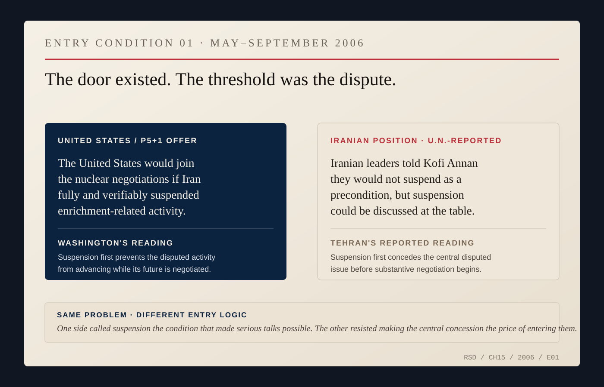
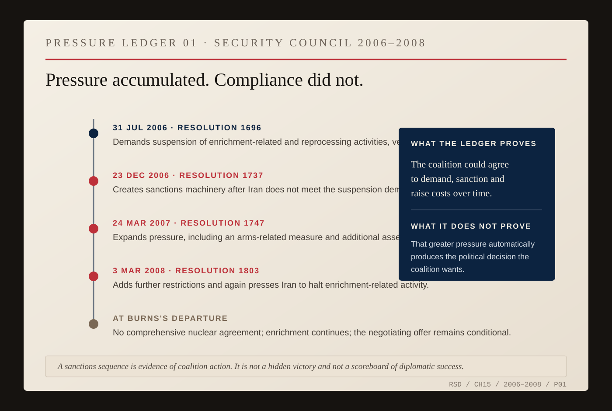
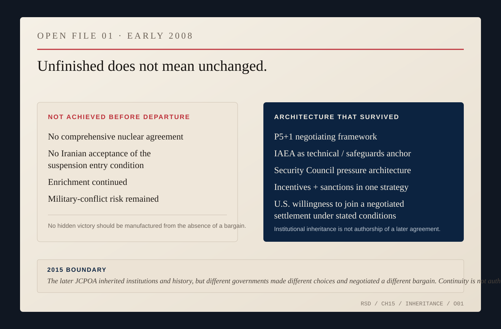

# Iran: When Patience Does Not Win

India could make diplomacy look like patience rewarded.

That was dangerous.

The lesson of the civil nuclear agreement was not that enough meetings eventually produce an agreement. It was that, under particular political conditions, two governments can decide a bargain is worth the trouble required to make it.

Nicholas Burns was working another nuclear file at almost the same time, with many of the same tools—coalitions, incentives, pressure, technical language, repeated negotiation—and with a very different result.

Iran did not become the negative image of India because one country was reasonable and the other was not. The structures, histories, domestic politics and bargains available were different.

Burns became Under Secretary of State for Political Affairs in 2005. President George W. Bush set policy. Condoleezza Rice was Secretary of State. The White House, National Security Council, Treasury Department, intelligence agencies and Congress all mattered. Abroad, Britain, France and Germany had already built a negotiating track with Iran. Russia and China possessed Security Council votes and interests of their own. The International Atomic Energy Agency possessed the inspection and safeguards role. Iran possessed the nuclear program and, ultimately, the decision about what terms it would accept.

The geometry alone should have discouraged hero stories.

The European diplomacy came first.

Britain, France and Germany—the EU3—had negotiated with Iran before Washington was prepared to join them directly. Their talks had produced temporary suspension arrangements but not a durable settlement. Iran insisted on its right to peaceful nuclear technology and enrichment. The Europeans sought confidence that the program would not move toward a weapon. The United States had its own history with the Islamic Republic, its own suspicions and its own reluctance to enter talks on terms that appeared to legitimize enrichment before the dispute had been resolved.

Burns therefore entered a negotiation in which the United States was powerful but not yet seated at the table it was trying to shape.

Washington could pressure Iran. It could support European diplomacy. It could work through the IAEA. It could try to assemble a Security Council coalition. But the more international the strategy became, the more American policy had to survive negotiation with the countries enforcing it.

Russia did not become American because it shared concern about Iran's nuclear program. China did not stop having commercial and strategic interests because Washington wanted a stronger resolution. Britain, France and Germany did not cease having their own judgments about timing, negotiation and escalation.

A coalition mattered only if it could survive the next disagreement.

In May 2006, the American position changed.

The United States announced that it was prepared to join negotiations with Iran alongside the Europeans if Iran verifiably suspended uranium enrichment and reprocessing activities.

The condition was the argument.

From Washington's perspective, suspension was a test: Iran should not continue advancing the disputed activity while negotiating over whether and under what conditions it would be permitted. From Tehran's perspective, Iran was being asked to concede the central issue before the substantive negotiation began.

The disagreement is visible in the international record. At the Security Council in July 2006, Iran's representative argued that the earlier suspension had been voluntary and that making suspension mandatory upset the balance of rights and obligations Iran claimed under the Non-Proliferation Treaty. Six weeks later, Secretary-General Kofi Annan said Iranian leaders had told him they would not suspend enrichment as a precondition to negotiations but were prepared to put suspension on the negotiating agenda.

That distinction defined the gap.

*ARCHIVE NOTE — The United Nations record of the July 31, 2006 Security Council meeting preserves both Resolution 1696's suspension demand and Iran's answer. Kofi Annan's September 13 briefing separately records the precondition-versus-agenda distinction after his discussions with Iranian leaders. [Security Council record.](https://press.un.org/en/2006/sc8792.doc.htm) [Secretary-General briefing.](https://www.un.org/sg/en/content/highlight/2006-09-13.html)*

The American offer was still significant. Washington was publicly saying that direct participation in a negotiated nuclear settlement was possible. It was not offering unconditional bilateral talks, and it was not accepting Iranian enrichment as a settled fact.

The door existed.

Iran did not accept the threshold on the required terms.

*ENTRY CONDITION 01 — Washington offered to join the European-led nuclear negotiations if Iran fully and verifiably suspended enrichment and reprocessing activity. Iranian leaders, as recorded in the U.N. diplomatic record, resisted suspension as the precondition for entering substantive talks while indicating it could be discussed inside negotiations. The object shows incompatible entry logic; it does not certify either side's account as the whole motive. [U.S. offer, May 31, 2006.](https://2001-2009.state.gov/secretary/rm/2006/67210.htm) [U.N. record, July 31, 2006.](https://press.un.org/en/2006/sc8792.doc.htm)*

The dispute moved increasingly through Vienna and New York. The IAEA supplied the technical and safeguards basis for international concern. The Security Council supplied a different kind of power: demands that could become binding and sanctions that could become multilateral.

In July 2006, Security Council Resolution 1696 demanded that Iran suspend enrichment-related and reprocessing activities. When Iran did not comply, Resolution 1737 imposed sanctions in December. Resolution 1747 expanded them in 2007. Resolution 1803 added further measures in March 2008.

That sequence can sound like momentum.

Pressure is not an outcome.

A sanctions coalition demonstrates that governments have agreed to impose costs. It does not demonstrate that the targeted government will make the political choice the coalition wants.

The December 2006 Council record also shows that Russia and China voted for sanctions while describing negotiation as the route out. The sanctions were structured to be suspended if Iran suspended enrichment and reprocessing and returned to the diplomatic track.

Consensus did not mean the six powers had acquired one motive.

They had acquired one decision.

*PRESSURE LEDGER 01 — Resolution 1696 demanded suspension; Resolutions 1737, 1747 and 1803 progressively added sanctions and restrictions. The December 2006 Council record also preserves Russian and Chinese insistence that pressure remain tied to a negotiated solution. This is a ledger of coalition action, not a diplomatic scorecard: Iran continued enrichment and no comprehensive nuclear bargain existed when Burns left government. [Resolution 1737 meeting record.](https://press.un.org/en/2006/sc8928.doc.htm) [U.N. Security Council resolution index.](https://main.un.org/securitycouncil/en/sanctions/1737/resolutions)*

Iran continued enriching uranium.

Its officials continued to describe peaceful nuclear technology as a right under the Non-Proliferation Treaty. The international response did not rest only on distrust in the abstract; the IAEA safeguards record contained unresolved questions that had damaged confidence in the peaceful character of the program. Yet even that did not collapse the political argument into a technical one.

Verification could describe material, facilities, declarations and compliance.

It could not decide what national humiliation meant in Tehran.

Nor could it decide what proliferation risk meant in Washington, Paris, London, Berlin, Moscow or Beijing.

This was where the Iran file differed most sharply from the India file.

The India negotiation was controversial partly because Washington was trying to create an exception to an existing nuclear order for a country outside the Non-Proliferation Treaty. With Iran, the coalition was trying to enforce and interpret an existing nonproliferation structure against a treaty member whose nuclear history had generated serious safeguards concerns.

One negotiation required governments to agree that an exception was worth making.

The other required them to agree on what compliance, confidence and acceptable nuclear capability should mean.

Burns could work Russia. He could work China. He could work the Europeans. He could help shape packages of incentives and pressure.

He could not make Iran suspend enrichment.

That sentence protects diplomatic history from mythology.

By the time Burns left government in 2008, the desired comprehensive agreement did not exist. Iran had not accepted the suspension condition. The United States had not entered the full nuclear negotiation envisioned by its 2006 offer. Enrichment continued. The Security Council had imposed multiple rounds of sanctions. The possibility of military conflict had not disappeared.

That is not a hidden victory.

It is an unfinished and dangerous situation.

But the diplomatic landscape was not the one Burns had inherited in 2005 either.

The United States had accepted publicly that it could participate in a negotiated nuclear settlement under specified conditions. Britain, France, Germany, Russia, China and the United States had a functioning negotiating framework. The Security Council had created an international pressure architecture. The IAEA remained the technical institution around which verification arguments turned. Incentives and sanctions had been joined inside a single diplomatic strategy.

Those structures would outlast Burns and the Bush administration.

*OPEN FILE 01 — The left side records what the Burns-era diplomacy had not achieved; the right side records machinery that survived it. The later JCPOA belongs to different governments and a different negotiation. Institutional continuity is not authorship.*

Years later, a different American administration would enter direct secret diplomacy with Iran, and the P5+1 would eventually negotiate the Joint Comprehensive Plan of Action.

It would be tempting to draw a clean line from the Burns years to 2015 and declare the later agreement the delayed payoff of earlier patience.

Do not.

Different presidents made different choices. Iranian politics changed. American policy changed. The sanctions environment changed. Direct U.S.-Iranian diplomacy went further than the conditional posture Burns had defended.

Institutional continuity is not authorship.

Burns helped leave behind a structure in which later diplomacy could occur. That is different from having negotiated the later deal.

A diplomat spends much of a career acting without control over the ending. Elections intervene. Governments fall. Ministers change. Intelligence changes. Wars begin. Coalitions fray. Another official inherits the folder.

The profession cannot be evaluated only by trophies because history does not stop at the signing ceremony.

Baseball has little useful to say here.

Patience is not waiting for a pitch. Sanctions are not innings. Nuclear capability is not a scoreboard. The language would shrink the subject.

The Red Sox fan disappears from this part of the story because personal charm cannot substitute for incompatible political choices.

Burns could build relationships and keep difficult conversations possible.

None of that gave him possession of another country's decision.

India had offered one version of the long game. Years of work crossed jurisdictions and eventually produced an agreement whose final ceremony Burns did not attend as a government official.

Iran offered another.

Years of work produced pressure, structure, clearer choices and a negotiating architecture—but not the bargain he wanted before he left.

The difference was not patience.

The difference was politics.

A diplomat can keep the door usable.

He cannot make the other side enter.
