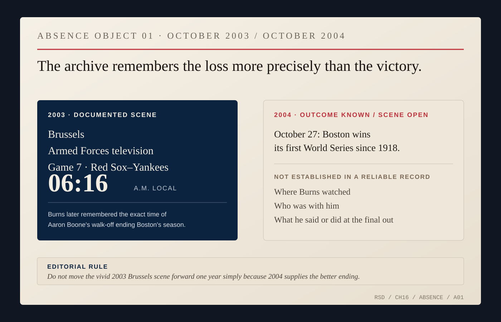
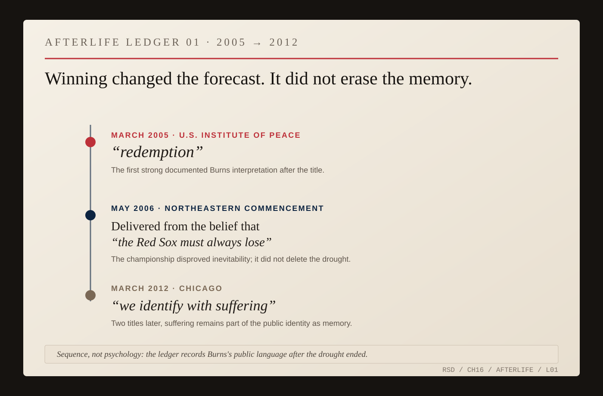

# October 2004

There is a scene this book does not have.

On October 27, 2004, the Boston Red Sox completed their World Series sweep of St. Louis and won their first championship since 1918. Somewhere, Nicholas Burns learned that the waiting was over. That is all the evidence presently allows. We do not know where he watched the final out, who was beside him, or what he said when it happened.

The missing scene pulls at the page because Burns had made the Red Sox unusually visible inside his public life. Reporters knew. Colleagues knew. Presidents knew. Greek journalists knew. Baseball had surfaced in briefing-room jokes, in his Athens office, in public diplomacy, and in his own descriptions of himself. The championship night—the scene almost too perfectly made for a book called *Red Sox Diplomacy*—is undocumented.

Leave it that way.

The archive gives us the room one year earlier.

At Boston College's commencement in May 2002, Burns had predicted that, after an eighty-four-year pause, Boston would be home to the World Series champions that October.

Wrong.

Then came 2003. Burns was the American ambassador to NATO in Brussels when the Red Sox and Yankees reached Game 7 of the American League Championship Series. Boston led late. The game stretched deep into the European morning. Burns later described following it on Armed Forces television in Brussels, all the way to another Boston loss.

That scene belongs to 2003. It cannot be moved twelve months forward because 2004 supplies the better ending. History contains events that happened and scenes that surely happened around them. Only the first category belongs to the biographer without evidence.

So Burns stays out of the room.

*ABSENCE OBJECT 01 — Burns later located the 2003 ALCS heartbreak precisely: Armed Forces television in Brussels, Aaron Boone, 6:16 a.m. The current record does not establish the equivalent 2004 championship-night room, companions or immediate reaction. [2003 first-person account.](https://www.espn.co.uk/espn/magazine/archives/news/story?page=magazine-20040119-article32)*

Watch the baseball instead.

The Yankees took the first three games of the 2004 American League Championship Series. No Major League Baseball team had recovered from a three-games-to-none deficit to win a best-of-seven postseason series. Boston won four straight, and the opponent mattered: the Red Sox went through the Yankees to reach the World Series, reversing the previous October. Then they swept St. Louis.

On October 27, the drought ended.

American forces were fighting in Iraq and Afghanistan. September 11 still organized much of the country's political language. The presidential election was six days away. The championship resolved none of it. It was local exultation inside a divided country, and for a fan culture that had spent decades turning disappointment into inheritance, the scoreboard finally offered no ambiguity.

Five months later, Burns supplied language the missing October scene cannot.

He had just begun as Under Secretary of State for Political Affairs. At the U.S. Institute of Peace in March 2005, the subject turned briefly to baseball. Burns put the aftermath this way:

> **NICK / REDEMPTION**
>
> ### “I'm a native-born member of Red Sox Nation ... we did indeed find redemption.”
>
> *U.S. Institute of Peace remarks · March 23, 2005 · [State Department transcript](https://2001-2009.state.gov/p/us/rm/2005/45781.htm)*

The word *redemption* is too large for baseball. That is why the joke lands.

A year later, at Northeastern's commencement in Boston, he made it more precise. New Englanders, Burns said, had been delivered from a belief “embedded deep in our regional DNA”: the Red Sox must always lose. Then he named what had broken the belief—the “glorious autumn of 2004.”

Years later, speaking in Chicago in 2012, Burns noted Boston's championships in 2004 and 2007 and told Cubs fans that “we identify with suffering.” The suffering had survived the winning, not as forecast but as memory.

*AFTERLIFE LEDGER 01 — The championship changes Burns's public Red Sox language without erasing the inherited drought: “redemption” in 2005; deliverance from inevitable losing in 2006; “we identify with suffering” in 2012. This is a chronology of public language, not a reconstruction of private feeling. [2005 USIP remarks.](https://2001-2009.state.gov/p/us/rm/2005/45781.htm) [2006 Northeastern commencement.](https://2001-2009.state.gov/p/us/rm/2006/66226.htm) [2012 Atlantic Council transcript.](https://www.atlanticcouncil.org/wp-content/uploads/2012/03/Burns_Transcript.pdf)*

The easy argument would be that decades of Red Sox disappointment trained Nicholas Burns for diplomatic patience. There is no evidence for it. He did not need Fenway Park to teach him that governments move slowly; Cairo, Jerusalem, Washington, Athens and Brussels had already managed that.

What the record does show is more modest and more useful. Burns carried a small piece of home into offices where his job required him to speak for something much larger than himself. Losing made that identity comic and durable. Winning did not dissolve it. In October 2005, he was still joking about shutting down the State Department so employees could watch Boston play the Chicago White Sox. Years later the Red Sox remained shorthand in profiles, speeches and banter.

The drought ended. The affiliation did not.

The absent room no longer needs filling. Give us the television, the final out, the people beside him, the exact sentence, and the chapter becomes more cinematic. It does not necessarily become more true.

The public record afterward gives us enough: he remained a fan while the offices kept changing—spokesman, ambassador, NATO representative, Under Secretary, professor, ambassador again.

Boston did not require reappointment.

We know what happened to the Red Sox on October 27, 2004. We know what Burns later called it.

Redemption.

The room remains his.
