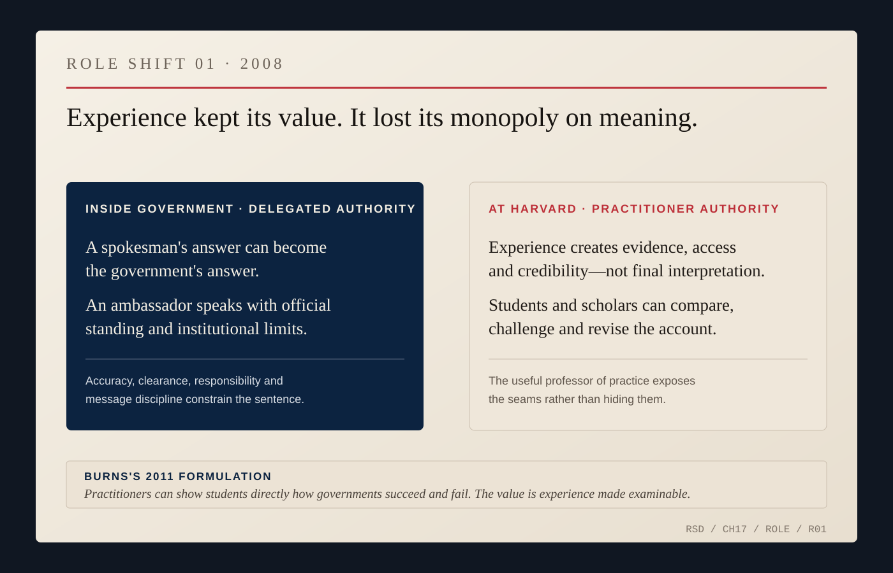
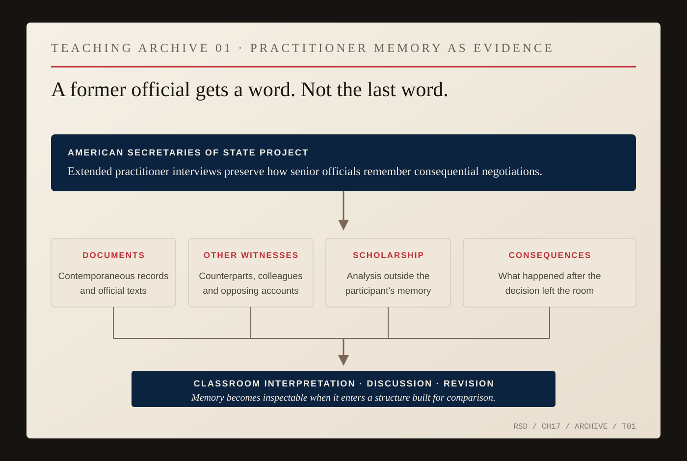

# The Professor in the Cheap Seats

For twenty-seven years, Nicholas Burns had worked inside the sentence. At a State Department podium, a phrase could become policy. An ambassador's cable could change what Washington believed was happening abroad. A negotiating formulation could preserve a coalition or expose a disagreement.

Then, in 2008, Burns left government, but not for one second act. He went to Harvard and joined The Cohen Group as a senior counselor, a role the firm says he held for twelve years before returning to government in 2021. The change was larger than geography: a diplomat speaks with delegated authority; a professor or private adviser does not.

Harvard appointed Burns Professor of the Practice of Diplomacy and International Politics after his retirement from the Foreign Service. The title contained the experiment. He was not being asked to stop being a practitioner. He was being asked to make practice examinable.

*ROLE SHIFT 01 — Inside government, Burns's words could carry delegated state authority; at Harvard, experience supplied evidence and credibility but not the final interpretation. In a 2011 Kennedy School interview, Burns argued that practitioners could show students directly how governments succeed and fail. [Harvard Kennedy School, “Practice Makes Perfect.”](https://www.hks.harvard.edu/sites/default/files/magazine/archives/autumn_2011.pdf)*

A few years later, Burns explained what professors of practice could contribute. People who had spent most of their careers in public service, he argued, had seen directly how governments succeed and fail. *Fail* mattered. Government service creates its own explanations: officials remember the constraints they faced, the information they had, the alternatives they rejected. Critics remember consequences. Historians acquire documents participants did not possess. Time exposes assumptions that once looked like facts.

A classroom can put those versions beside one another. At the State Department podium, Burns had been required to protect institutional confidence while distinguishing what was known from what was alleged. At Harvard, the uncertainty itself could become material. A failed negotiation might be more useful than one ending in a photograph and signatures; a coalition could be taken apart to expose the compromises hidden inside the word *unity*. A former official could be asked what he believed at the time, what he did not know and what he would now describe differently.

Burns built an institutional version of that idea in the Future of Diplomacy Project. The project brought diplomats and other practitioners into Harvard, supported teaching and research on negotiation and statecraft, and helped construct the American Secretaries of State Project: extended interviews with former secretaries about consequential negotiations.

> **NICK / THE CRAFT**
>
> ### “a venerable and antique art, little understood and sometimes maligned, but of great value to all of us—Diplomacy.”
>
> *Chautauqua Institution · August 5, 2013 · [Belfer Center prepared remarks](https://www.belfercenter.org/publication/return-american-diplomacy)*

## Diplomacy Without a Flag

The former secretaries represented the obvious version of Burns's subject: people who had possessed the authority of the state and could later explain how they had used it. But one of the more revealing guests in the Future of Diplomacy Project came from outside that architecture entirely.

In February 2012, the project announced Tim Shriver, then chairman and chief executive of Special Olympics, as a Fisher Family Fellow alongside former Indian foreign secretary Shyam Saran and former NATO secretary general Javier Solana. The grouping was not accidental in the administrative sense: all three had been selected by a program explicitly devoted to diplomacy, negotiation and statecraft. Shriver was the one who made the category harder to define. He did not arrive with a foreign ministry behind him. [Harvard's announcement](https://www.belfercenter.org/publication/harvard-kennedy-schools-future-diplomacy-project-announces-spring-2012-fisher-family) described Special Olympics as a movement operating in more than 170 countries and noted work in places including Afghanistan, Bosnia-Herzegovina and Iraq.

When Shriver returned to Harvard that September, the Future of Diplomacy Project framed his subject directly as [“Non-state Actors in International Affairs”](https://www.belfercenter.org/publication/non-state-actors-international-affairs). His argument was not that nongovernmental organizations had quietly become governments. It was that they could organize citizens across borders, build networks around common needs and create pressure for better treatment without beginning from state security as their organizing purpose.

This was close enough to diplomacy to matter and different enough to clarify what diplomacy was.

A government can recognize another government, sign an agreement, impose a sanction, issue a visa or order a military deployment. Special Olympics can do none of those things. It can, however, create a field on which people who are routinely treated as marginal become athletes, teammates, competitors, leaders and representatives of their communities. It can establish rules for an encounter. It can repeat the encounter across borders. It can create a network that exists whether or not two governments are getting along.

Burns made his own conceptual move visible later that year. In a December 2012 column on [“The Peacemakers of 2012”](https://www.hks.harvard.edu/publications/peacemakers-2012), he began with the scarcity of political leaders producing peace and then widened the frame to people who did not possess the power of a state. Tim Shriver was on the list. Burns pointed to Special Olympics' reach among millions of young people with intellectual disabilities around the world and described Shriver's work as peace-building person by person.

That was more than an admiring aside because Burns subsequently took on a governance role in the organization. A 2015 State Department biography listed him on the board of Special Olympics International—the same biography, with almost comic compression, also listed him as a member of Red Sox Nation. In 2016, Special Olympics announced that Burns had been [re-elected to a second three-year term](https://www.prnewswire.com/news-releases/special-olympics-board-of-directors-awards-the-2019-world-summer-games-to-abu-dhabi-announces-new-board-members-and-welcomes-returning-board-members-at-international-board-directors-meeting-300363665.html). The organization's description of its [international board](https://www.specialolympics.org/about/board-of-directors/nicholas-burns) is functional rather than ceremonial: the board determines international policies.

The record does not tell us which policies Burns personally proposed, which board debates he changed or what private reasons brought him to the work. It would be easy to make a diplomat's presence on an international board carry more narrative weight than the documents permit. The useful fact is narrower and stronger. After a career spent representing a state, Burns chose to spend part of his post-government life governing an international civic organization whose power depended on participation rather than sovereignty.

One board meeting in 2016 puts the scale in view without telling us Burns's individual position. At the session where he was re-elected, the board also awarded the 2019 Special Olympics World Summer Games to Abu Dhabi, the first host in the Middle East for a global multisport event of that size. Tim Shriver described the choice as an invitation for people of many kinds to come together through sport. The decision belonged to the board, not to Burns alone. That distinction matters. So does the geography.

Athens had shown Burns using baseball as public diplomacy while he was an American ambassador: cameras, children, a batting cage, local organizers, American baseball networks, the embassy somewhere in the machinery. Special Olympics offered almost the inverse case. There was no need to persuade anyone to like an American policy. There was no U.S. position to defend. The institution's claim was about inclusion, not national advantage.

This is where the sports strand in Burns's life becomes larger than the Red Sox without becoming a metaphor for everything.

The Red Sox made Burns legible. A cap, a complaint about the Yankees, a score checked from another time zone—these were pieces of a local identity he carried into rooms built for national interests. Special Olympics showed sport doing something else. It did not merely reveal the person inside the representative. It built a transnational institution around people whom many societies had failed to treat as full participants.

One was fandom carried abroad. The other was an organized civic field.

Neither replaces diplomacy between states. A Special Olympics board cannot negotiate a nuclear agreement or invoke Article 5. A baseball conversation cannot settle a territorial dispute. But Burns's Harvard years make the border worth seeing. International life is not made only by officials speaking to officials. It is also made by institutions that decide who gets to enter the room, who counts as a participant and what kinds of human contact can continue when governments are stuck.

The Cohen Group occupied a different civilian border. It advised business clients rather than organizing civic participation or teaching students. Burns's title and tenure are documented; the public sources used here do not identify which client matters he personally handled, so the book should not invent them. The useful point is institutional: after leaving government, his international work ran through a university, a business advisory firm and an international civic organization, each close to power in a different way and none carrying delegated state authority.

*ARCHIVE NOTE — Harvard identified Burns contemporaneously as a senior counselor at The Cohen Group while he was on the Kennedy School faculty. The Cohen Group later said he held the role for twelve years before returning to government in 2021. [Harvard Kennedy School, 2020.](https://www.hks.harvard.edu/wiener-conference-calls/nicholas-burns) [The Cohen Group, February 2025.](https://cohengroup.net/ambassador-nicholas-burns-rejoin-cohen-group-vice-chair)*

That idea would matter later in Beijing, where people-to-people exchange became one of the contested spaces inside a much harder strategic relationship. The authority would be different there. Burns would again speak for the United States. But his years outside government had supplied a useful contrast: some of the relationships that make international life possible are built by people who cannot sign anything on behalf of a country.

Henry Kissinger, George Shultz, James Baker, Madeleine Albright, Colin Powell, Condoleezza Rice, Hillary Clinton, John Kerry and others could explain their negotiations through the American Secretaries of State Project. Their recollections were valuable without becoming the final word. Students could put memory against documents, other participants, scholarship and consequences.

*TEACHING ARCHIVE 01 — Harvard's American Secretaries of State Project preserved extended interviews with former secretaries and used them in teaching on diplomacy and negotiation. The documentary value comes from comparison: memory against records, other witnesses, scholarship and consequences. [HKS diplomacy-program overview.](https://www.hks.harvard.edu/more/hks-magazine/research-footprint-diplomacy-programs-hks) [Negotiation and Diplomacy course.](https://www.hks.harvard.edu/courses/negotiation-and-diplomacy)*

There is some evidence of what individual students took from Burns's teaching, and it is better to keep that evidence small. Hainer Sibrian, who attended the Kennedy School before entering the Foreign Service, later described Burns's diplomacy course as a useful counterpart to another class examining what happens when diplomacy fails. Christy Vines recalled that a Burns course changed her academic direction toward foreign policy and national security. Two students are two students. They show, at least, what a professor of practice can make available: the profession becomes easier to inspect when someone who has done it is willing to take apart the machinery.

Burns's courses made the method explicit. Students studied negotiation through successes and failures, examined diplomacy alongside economic and military pressure, and asked why apparently intractable conflicts remained intractable. The cases were already in his own career. India had required a leaders' bargain, congressional legislation, technical negotiation, international approvals and domestic risk in both countries. Iran had shown that persistence and coalition-building could still leave the central bargain unavailable. NATO after September 11 had shown solidarity becoming procedure; NATO over Iraq, procedure surviving a bitter political rupture.

Those episodes were no longer only résumé lines. Someone else could challenge them. This may be one of the stranger privileges of leaving government: your mistakes become syllabus material.

Burns did not withdraw from policy while teaching. He wrote, spoke, advised and argued about current affairs. Practitioners moved through his programs. Students studied crises while they were happening, not only after archives opened.

Harvard was only part of that outside-government life. On July 2, 2009, a little more than a year after leaving the Foreign Service, Burns became director of the Aspen Strategy Group, succeeding Kurt Campbell after Campbell returned to government. Aspen was not another classroom. It was a standing room for people who had held power, might hold it again or still operated close enough to it that the argument mattered: former secretaries, national security advisers, legislators, military officers, business leaders, journalists and academics. [Aspen's 2009 announcement](https://www.aspeninstitute.org/news/aspen-strategy-group-welcomes-nicholas-burns/) described the group as a bipartisan forum for major foreign-policy and national-security questions.

That was diplomacy-adjacent work, not diplomacy. Nobody at an Aspen table could bind the United States. A Track II participant could test a proposition, discover where another side actually objected, keep a relationship alive or learn that a formulation would fail before a government invested itself in it. The power was softer and the limitation was the point: there was room to argue because the room itself did not issue policy.

During Burns's tenure, the group continued an existing U.S.-India dialogue, added Track II dialogues with China, Brazil and Europe, brought the Aspen Security Forum into the Strategy Group's work and later established a Rising Leaders Program. Aspen credits Burns with those changes in its [2021 institutional retrospective](https://www.aspeninstitute.org/news/nicholas-burns-anja-manuel-aspen-strategy-group/). That account is Aspen describing its own history, not an independent grade on Burns's performance. The underlying programs are visible in the archive: the [India dialogue](https://www.aspeninstitute.org/blog-posts/us-india-strategic-dialogue/) predated him; the [Brazil dialogue](https://www.aspeninstitute.org/programs/aspen-strategy-group/the-u-s-brazil-strategic-dialogue/) began in 2014; the [transatlantic dialogue](https://www.aspeninstitute.org/programs/aspen-strategy-group/transatlantic-strategic-dialogue/) began in 2017.

China is the part that changes the handoff to the next chapter. In June 2013, the Aspen Strategy Group launched a U.S.-China Track II dialogue with the Party School of the Central Committee of the Communist Party of China. Aspen's current history says President Xi Jinping explicitly endorsed the effort. The stated purpose was sustained contact among senior Americans and Chinese outside formal negotiation: a place to talk through conflict without pretending the participants could settle it. [Aspen's U.S.-China dialogue history](https://www.aspeninstitute.org/programs/aspen-strategy-group/the-u-s-china-policy-dialogue/) records the launch and later meetings.

Eight years later, the State Department itself singled that work out. The June 2021 certificate supporting Burns's nomination as ambassador to China said that at Aspen he had organized a policy dialogue with the Chinese government's Central Party School. [The State Department competence record](https://2021-2025.state.gov/burns-r-nicholas-the-peoples-republic-of-china-september-2021/) did not claim that Aspen had made him ambassador. It did something narrower and more useful: it treated the Aspen-China work as part of the experience relevant to sending him to Beijing.

There is no need to turn Aspen into a shadow embassy. Nor is there evidence here that a private dialogue produced an official agreement. What the record supports is simpler. Burns spent much of his time outside government still practicing the maintenance side of diplomacy: convening people who disagreed, keeping recurring channels alive, making room for argument before crisis narrowed the room.

Nothing in the Aspen record assembled for this book earns a Red Sox scene. That is fine. The point of the baseball identity was never that every institution became Fenway. Aspen matters because it shows the method with the joke stripped away.

The professor was in the cheap seats only in one limited sense: he no longer controlled a piece of the field. From outside government, Burns could recommend, criticize and explain without forcing a foreign ministry to parse his wording as the position of the United States. Distance created freedom and ignorance at the same time. Officials knew things outsiders did not know; outsiders could say things officials could not say. A professor of practice occupied the uncomfortable middle, close enough to authority to understand its pressures and far enough away to turn those pressures into questions.

The Red Sox identity survived the move because it had never depended on office. By then the team had won championships, and the old suffering joke no longer carried quite the same premise. Burns could still talk baseball, still advertise allegiance, still make himself legible through a piece of ordinary American life.

In 2013, Boston gave the sport a different public meaning. On Patriots' Day, two bombs exploded near the finish line of the Boston Marathon. People were killed and hundreds injured. The attack struck one of the city's defining civic rituals, on the day when the marathon, an early Red Sox game and the public holiday overlap. Burns was back in Massachusetts, teaching at Harvard.

The record used for this book does not give us his private reaction to the bombing or to the Red Sox season that followed. It should not be invented. The public history is enough.

The Red Sox placed `Boston Strong` into the team's visible identity. Fenway became one of the places where the city mourned, thanked first responders and resumed ordinary civic life. That October, Boston reached the World Series. On October 30, the Red Sox clinched the championship at Fenway Park, the club's first World Series clincher on its home field since 1918.

A championship did not repair the physical or psychological damage of the Marathon attack, and a baseball team was not therapy. A civic institution did not have to cure grief to become one of the places where grief was expressed. Fenway gave Boston a stage.

The Special Olympics work sharpens that scene by contrast. Sport can be commerce, ritual, identity, civic gathering, international institution or simply a game. It does not become morally important merely because a diplomat likes it. The work is in what people build around it—and in who they allow onto the field.

*ARCHIVE NOTE — Major League Baseball's 2013 retrospective records the Red Sox adoption of `Boston Strong` symbolism after the Marathon bombing and the team's championship that fall. Boston clinched Game 6 of the World Series at Fenway, its first home-field World Series clincher since 1918. [MLB 2013 retrospective.](https://www.mlb.com/redsox/news/mlb-2013-year-in-review) [2013 postseason history.](https://www.mlb.com/postseason/history/2013)*

Burns spent thirteen years at Harvard before returning to government. For twelve of those years he also led the Aspen Strategy Group and served as a senior counselor at The Cohen Group. Administrations changed. The wars after September 11 changed shape. Russia seized Crimea. The Iran nuclear agreement was negotiated, signed and later abandoned by the United States. China became more powerful and the American argument about China became harder. Burns watched, argued, advised, taught and convened from outside delegated authority.

Then the distance ended. In 2021, President Joe Biden nominated him to become United States ambassador to the People's Republic of China. For thirteen years Burns had asked students to examine how governments succeed and fail. For twelve years he had also helped keep unofficial rooms open around problems governments still had to solve. Now a government was asking him to represent it again.

He was back inside the sentence.
