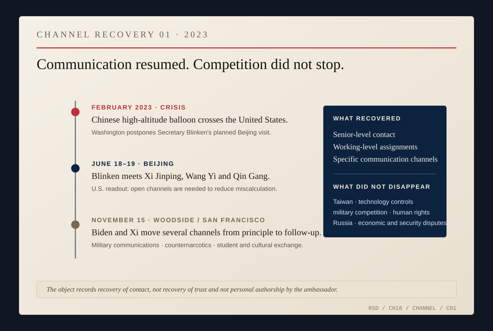
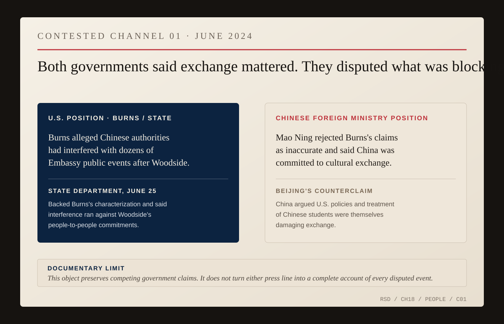
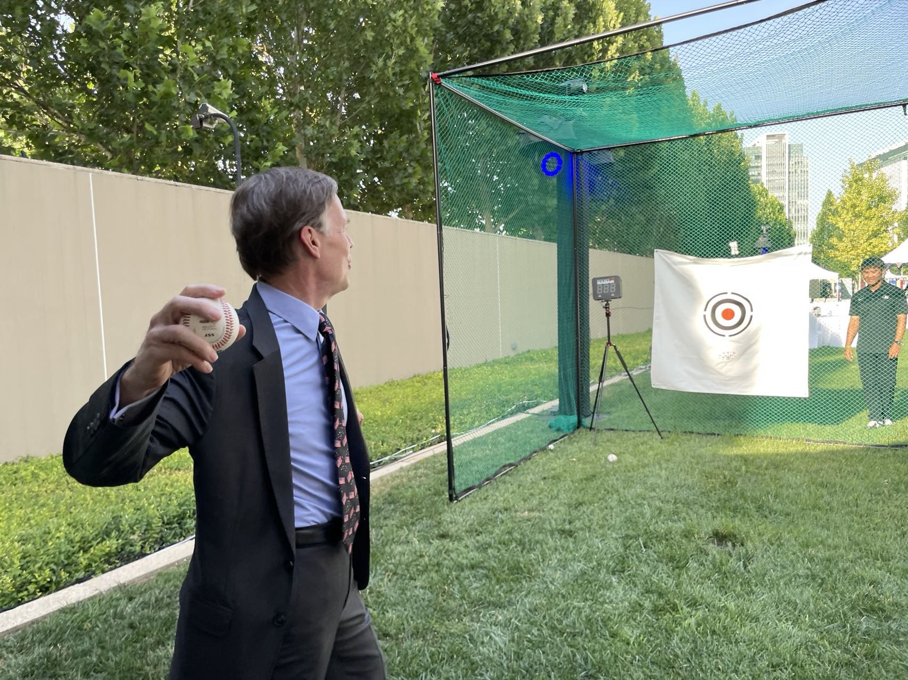

# Beijing

The seminar was over.

For thirteen years Nicholas Burns had taught diplomacy at Harvard. He could reconstruct negotiations after the fact, compare decisions and invite disagreement.

An ambassador could not remain outside the sentence.

When Burns returned to government as the United States ambassador to China, his public words once again carried delegated authority.

The scale of the assignment was different from anything he had held before.

Security competition. Nuclear weapons. Taiwan. Trade. Technology. Military signaling. Human rights. Climate. Fentanyl precursors. Russia's war against Ukraine. Students. Scientists. Business executives. Consular cases. Visas. Propaganda. Supply chains. Aircraft and ships operating close enough that an error could become a crisis before either capital had decided it wanted one.

Harvard later described Burns as having led Mission China personnel drawn from forty-eight agencies of the United States government.

That number ruins the fantasy of the solitary ambassador.

The embassy was not Nick Burns with a flag behind him. It was an American government in miniature, carrying its own specialties and internal distinctions into a relationship too large for any one office to comprehend.

Burns's public formula for the relationship was plain.

Compete. Communicate. Cooperate where interests permitted.

The middle word did most of the diplomatic work.

Beijing wanted communication too, but rejected the American premise around it.

When Foreign Minister Qin Gang met Burns in May 2023, the Chinese Foreign Ministry's own account said the relationship needed stabilization and that the two countries should prevent unexpected incidents. Then Qin accused Washington of talking about communication while pursuing policies China regarded as suppression and containment. He urged Burns to make more contacts inside China and to serve as a bridge between the two countries.

Both governments could say communication mattered while disagreeing about what communication was for. Burns's formula treated competition as the condition inside which communication had to work. Beijing repeatedly objected to defining the relationship by competition at all.

*ARCHIVE NOTE — China's Foreign Ministry records Qin Gang's May 8, 2023 meeting with Burns, including both the call to stabilize the relationship and Beijing's objection to American containment language and policy. The same readout says Qin urged Burns to serve as a bridge. [Chinese Foreign Ministry record.](https://www.fmprc.gov.cn/mfa_eng/gjhdq_665435/3376_665447/3432_664920/3435_664926/202305/t20230509_11073827.html)*

The United States and China did not need an ambassador to discover that they disagreed. Washington criticized Chinese military pressure around Taiwan, economic practices, human-rights abuses and support that benefited Russia's war effort. Beijing objected to American technology controls, alliances, Taiwan policy and what it described as interference and containment.

The useful question was whether serious competition could remain intelligible to both sides.

That became especially difficult during crisis.

In early 2023, a Chinese high-altitude balloon crossed the United States. Washington described it as a surveillance platform. Beijing said it was a civilian airship used mainly for meteorological purposes that had deviated from its planned course. The United States shot it down after it crossed the continent. Secretary of State Antony Blinken postponed a planned visit to Beijing.

An object moved through physical space.

Two governments assigned different explanations to it.

Domestic politics accelerated.

A diplomatic visit disappeared from the calendar.

The relationship did not remain frozen.

Blinken went to Beijing in June 2023. Other senior American officials traveled to China. National Security Adviser Jake Sullivan and Wang Yi developed a senior-level channel. President Joe Biden and President Xi Jinping met at Woodside, California, in November.

Burns did not create those decisions. The White House, State Department, Chinese leadership and officials on both sides owned them.

The ambassador worked inside the machinery that followed.

Woodside did not end strategic competition. It moved the governments to resume important military-to-military communications, advance counternarcotics cooperation, maintain high-level engagement and assign more work below the presidential level.

A summit is often photographed as a climax.

Professionally, it is frequently an assignment sheet.

*CHANNEL RECOVERY 01 — The February balloon crisis disrupted contact; Blinken's June visit explicitly emphasized communication to reduce miscalculation; Woodside created additional military, counternarcotics and people-to-people work. This records recovery of channels, not recovery of trust and not personal authorship by the ambassador. [U.S. June 2023 readout.](https://2021-2025.state.gov/secretary-blinkens-visit-to-the-peoples-republic-of-china-prc/) [Chinese Woodside readout.](https://www.fmprc.gov.cn/eng/wjb/zzjg_663340/bmdyzs_664814/xwlb_664816/202312/t20231204_11194316.html)*

By April 2024, the Chinese record was describing Burns, Assistant Secretary Daniel Kritenbrink, National Security Council official Sarah Beran and Chinese officials engaged in candid and constructive talks across bilateral and regional issues. The same readout paired that support for exchange with sharp objections over Taiwan, technology policy, alliances and the South China Sea.

The channel did not sit outside the conflict.

It was one of the places the conflict was conducted.

*ARCHIVE NOTE — China's April 15, 2024 Foreign Ministry readout records continued high-level exchanges while preserving Beijing's objections on Taiwan, technology, alliances and regional security. [Chinese Foreign Ministry record.](https://www.fmprc.gov.cn/eng/gjhdq_665435/3376_665447/3432_664920/3435_664926/202404/t20240417_11282825.html)*

Burns also pushed a less dramatic form of contact.

People.

He and Libby arrived in March 2022 and spent their first twenty-one days quarantined in the residence. Later Burns often described the posting in the plural: the two of them trying to learn Mandarin, traveling when they could, attempting to see a country that had been difficult for outsiders to enter during zero-COVID.

In one early walk from the residence toward Tiananmen Square, Burns recalled passing through checkpoint after checkpoint and being held while officials tried to determine what the American ambassador was doing on foot.

Later, when movement became easier, the couple took second-class train rides and talked with people around them. They went to a Beijing soccer match, wore the home team's green scarves and received high-fives from nearby spectators. They both studied Chinese.

None of this was negotiation.

The ambassador remained the official representative. His spouse did not acquire delegated authority by proximity. But diplomatic life was shared, and the Beijing record gives Elizabeth Baylies Burns an independent presence.

An attendee at an October 2024 residence event, *A Celebration of Contemporary Chinese Art*, reported that Libby conceived the idea of bringing Chinese and China-inspired artists into a residence where American art normally dominated the display. The account is eyewitness reporting, not an embassy transcript, and should remain at that evidentiary level. Other records show Burns and Libby selecting work for the State Department's Art in the Embassies program and hosting Chinese academics and foreign diplomats at an Ambassadors for Nature event.

The residence had again become a place where the shared life of a posting touched public representation.

The pandemic and political deterioration had reduced ordinary movement between the two societies. American students were far less present in China than they had once been. Academic and cultural exchange had become harder. Political suspicion attached itself to institutions that might previously have been treated as routine bridges.

Burns argued publicly for rebuilding some of those connections.

Students do not solve Taiwan. A cultural event does not remove export controls. A visiting scholar does not create military confidence.

Direct contact does something smaller: it makes the other society harder to reduce entirely to an abstraction.

Even that became contested terrain.

In 2024, Burns publicly accused Chinese authorities of interfering with U.S. Embassy cultural, educational and people-to-people programming. The State Department backed his complaint.

China rejected the characterization. Its Foreign Ministry said China supported people-to-people exchange while objecting to what it regarded as American interference and politicization.

Both governments said contact mattered and disagreed about what was preventing it.

*CONTESTED CHANNEL 01 — Burns and the State Department alleged repeated Chinese interference with U.S. Embassy cultural and educational programming. China's Foreign Ministry rejected the characterization, said China supported exchange and argued U.S. policies were themselves obstructive. The object preserves competing government claims rather than turning either press line into a complete finding. [State Department, June 25, 2024.](https://2021-2025.state.gov/briefings/department-press-briefing-june-25-2024/) [Chinese Foreign Ministry, June 26, 2024.](https://www.fmprc.gov.cn/eng/xw/fyrbt/lxjzh/202407/t20240730_11463247.html)*

Burns's tenure did not dissolve the structural conflict between the United States and China. Taiwan remained dangerous. Technology restrictions expanded. Military competition continued. Human-rights disputes remained. Beijing continued to object to American alliances and what it viewed as containment. Washington continued to object to coercive Chinese behavior and China's relationship with Russia.

Communication existed beside all of it.

So did baseball.

A 2024 public post from Burns showed young people in China and referred to future members of Red Sox Nation. In 2023, he had been photographed pitching a baseball at an embassy July Fourth event.

Nothing important in U.S.-China relations changed because of either moment.

That is why they belong.

*FIG. 07 — Ambassador Nicholas Burns pitching a baseball, Beijing, July 4, 2023. U.S. Department of State / @USAmbChina. Public domain. The image records a real baseball/public-diplomacy moment during the posting; it does not show that baseball altered access, public opinion or policy. [Archive record.](https://commons.wikimedia.org/wiki/File:Ambassador_Burns_pitching_baseball.jpg)*

*VIDEO COMPANION 01 — In the digital edition, [watch the linked Instagram reel](https://www.instagram.com/reel/DdP_aO8OWQppztZhsfZjcREUnceQtaqIczk0yI0/). In print, scan the QR code to open a maintained companion page that preserves the live reel link and can later carry a verified transcript. The book links to the video rather than reproducing it. Until the source media itself is captured and checked, no dialogue from the reel is quoted or used to support a factual claim.*

The Red Sox had followed Burns through the State briefing room, Athens, NATO, Harvard and now Beijing. The allegiance could still make the representative recognizable as a particular American without pretending to explain the relationship he represented.

That relationship was unfinished when Burns left.

There was no treaty to summarize the assignment. The United States and China were still competitors. They were still talking. They were still accusing each other of destabilizing the relationship. They were still trading. Students still crossed the Pacific. Militaries still watched one another.

An ambassador does not always leave with a solved problem.

Sometimes the work is narrower.

Make the message clear enough to be understood.

Keep important channels usable.

Report what the other side is actually saying.

Do not mistake contact for trust.

Do not mistake competition for a reason to stop listening.

The relationship may remain dangerous anyway.

That is the condition Burns handed back when the posting ended.
