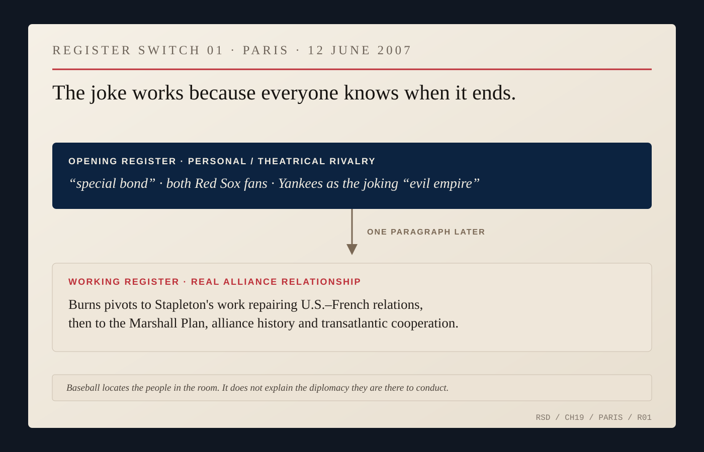
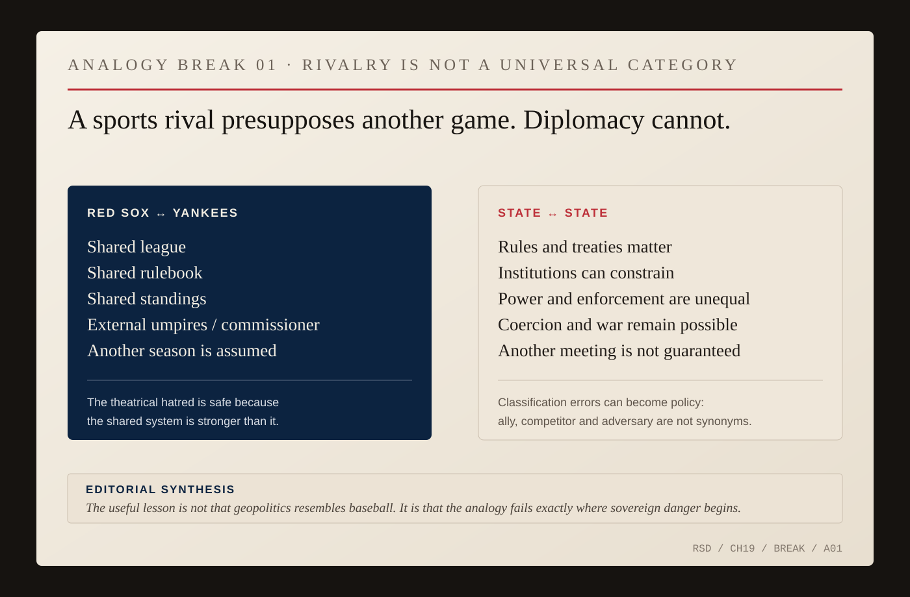

# Yankees, Rivals, Adversaries

Nicholas Burns once told a State Department briefing room that the rules were simple.

The Red Sox were good.

The Tigers were acceptable.

The Yankees were hated.

Everyone laughed because everyone knew the hatred was fake in the important sense. A Yankees fan could be threatened with expulsion from the briefing room and still know where the joke ended.

The teams played inside a shared system. Same league. Same rulebook. Same standings. Another series was already on the schedule.

International politics offers no comparable guarantee.

Burns's career eventually put him inside relationships where *rival*, *competitor*, *adversary* and *enemy* described different kinds of danger. Getting the category wrong could distort policy before policy began.

An ally who blocks an American preference is still an ally. A competitor need not be an enemy. An adversary cannot safely be treated as merely another team on the schedule.

The State Department podium supplied the harmless version first.

In 1997, baseball banter recurred often enough that reporters knew the ritual. A visiting intern admitted to being a Yankees fan and Burns theatrically pointed toward the doors before granting clemency. A Dutch journalist knew enough to say the Red Sox played at Fenway, and Burns pressed him on whether Boston's club was more famous than New York's.

Everyone knew the antagonism had limits.

Ten years later, in Paris, Burns opened a Marshall Plan commemoration with Ambassador Craig Stapleton by noting their shared Red Sox allegiance and joking opposition to the Yankees' “evil empire.” Then he turned to U.S.-French relations.

*REGISTER SWITCH 01 — Paris, June 12, 2007. Burns opens with the shared Red Sox allegiance he and Ambassador Craig Stapleton understood as social shorthand, invokes the Yankees as the joking “evil empire,” then immediately turns to U.S.–French repair, the Marshall Plan and transatlantic cooperation. The joke locates the diplomats; it does not explain the diplomacy. [State Department transcript.](https://2001-2009.state.gov/p/us/rm/2007/87176.htm)*

The joke located the diplomats. It did not explain the diplomacy.

Years later Burns used *competition* and *rivalry* in a much less forgiving setting.

As ambassador to China, he described the United States and China as engaged in historic competition. Technology, military power, Taiwan, trade, artificial intelligence, human rights, alliances and global influence all sat inside the relationship.

The United States and China traded at enormous scale while restricting technologies from one another. Their diplomats met while their militaries prepared for contingencies. Students crossed the Pacific while both governments accused the other of destabilizing conduct. Selective cooperation lived beside deterrence.

There was no commissioner to settle the dispute.

*ANALOGY BREAK 01 — Editorial synthesis. Red Sox–Yankees rivalry presupposes a shared league, rules, standings, outside game authorities and another season. States have law, treaties and institutions too, but enforcement is partial, power unequal and coercion or war remain possible. The analogy becomes useful at the point where it fails. [Source map.](../research/ch19-visual-archive.md)*

NATO had already shown Burns one classification error to avoid. France, Germany and Belgium fought Washington bitterly over Iraq and the timing of defensive planning for Turkey in 2003. They did not become American adversaries because they opposed the United States. The alliance survived the argument precisely because disagreement did not erase the underlying relationship.

Iran supplied the reverse case. Washington regarded the Iranian government as profoundly adversarial. The nuclear dispute involved sanctions, proliferation risk and the possibility of military conflict. Diplomacy still occurred.

Talking was not a reward for good behavior. It was one instrument for dealing with a dangerous disagreement.

China brought the two lessons together. Burns argued for sustained communication while describing the relationship as structural competition. He also warned against demonizing the Chinese people.

That position depends on precision. If every competitor becomes an enemy, ordinary competition begins to look like proof of hostile intent. If every adversarial act is softened into “rivalry,” coercion can disappear inside reassuring language.

The label has to follow the behavior, not replace it.

What is the other government doing? What does it want? Where does it compromise? Where does it refuse? Which signals are theater and which are preparation?

The answer can change. Countries that were enemies become allies. Allies drift. Competitors cooperate in one domain and threaten each other in another. Leaders and governments change faster than diplomatic vocabulary sometimes does.

Baseball gave Burns a language for antagonism without annihilation because the league itself was never in doubt.

States do not get that luxury.

A sports rivalry presupposes another game.

Diplomacy sometimes exists to make another meeting possible when no such guarantee exists.

The diplomat's task is not to turn adversaries into Yankees.

It is to know the difference.