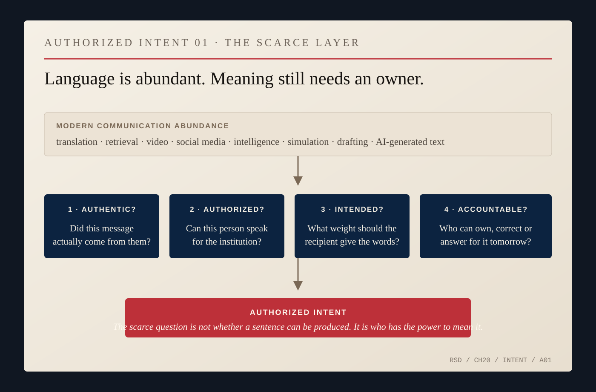
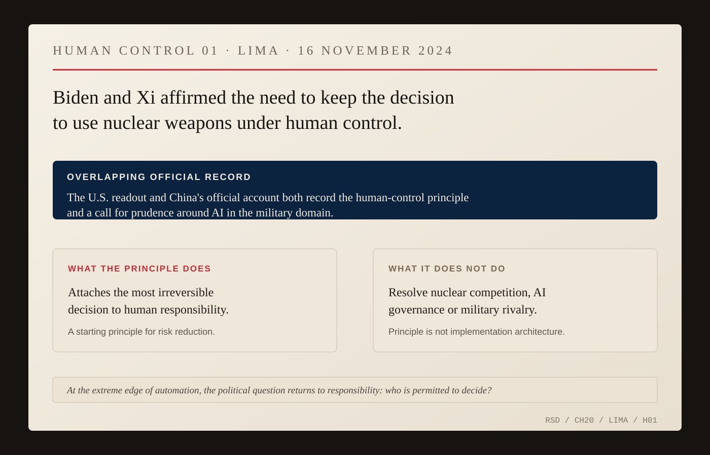

# The Human Channel

Nicholas Burns entered the Foreign Service when official communication still moved heavily through cables, secure telephones, formal notes and meetings whose records took time to circulate. By Beijing, an ambassador worked amid smartphones, social media, ubiquitous video and machine systems capable of translating, retrieving and drafting at speeds no embassy of Burns's early career could approach.

The volume changed. The old problem did not: who, exactly, is speaking for the state?

After leaving Beijing, Burns described one basic ambassadorial function in plain terms: represent the policies of your government and remain a primary point of communication with the host government. The receiving side needs more than words. It needs to know what weight to put on them. Was the statement authorized? Was the minister improvising? Was the president making a commitment or describing a preference? Was the ambiguity intentional? What changed since yesterday?

A machine can recover the record. It cannot, by itself, decide what a government intends another government to treat as binding. Burns had spent years inside that problem before anyone called it AI.

At the State Department podium, *known* was different from *reported*. *Confirmed* was different from *alleged*. A mistake had to be corrected rather than hidden under another sentence. Those distinctions could look fussy until the subject became war, proliferation or a live negotiation. The spokesman's authority did not come from personal force; it came from the government behind him. But the person still mattered because the audience had to decide whether that government could be believed through him.

Call that political authentication.

Diplomacy also needs room. Governments must say enough to be understood while sometimes leaving enough unsaid for another move. Precision is not always the elimination of ambiguity. Sometimes it is control over ambiguity.

Repeated contact helps without becoming magic. A Russian official does not become less Russian because an American has known him for ten years. An Iranian negotiator does not surrender a national position because the meetings are cordial. A Chinese official does not stop answering to his own political system because he knows an ambassador's family.

What repeated contact creates is a record of behavior. The same counterpart delivers good news, bad news, corrections, warnings and concessions. Over time, each side learns something about consistency, evasiveness, follow-through and memory. That may produce trust. It may produce informed distrust. Both are better than fantasy.

Burns had spent part of his Harvard years around a revealing inverse case. Through the Future of Diplomacy Project, he brought Special Olympics leader Tim Shriver into a discussion of [non-state actors in international affairs](https://www.belfercenter.org/publication/non-state-actors-international-affairs); Burns later served on the [Special Olympics International board](https://www.specialolympics.org/about/board-of-directors/nicholas-burns). A civic network can create encounters, expectations and relationships across borders without possessing the authority to bind a government. An ambassador has the opposite burden: the relationship is human, but the words can commit an institution far larger than the person speaking them.

That difference is easy to lose when every kind of cross-border contact is called diplomacy. It is better to keep the categories visible. Civic contact can widen the set of people who know one another. Official diplomacy determines what a state will promise, oppose, recognize or risk. The two can reinforce one another without becoming interchangeable.

Synthetic communication makes the distinction more important. Text, audio, video and translation can be produced quickly and convincingly. Language is becoming abundant. Authorized intent is not.

Who meant this? Who had the power to mean it? Who can be held to it tomorrow?

*AUTHORIZED INTENT 01 — Editorial synthesis from recurring problems across Burns's career. Modern systems can make language, retrieval and analysis abundant; institutions still have to answer whether a message is authentic, whether the speaker is authorized, what political weight the words carry and who can own or correct them tomorrow. This is not a Burns-authored doctrine. [Source map.](../research/ch20-visual-archive.md)*

Beijing supplied the late-career stress test. Important U.S.-China channels were disrupted after crises while American and Chinese forces continued operating near one another. Burns later described the danger practically: an accident at sea or in the air could force two capitals to interpret intent under pressure precisely when senior communication was weakest.

Interpretation does not stop when a channel fails. Each government still has to decide whether an event was ordered, accidental, limited or preparatory. It simply does so with worse access to the other side's authorized intent. Communication, in that setting, is part of deterrence rather than decoration.

Technology can make the problem faster. A government may receive more warning, more imagery and more possible explanations than any previous generation while leaders have fewer minutes to decide which interpretation is real enough to act on.

Burns's last year in China produced one narrow case with unusually high stakes. At their November 2024 meeting in Lima, President Joe Biden and President Xi Jinping affirmed the need to maintain human control over decisions to use nuclear weapons.

*HUMAN CONTROL 01 — Lima, November 16, 2024. U.S. and Chinese official records both preserve the principle that the decision to use nuclear weapons should remain under human control, alongside a call for prudence around military AI. The statement is a starting principle, not an arms-control or AI-governance regime. [Chinese Foreign Ministry readout.](https://www.mfa.gov.cn/eng/xw/zyxw/202412/t20241217_11495877.html) [U.S. readout archive.](https://www.presidency.ucsb.edu/documents/readout-president-joe-bidens-meeting-with-president-xi-jinping-the-peoples-republic-1)*

The statement did not settle military AI, command-and-control vulnerability, cyber operations or the strategic competition between the two countries. Burns later described it as a beginning. That is enough. Nuclear command is an extreme case of the same problem: the world does not merely need an authentic signal. It needs a traceable chain of responsibility for an irreversible decision.

None of this requires diplomats to reject better tools. Translation, retrieval, simulation and analysis can expose inconsistencies, recover forgotten commitments and give officials better options. The mistake is to confuse assistance with authorization. A model can generate ten plausible responses to a crisis; the state still has to choose one. A system can estimate that a counterpart is bluffing; someone still has to decide whether to risk lives on the estimate. A translator can make every sentence fluent. Someone still has to mean it.

The Red Sox cap mattered only because it made Burns recognizable as a person. The person mattered politically because an institution had authorized him to speak. The institution mattered because the words had consequences beyond the room.

Charm is not the point. Some of the most important diplomatic conversations are unpleasant. Some transmit threats. Some end without agreement. Sometimes success consists only in both sides understanding that the other will not move. The human channel does not make states like one another. It makes intention harder to mistake.

Burns began his career when official communication was comparatively scarce and slow. His last government posting ended amid almost infinite messaging. Underneath the volume were the questions that had followed him from the podium to the embassy: Who is speaking? What are they authorized to promise? What will they own tomorrow?
