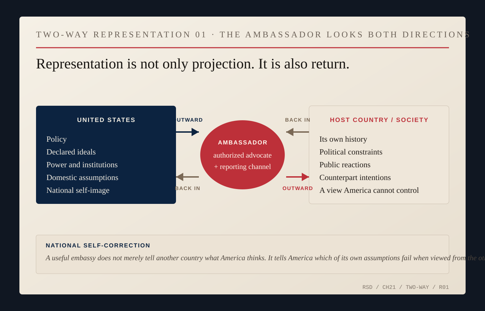

# What America Looks Like From Away

An ambassador arrives with a flag, a security detail, an embassy, a motorcade and a government whose behavior continues after the reception ends. Strangers begin using him as evidence. Then the host country supplies its own history.

Nicholas Burns learned the problem early enough that public diplomacy became a professional argument for him. As State Department spokesman in 1997, he worried that American diplomats were not serious enough about explaining what the United States was doing, at home or overseas. Policy did not explain itself. Power certainly did not.

Greece made the argument physical.

When Burns arrived in Athens in 1997, Greeks already had stories about the United States: the civil war, the Cold War, the junta, Cyprus, Turkey, NATO, the Balkans, American intervention, American culture. Some were flattering, some hostile, some selective. None began with the new ambassador.

The Kosovo war sharpened them. NATO's bombing campaign was deeply unpopular in Greece. Anti-American demonstrations grew. President Bill Clinton's 1999 visit became a security and political problem before he landed. Washington described a campaign intended to stop Serbian violence in Kosovo; many Greeks placed the bombing inside a regional history Washington did not control. An embassy could issue arguments. It could not issue a new memory.

Burns still pushed the mission outward. The Athens record shows commercial diplomacy, cultural work, educational programs, civic engagement and contact beyond ministries. His office carried Boston objects and a signed Red Sox cap. The embassy building itself was cleaned, opened visually and used to signal respect for the bilateral relationship. None of this required a Greek citizen furious about Kosovo to become less furious. Public diplomacy was not a solvent for policy disagreement. Its harder job was to make the picture less flat.

An ambassador is not a neutral anthropologist. He advocates for his government. But advocacy becomes useless if it requires him to stop noticing how that government looks from outside itself.

The United States is unusually exposed to the comparison because it speaks in universal language—freedom, democracy, rights, opportunity, rule of law—while foreign audiences can set those words beside immigration policy, war, racial conflict, elections, companies, military bases, universities, entertainment and the Americans they actually meet. Sometimes the comparison is unfair. Sometimes it is not.

The Red Sox gave Burns one recognizable piece of biography inside that larger encounter: Boston, family, loyalty, humor, a city and a team. It did not make America lovable. It made the representative less abstract.

China posed the same problem under harder political conditions. By the time Burns reached Beijing, Washington and Beijing had dense public stories about one another. The United States described an authoritarian competitor using coercion, violating rights and seeking technological and military advantage. Chinese officials described a United States attempting to contain China's rise, interfere in its internal affairs and preserve an order built around American dominance.

Burns argued for educational and cultural exchange while representing a competitive American strategy. In 2024 he accused Chinese authorities of interfering with U.S. cultural and educational programs; China rejected the charge, saying it supported people-to-people contact while opposing American interference and politicization. National image was not scenery around the relationship. It was contested terrain.

Governments care about media, scholarships, cultural programs, visas, tourism, censorship and influence because political impressions form far outside formal negotiations. Yet no government owns the picture. Hollywood exports one America. Harvard exports another. So do a Marine at an embassy gate, a technology company, an exchange student, a protester, a refugee, a diplomat and a baseball fan. They contradict one another.

Even baseball is less sealed than the phrase *American pastime* suggests. The Greece story ran through Greek organizers, Greek-American volunteers, Major League institutions and North American players of Greek descent. The sport traveled as American culture while being remade by people whose lives already crossed national borders. By the time Burns wore a Red Sox cap in China, he was carrying a regional American loyalty inside a global game.

Burns served in places where American power could not be interpreted only one way. In the West Bank, aid carried political meaning because the donor carried political meaning. At NATO after September 11, the United States appeared as a wounded ally whose partners rushed to its defense. During the Iraq rupture, some of those same allies believed American policy profoundly mistaken. India saw strategic opportunity in an American decision to change nuclear rules. Iran encountered a state organizing pressure and demanding suspension. China encountered a competitor, market, military power, cultural source and educational destination at once.

Inside that accumulation of consequences, the ambassador still has an official obligation: represent the government accurately without letting advocacy become self-deception. Diplomats defend policies they did not invent, protect classified information and operate under instructions. They still cannot afford to report only the foreign reality that flatters Washington.

An ambassador who cannot understand why another society distrusts the United States cannot explain the distrust home. One who dismisses every criticism as propaganda will eventually send propaganda back to Washington. One who treats every criticism as decisive will stop representing his own country. The job runs both directions.

*TWO-WAY REPRESENTATION 01 — Editorial synthesis. Burns argued in 1997 for explaining American policy and ideas to publics and governments; after Beijing he described the ambassador as both a primary government-to-government communicator and a representative to the host country's people. The return arrow is the chapter's other half: reporting local realities back to Washington so national self-image can be corrected by contact with the world. [1997 public-diplomacy address.](https://1997-2001.state.gov/policy_remarks/970509.burns.html) [2025 Fairbank/Belfer lecture.](https://www.belfercenter.org/research-analysis/lessons-front-lines-us-china-relationship)*

Ambassadors explain America abroad. They also explain foreign countries to America. That return trip can be harder because it threatens national self-image. A useful embassy reports what local officials say when the cameras are gone, what an opposition believes, what a government cannot admit publicly and which American assumptions collapse on contact.

Burns once worried that Americans did not understand what the State Department did. Here is part of the answer: diplomats work at the boundary where American self-description loses control over the view.

The ambassador reports back.
