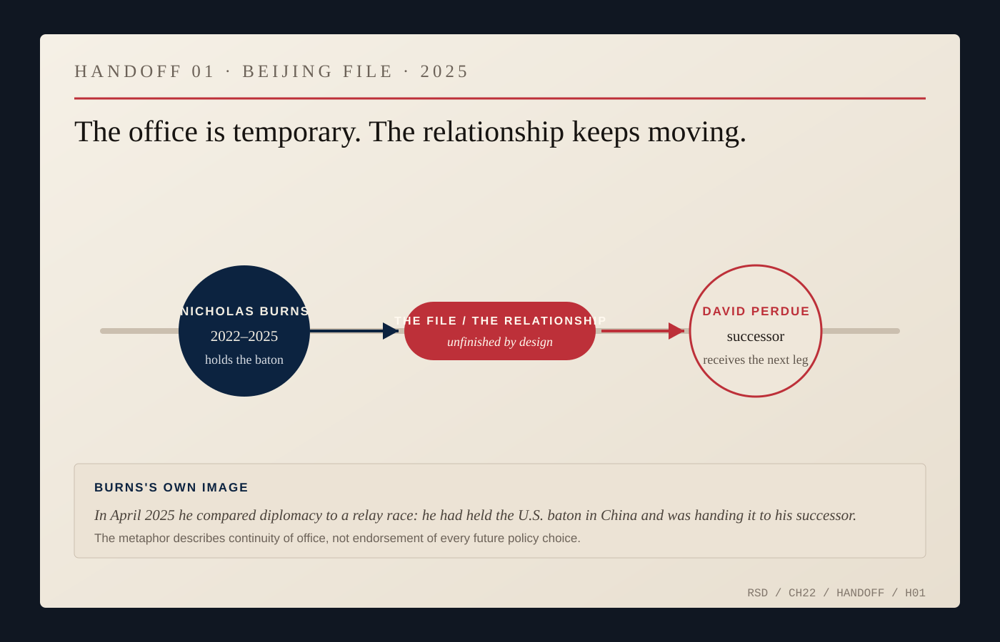
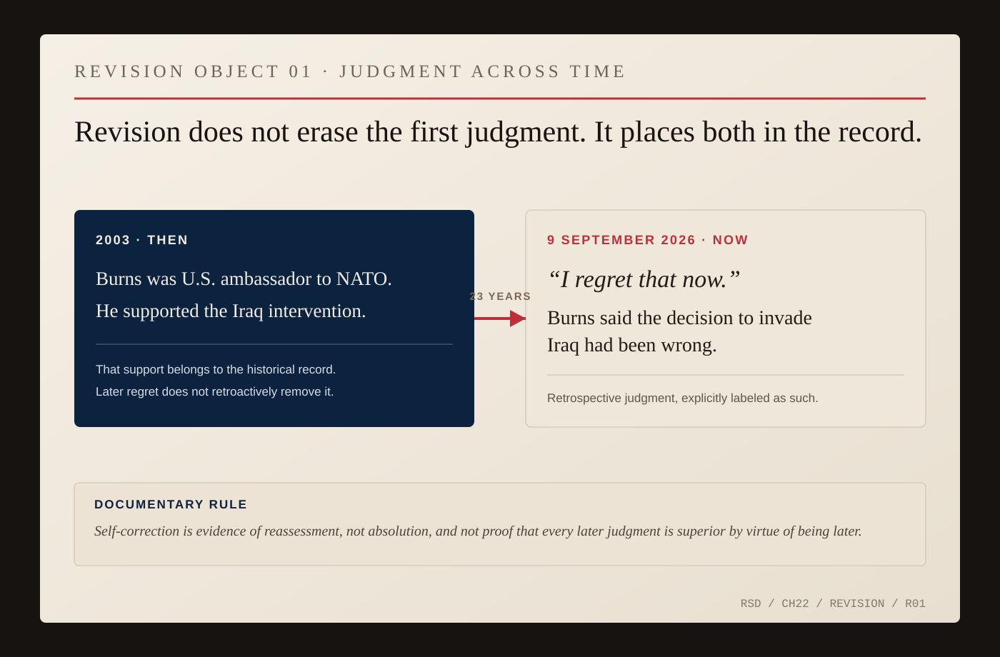

# Extra Innings

Nicholas Burns left Beijing in January 2025.

A few months later he was back at Harvard.

In an April lecture reflecting on China, Burns reached for a relay race rather than baseball. He had carried the American baton in Beijing for a few years, he said in substance, and now he was handing it to his successor.

*HANDOFF 01 — In April 2025 Burns compared diplomacy to an Olympic relay race: he had held the U.S. baton in China and was handing it to his successor. The object records continuity of office, not endorsement of every future policy choice. [Fairbank/Belfer lecture.](https://www.belfercenter.org/research-analysis/lessons-front-lines-us-china-relationship)*

A diplomat inherits a relationship already in motion and leaves it unfinished. The U.S.-China relationship did not belong to the ambassador who occupied the residence. NATO did not begin when Burns arrived twelve days before September 11. The India nuclear agreement did not belong to one negotiator. Iran did not resolve itself because an under secretary left office.

The office is temporary. The file is not.

Burns had already made this transition once. In 2008, after twenty-seven years in the Foreign Service, he moved to Harvard. More than a decade later President Joe Biden asked him to return as ambassador to China. Now he was back in the classroom with another government service behind him and another set of decisions available for examination.

Some of the outcomes he carried back were deliberately small.

Burns later emphasized the late-2024 release of Americans who had been detained in China for years. In a relationship measured in nuclear weapons, Taiwan, trade and technological competition, a handful of individuals can sound numerically trivial.

They were not trivial to their families.

That double scale runs through diplomacy. The state scale produces deterrence, sanctions, alliances and summits. The human scale produces a person walking out of a prison.

The end of a diplomatic biography invites a verdict.

Was Burns a great diplomat?

Compared with whom, and measured when? Agreements are abandoned. Failed negotiations leave machinery successors use. Alliances look obsolete until they do not. Judgments that appear defensible inside one moment can age badly.

Burns eventually said so about one of his own.

In September 2026, twenty-three years after the invasion of Iraq, he returned publicly to a decision he had supported while serving as ambassador to NATO. Looking back, he said he regretted that support and believed the invasion had been wrong.

*REVISION OBJECT 01 — The record contains both judgments. Burns supported the Iraq intervention while serving as U.S. Ambassador to NATO; on September 9, 2026, he said, *“I regret that now,”* and described the decision to invade as wrong in retrospect. The arrow is time, not absolution. [PBS, Amanpour and Company.](https://www.pbs.org/video/september-9-2026-prwre2/)*

The later judgment does not erase the first one.

It adds another fact to the record: Burns was willing to revise the account he gave of his own judgment.

That is not absolution. It is revisability.

Officials decide with partial information, institutional pressure and the confidence of the moment. History later supplies facts they lacked, discounted or misunderstood. Experience does not guarantee that the revised judgment will be better; sometimes it only gives error a more elaborate vocabulary.

Harvard gave Burns a place where former decisions could become material students questioned. Return to government exposed the professor's ideas to authority again. Return to teaching put the latest exercise of authority back under examination.

The same tension belongs to representation. A diplomat who assumes the country is always right cannot report inconvenient reality. One who cannot defend the country at all cannot do the job.

Baseball can return once, narrowly.

Extra innings begin after the expected ending has passed. The game continues.

Burns's public career has had several apparent endings: the Foreign Service in 2008, thirteen years of teaching, government again, China, Harvard again. In his seventies he was still arguing publicly about alliances, China, intervention and September 11.

That is not a victory lap. It is continued participation, which preserves the possibility of correction.

This book has resisted ranking Burns as America's greatest diplomat because the category collapses too much into one adjective: craft, judgment, luck, presidents, colleagues, counterparts, institutions and history.

The record supports a smaller claim.

Burns's career shows a profession that repeatedly asks people to enter countries they do not own, represent policies they did not make alone, maintain relationships that do not erase interests, leave work unfinished and sometimes return years later to say where their judgment failed.

The Red Sox cap never answered any of those problems.

It simply kept one fact visible.

There was a person under the title.

Then the title passed to somebody else.

The inning was never extra.

It was only next.