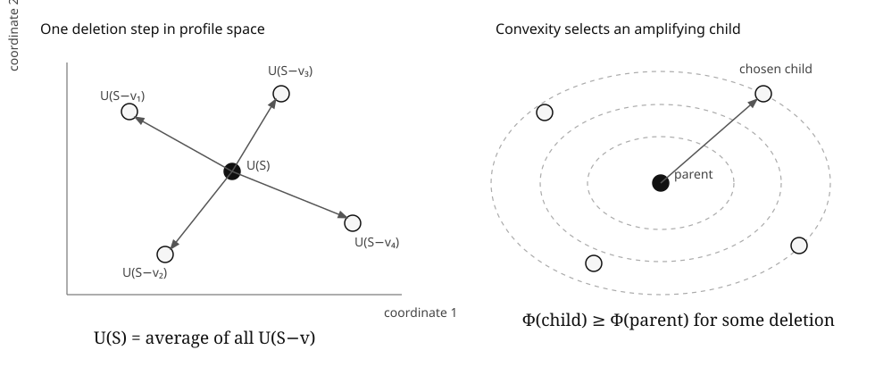

# Convex Pattern Amplification Under Deletion

## A deterministic selection principle for U-statistics and induced substructure laws

**Sven Hardy Benson**  
12 September 2026

## Abstract

Let \(V\) be a finite set. For each \(j=1,\ldots,d\), choose an order \(r_j\) and a real-valued kernel on the \(r_j\)-subsets of \(V\). For every sufficiently large \(S\subseteq V\), let \(U(S)\in\mathbb R^d\) be the vector of the corresponding normalized U-statistics. The elementary deletion identity

\[
U(S)=\frac1{|S|}\sum_{v\in S}U(S\setminus\{v\})
\]

says that the current profile is exactly the barycenter of its one-vertex deletions. Jensen's inequality then has a deterministic consequence: for every convex \(\Phi:\mathbb R^d\to\mathbb R\), some vertex deletion satisfies

\[
\Phi(U(S\setminus\{v\}))\ge \Phi(U(S)).
\]

Iterating gives a nested chain of induced substructures along which \(\Phi\) never decreases. For quadratic potentials there is an exact gain identity: the mean energy increase under deletion is the jackknife variance of the deletion profiles. The same principle applied to induced graph-pattern distributions yields nested induced subgraphs whose collision energy and Kullback--Leibler divergence from any fixed positive reference law are nondecreasing, while Shannon entropy is nonincreasing.

The mathematical ingredients are classical: U-statistics go back to Hoeffding, their reverse-martingale structure is classical, Jensen's inequality is standard, and induced-subgraph density vectors are central in graph limits and flag algebras. The candidate contribution is the finite deterministic **nested deletion-chain formulation**, its simultaneous multi-order profile version, and the exact quadratic energy accounting. A targeted literature search did not locate this package stated in this form. That is a provisional novelty claim, not proof of priority.

A reproducibility bundle accompanies the paper: LaTeX source, an SVG diagram, a pure-Python exhaustive checker over all \(32{,}768\) labeled graphs on six vertices for the edge/triangle specialization, and a pinned Lean 4 / Mathlib project formalizing the barycentric selection spine. The authoring environment does not contain Lean/Lake, so the formal source is accurately labeled **formalized, compiler check pending** until independently built.

## 1. The selection problem

A large finite structure carries many local statistics. In a graph one can record edge density, triangle density, the frequency of a four-cycle, or the full distribution of induced \(r\)-vertex graphs. In a permutation one can record pattern frequencies. In a hypergraph one can record densities of small configurations. In statistics the same algebra appears as a vector of U-statistics.

The usual question is what happens under random sampling. This note asks a deterministic question instead:

> Can one delete a single point so that a chosen measure of local structure becomes no smaller, and can one keep doing this along a nested chain?

For a convex measure of the local profile, the answer is yes for a reason that is almost embarrassingly exact: the parent profile is the barycenter of the child profiles.

The useful content is not the existence of an average. It is the combination of four features:

1. the identity holds exactly at every finite size;
2. several U-statistics of different orders can be carried simultaneously;
3. an arbitrary convex potential may be placed on their joint vector; and
4. the maximizing deletions can be chosen recursively, producing a deterministic nested chain rather than unrelated good subsets at different sizes.

The quadratic case adds something more: it identifies exactly how much convex energy is available on average at each deletion step.

## 2. Multi-order local profiles

Let \(V\) be finite with \(|V|=n\). Fix \(d\ge1\). For each coordinate \(j\), choose an integer \(r_j\ge1\) and a kernel

\[
h_j:\binom Vr_j\to\mathbb R.
\]

Write

\[
r_*:=\max_j r_j.
\]

For every \(S\subseteq V\) with \(|S|\ge r_*\), define

\[
U_j(S)
:=
\frac1{\binom{|S|}{r_j}}
\sum_{A\in\binom S{r_j}} h_j(A),
\]

and set

\[
U(S):=(U_1(S),\ldots,U_d(S))\in\mathbb R^d.
\]

No probability model is assumed. The kernels may be arbitrary fixed functions of subsets of the original ground set.

## 3. The deletion barycenter identity

### Theorem 3.1 — Exact deletion barycenter

If \(|S|>r_*\), then

\[
\boxed{
U(S)=\frac1{|S|}\sum_{v\in S}U(S\setminus\{v\}).
}
\tag{3.1}
\]

### Proof in Lamport style

It is enough to prove the identity coordinatewise.

**〈1〉1.** Fix a coordinate \(j\), put \(r=r_j\), and write \(m=|S|\).

**〈1〉2.** Expand the sum over all one-point deletions:

\[
\sum_{v\in S}U_j(S\setminus\{v\})
=
\frac1{\binom{m-1}{r}}
\sum_{v\in S}
\sum_{A\in\binom{S\setminus\{v\}}r}h_j(A).
\]

**〈1〉3.** Fix an \(r\)-subset \(A\subseteq S\). It occurs in the inner sum precisely when \(v\notin A\).

**〈2〉1.** There are exactly \(m-r\) choices of \(v\in S\setminus A\).

**〈1〉4.** Therefore

\[
\sum_{v\in S}
\sum_{A\in\binom{S\setminus\{v\}}r}h_j(A)
=
(m-r)
\sum_{A\in\binom Sr}h_j(A).
\]

**〈1〉5.** Use the binomial identity

\[
\binom{m-1}{r}
=
\frac{m-r}{m}\binom mr.
\]

**〈1〉6.** Substituting **〈1〉4** and **〈1〉5** into **〈1〉2** gives

\[
\sum_{v\in S}U_j(S\setminus\{v\})
=
m U_j(S).
\]

**〈1〉7.** Divide by \(m\). This proves (3.1) in coordinate \(j\). Since \(j\) was arbitrary, the vector identity follows. **QED.**

The proof is just double counting. Every local \(r\)-set survives exactly \(m-r\) of the \(m\) one-point deletions.

## 4. Convex deletion amplification

### Theorem 4.1 — One-step convex amplification

Let \(\Phi:\mathbb R^d\to\mathbb R\) be convex. If \(|S|>r_*\), then there exists \(v\in S\) such that

\[
\boxed{
\Phi(U(S\setminus\{v\}))\ge\Phi(U(S)).
}
\tag{4.1}
\]

### Proof

By Theorem 3.1,

\[
U(S)=\frac1{|S|}\sum_{v\in S}U(S\setminus\{v\}).
\]

Jensen gives

\[
\Phi(U(S))
\le
\frac1{|S|}\sum_{v\in S}
\Phi(U(S\setminus\{v\})).
\]

At least one summand is no smaller than the average. **QED.**

### Theorem 4.2 — Nested convex amplification chain

Let \(m\) satisfy

\[
r_*\le m\le |V|.
\]

There is a nested chain

\[
V=S_n\supset S_{n-1}\supset\cdots\supset S_m,
\qquad |S_t|=t,
\]

such that

\[
\Phi(U(S_n))
\le
\Phi(U(S_{n-1}))
\le\cdots\le
\Phi(U(S_m)).
\tag{4.2}
\]

### Proof

Apply Theorem 4.1 to \(S_n=V\), choose a deletion that does not decrease \(\Phi\), and repeat until size \(m\). **QED.**

This nestedness is the feature worth isolating. Jensen alone gives good children. Recursion turns those local choices into a coherent induced filtration of the original object.

### Strictness

If \(\Phi\) is strictly convex and the vectors

\[
U(S\setminus\{v\}),\qquad v\in S,
\]

are not all equal, then Jensen is strict on the average. Consequently at least one deletion strictly increases \(\Phi\).

Thus stagnation of every strictly convex potential is possible only when all one-point deletion profiles coincide.

## 5. Exact quadratic accounting

Fix a reference vector \(c\in\mathbb R^d\) and define the quadratic energy

\[
E_c(S):=\|U(S)-c\|_2^2.
\]

For \(|S|>r_*\), define the deletion variance

\[
J(S)
:=
\frac1{|S|}
\sum_{v\in S}
\|U(S\setminus\{v\})-U(S)\|_2^2.
\tag{5.1}
\]

The letter \(J\) is intended to evoke the jackknife: it measures how much the local profile moves across leave-one-out deletions.

### Theorem 5.1 — Exact energy-gain identity

For every \(S\) with \(|S|>r_*\),

\[
\boxed{
\frac1{|S|}
\sum_{v\in S} E_c(S\setminus\{v\})
=
E_c(S)+J(S).
}
\tag{5.2}
\]

### Proof

Let

\[
x_v:=U(S\setminus\{v\}),
\qquad
\bar x:=U(S).
\]

By Theorem 3.1, \(\bar x\) is the average of the \(x_v\). For each \(v\),

\[
\|x_v-c\|^2
=
\|x_v-\bar x\|^2
+
\|\bar x-c\|^2
+
2\langle x_v-\bar x,\bar x-c\rangle.
\]

Average over \(v\). The cross term vanishes because

\[
\frac1{|S|}\sum_v(x_v-\bar x)=0.
\]

The remaining terms are exactly (5.2). **QED.**

### Corollary 5.2 — Quantified greedy gain

Some \(v\in S\) satisfies

\[
E_c(S\setminus\{v\})
\ge
E_c(S)+J(S).
\tag{5.3}
\]

Indeed, the maximum is at least the average.

Iterating the choice in (5.3) produces a nested chain with

\[
E_c(S_m)
\ge
E_c(V)
+
\sum_{t=m+1}^{n}J(S_t).
\tag{5.4}
\]

The increase is not merely monotone. The accumulated gain pays for the full jackknife-instability budget encountered along the chosen chain.

## 6. Induced graph-pattern laws

Let \(G\) be a finite simple graph and fix \(r\ge2\). Let \(\mathcal G_r\) be the finite set of unlabeled simple graphs on \(r\) vertices. For \(H\in\mathcal G_r\) and \(S\subseteq V(G)\) with \(|S|\ge r\), define

\[
p_H(S)
:=
\Pr_{A\in\binom Sr}\bigl(G[A]\cong H\bigr).
\]

Equivalently,

\[
p_H(S)
=
\frac{
\#\{A\in\binom Sr:G[A]\cong H\}
}{\binom{|S|}{r}}.
\]

The vector

\[
p_r(S):=(p_H(S))_{H\in\mathcal G_r}
\]

is a probability distribution. Each coordinate is a U-statistic with indicator kernel, so Theorem 3.1 gives

\[
p_r(S)=\frac1{|S|}\sum_{v\in S}p_r(S\setminus\{v\}).
\tag{6.1}
\]

This places induced-pattern laws directly inside the convex deletion principle.

### Corollary 6.1 — Collision-energy amplification

Define

\[
C_r(S)=\sum_{H\in\mathcal G_r}p_H(S)^2.
\]

There is a nested induced chain down to size \(r\) along which \(C_r\) is nondecreasing.

The quantity \(C_r\) is the collision probability of two independent random \(r\)-subsets producing the same unlabeled induced pattern. A larger value means the local pattern law is more concentrated.

### Corollary 6.2 — Entropy descent

Define Shannon entropy

\[
\mathsf H_r(S)
:=-\sum_H p_H(S)\log p_H(S),
\]

with \(0\log0=0\). Since entropy is concave, some deletion satisfies

\[
\mathsf H_r(S\setminus\{v\})\le \mathsf H_r(S).
\]

Hence there is a nested induced chain along which local-pattern entropy never increases.

### Corollary 6.3 — KL divergence amplification

Let \(q=(q_H)_{H\in\mathcal G_r}\) be any fixed probability law with \(q_H>0\) for every \(H\). Define

\[
D_{\mathrm{KL}}(p_r(S)\|q)
=
\sum_H p_H(S)
\log\frac{p_H(S)}{q_H}.
\]

For fixed positive \(q\), KL divergence is convex in its first argument. Therefore there is a nested deletion chain along which

\[
D_{\mathrm{KL}}(p_r(S_t)\|q)
\]

is nondecreasing as the graph shrinks.

A natural reference is the \(r\)-vertex law of \(G(r,p)\), for any \(0<p<1\). Then every finite graph admits a nested induced chain whose local \(r\)-pattern distribution becomes no closer to that random-graph reference in KL divergence.

This is a selection theorem, not a statement that arbitrary graphs become globally less random under deletion. It concerns a specified finite pattern law and a specified divergence.

## 7. Simultaneous multi-scale amplification

The theorem is not restricted to one pattern size. Choose finitely many graph patterns

\[
H_1,\ldots,H_d
\]

of possibly different orders. Let

\[
U(S)=
\bigl(
 t_{\mathrm{ind}}(H_1,G[S]),
 \ldots,
 t_{\mathrm{ind}}(H_d,G[S])
\bigr).
\]

As long as \(|S|\) exceeds the largest pattern order, the deletion barycenter identity holds coordinatewise. Therefore **one deletion can be selected using a convex potential that couples several pattern scales at once**.

For example, with edge density \(e(S)\) and triangle density \(t(S)\), fix a baseline \((e_0,t_0)\) and define

\[
\Phi(e,t)
=(e-e_0)^2+\lambda(t-t_0)^2,
\qquad \lambda>0.
\]

There is a nested induced chain along which this joint deviation never decreases.

The Python companion exhaustively checks this edge/triangle specialization for every labeled graph on six vertices and also verifies the exact deletion barycenter identity to floating-point tolerance.

## 8. Computational falsification harness

The script

`papers/code/convex_pattern_amplification/graph_experiment.py`

contains two independent checks.

First, it enumerates all

\[
2^{\binom 62}=32768
\]

labeled simple graphs on six vertices. For each graph it verifies the deletion barycenter identity for the vector consisting of edge density and triangle density. It then greedily deletes a vertex maximizing squared distance from the baseline

\[
(1/2,1/8)
\]

and checks that the quadratic energy never decreases.

Second, it constructs a deterministic 14-vertex example and follows a greedy chain for the full unlabeled three-vertex pattern law. The four coordinates are the probabilities of observing \(0,1,2,3\) edges on a random triple. Against the \(G(3,1/2)\) reference

\[
q=(1/8,3/8,3/8,1/8),
\]

the observed KL divergence along the bundled example chain is

| vertices | KL divergence |
|---:|---:|
| 14 | 0.04592 |
| 13 | 0.12483 |
| 12 | 0.24643 |
| 11 | 0.38320 |
| 10 | 0.58679 |
| 9 | 0.87787 |
| 8 | 1.09837 |
| 7 | 1.16728 |
| 6 | 1.35932 |
| 5 | 2.07944 |

The experiment is not evidence in place of proof. Its purpose is adversarial: expose indexing, normalization, deletion-direction, and implementation mistakes that a clean symbolic proof can conceal.

## 9. Relation to established mathematics

The local averages in this note are U-statistics. Hoeffding introduced the class in 1948: [W. Hoeffding, *A Class of Statistics with Asymptotically Normal Distribution*, Annals of Mathematical Statistics 19 (1948), 293--325](https://doi.org/10.1214/aoms/1177730196).

The reverse-martingale structure of U-statistics is classical and has been used for convergence and maximal inequalities. A useful published reference is [T. C. Christofides and R. J. Serfling, *Maximal inequalities and convergence results for generalized U-statistics*, Journal of Statistical Planning and Inference 24 (1990), 271--286](https://doi.org/10.1016/0378-3758(90)90048-Y).

Sampling and finite-pattern densities are foundational in dense graph-limit theory; see [László Lovász, *Large Networks and Graph Limits*, AMS Colloquium Publications 60 (2012)](https://doi.org/10.1090/coll/060). Pattern-density vectors also sit naturally inside Razborov's flag-algebra framework: [Alexander A. Razborov, *Flag Algebras*, Journal of Symbolic Logic 72 (2007), 1239--1282](https://doi.org/10.2178/jsl/1203350785).

Induced-subgraph density remains an active structural theme. For a recent example, see [Tung Nguyen, Alex Scott and Paul Seymour, *Induced subgraph density. VII. The five-vertex path*, Proceedings of the London Mathematical Society 132 (2026)](https://doi.org/10.1112/plms.70133).

These references are important because they narrow the novelty claim. The barycentric/reverse-martingale mechanism itself is not new. Convexity of KL divergence and concavity of entropy are not new. Induced pattern-density vectors are not new.

### Novelty posture

The targeted search conducted for this draft did **not** locate the following finite deterministic package stated together:

* a deletion barycenter identity for a vector of local statistics of different orders;
* an arbitrary convex potential on that joint vector;
* a recursively selected nested induced chain with monotone potential;
* the exact quadratic energy-gain identity in terms of leave-one-out profile variance; and
* graph-pattern corollaries phrased as collision-energy amplification, entropy descent, and KL-divergence amplification from an arbitrary positive reference law.

That is a provisional literature finding, not a proof that the formulation is new and certainly not a claim about what any individual mathematician may have considered privately. A serious priority claim would require deeper MathSciNet/zbMATH searching, citation-chain work, and specialist review across U-statistics, extremal combinatorics, graph limits, and probabilistic method literature.

## 10. What would falsify or weaken the claim

The theorem itself is elementary once (3.1) is established, so the primary risk is not mathematical correctness but antecedence.

The novelty claim should be weakened or withdrawn if prior work is found that explicitly states the deterministic nested-chain theorem for vector U-statistics under arbitrary convex potentials, or an equivalent theorem for induced pattern-density vectors. A paper stating only the reverse-martingale property is close background but not automatically the same finite deterministic selection statement; conversely, a theorem in another language that immediately specializes to this result counts as antecedence whether or not it uses the words “pattern amplification.”

The graph-theoretic interpretation should also not be oversold. Increasing KL divergence of a fixed local pattern law from a fixed reference does not imply every accepted notion of pseudorandomness deteriorates, nor that spectral, cut, or global entropy metrics move monotonically.

## 11. Lean formalization boundary

The companion project lives at

`papers/code/convex_pattern_amplification/`.

The Lean source formalizes the abstract finite barycenter-selection spine used by Theorem 4.1: finite averaging, Jensen's inequality for a convex function, and extraction of one child whose potential is at least the parent's. It also includes a finite-sum quadratic variance identity specialized to real scalars, which is the algebraic core of Theorem 5.1.

The full graph-pattern encoding and the combinatorial proof that each normalized kernel statistic satisfies the deletion barycenter identity are not yet translated into Lean. Those remain ordinary mathematical proofs in this draft.

The project is pinned to Lean 4.33.0 and Mathlib 4.33.0. The proof file contains no `sorry`, `admit`, or user-declared `axiom`. Because the current authoring environment does not provide Lean/Lake, the accurate status is **formalized, compiler check pending** until the pinned project builds independently.

## 12. Why this is useful

Many extremal arguments search for an induced substructure with more visible bias, more concentration, or more separation from a model. Usually the potential is invented specifically for the problem and an averaging step is embedded inside a longer proof.

The convex deletion principle isolates one reusable piece of that logic. Once a local statistic is an average over fixed-size subsets, its one-point deletions have the parent as their exact barycenter. Any convex potential then supplies a legal direction of descent in size and ascent in structure.

The theorem does not solve an extremal problem by itself. It gives a deterministic path on which an extremal potential never gets worse. The quadratic identity adds a diagnostic: if the potential barely moves, then the leave-one-out profiles are collectively stable; if the profiles fluctuate, some deletion must cash that fluctuation out as energy gain.

That is the first-principles mechanism:

\[
\boxed{\text{local averaging} + \text{convexity} = \text{nested deterministic amplification}.}
\]
